# Rust编程2-3（数据工程、DevOps）：57：Databricks笔记本集成MLflow入门教程 🚀

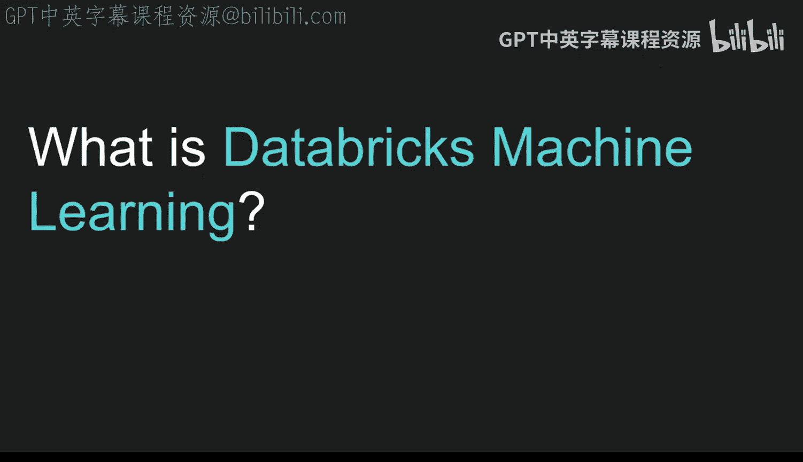

在本节课中，我们将要学习如何在Databricks环境中开始使用MLflow进行机器学习实验跟踪。我们将从Databricks机器学习平台概述开始，逐步介绍数据摄取、快速启动、实验跟踪以及超参数调优等核心概念。

## 概述：什么是Databricks机器学习？ 🤔

Databricks机器学习是一个完整的解决方案或平台，它允许你训练模型、跟踪训练运行、创建特征表以及共享模型。

官方文档中的一张图表展示了其工作流程：数据准备位于“数据源”和“Delta表”阶段。随后，数据进入创建精炼特征的阶段，这些特征被放入特征存储库。这使得在笔记本中进行自动化机器学习（AutoML）以及使用这些模型和特征变得更加容易。接着，可以执行多个实验，例如自动超参数调优任务。一旦完成并选择了合适的模型，就可以将其部署为批处理模式或在线服务模式。因此，这是一个从数据到生产的全面解决方案。

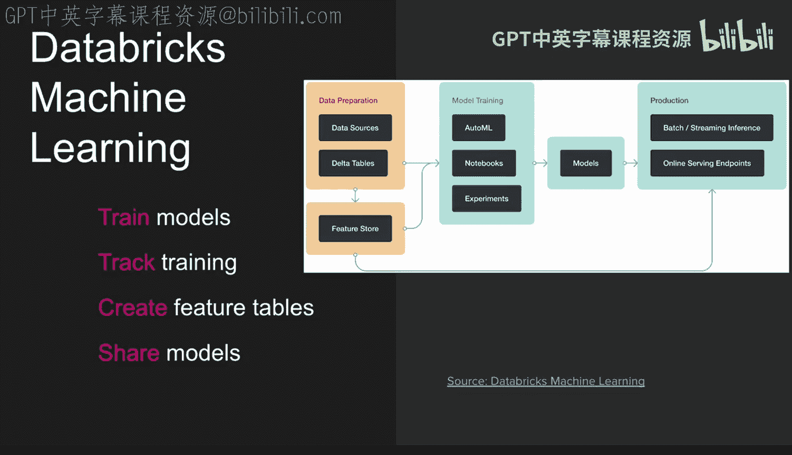

## 数据摄取：多种方式导入表格 📥

有多种不同的方式可以将数据表导入Databricks。

以下是几种主要方法：
*   上传文件：这是最简单的入门方式。
*   使用DBFS（Databricks文件系统）。
*   Azure集成：一个独特之处在于可以连接到Azure存储，如Azure Blob存储系统。
*   第三方集成：也可以连接到并使用第三方工具，存在许多不同的第三方集成选项。

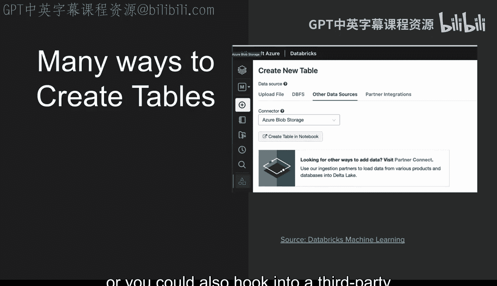

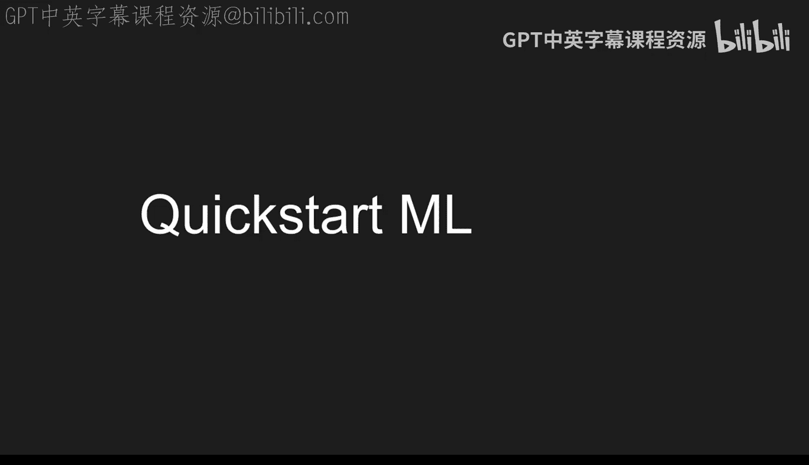

## 快速启动机器学习工作流 🏃

要快速开始，首先需要创建一个一到两个节点的ML工作集群。

如果你在Databricks的“机器学习”选项卡中，选择“集群”，需要确保Databricks运行时版本使用的是ML版本。存在标准运行时和ML运行时。ML运行时包含了MLflow，并允许你与实验跟踪以及机器学习工作流中预期的其他功能进行集成。

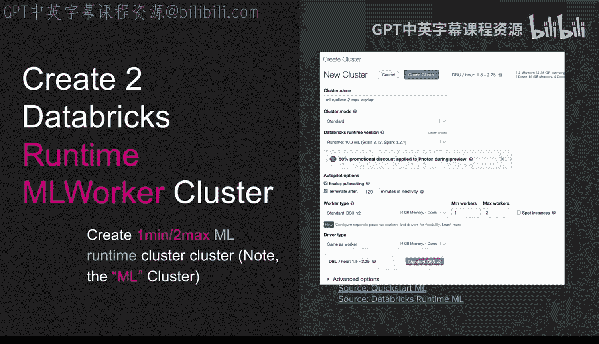

创建集群后，下一步是附加一个笔记本。

你可以导入默认控制台中包含的“ML快速入门”笔记本，右键单击并将其附加到集群，然后就可以开始在该笔记本上工作了。这可能是最好的入门方式：创建一个集群，等待集群启动后，运行快速入门模型训练笔记本。

## 实验跟踪与模型选择 🔬

如果你已经训练了一个分类模型，你会看到许多不同实验的概念。你可以在实验UI中选择要部署到生产环境的超参数或模型。

实验UI是许多模型跟踪功能的核心，因为它允许你直接从笔记本跳转到实验选项卡，并实际查看你所做的操作。

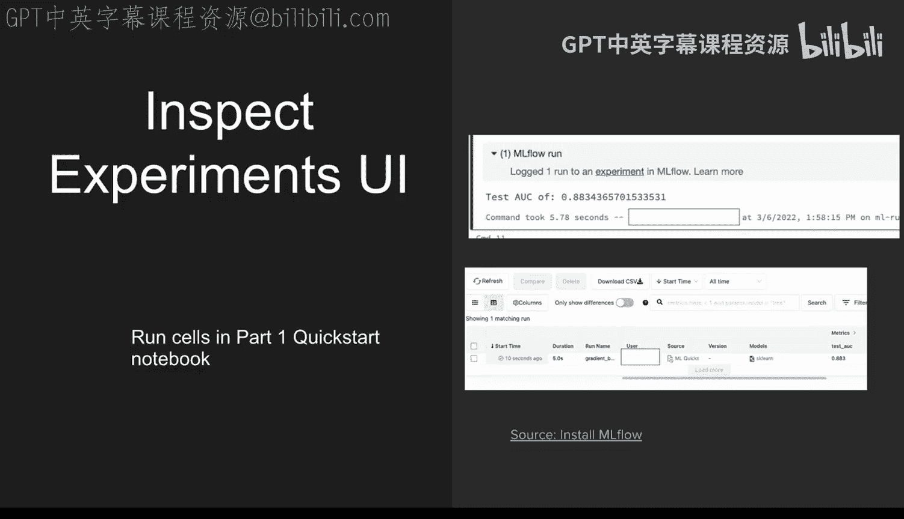

进入实验选项卡后，其强大之处在于你可以通过侧边栏切换，查看不同的实验以及创建的模型，包括显示在实验选项卡中的指标所体现的准确度。

## 深入探讨：超参数调优 ⚙️

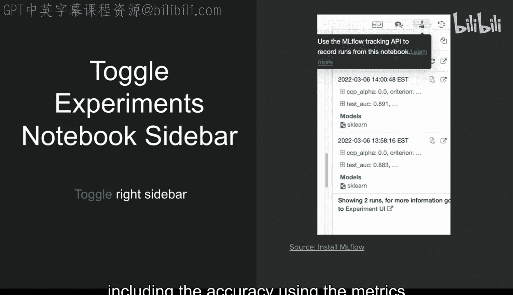

上一节我们介绍了实验跟踪，本节中我们来看看如何利用Databricks进行超参数调优。

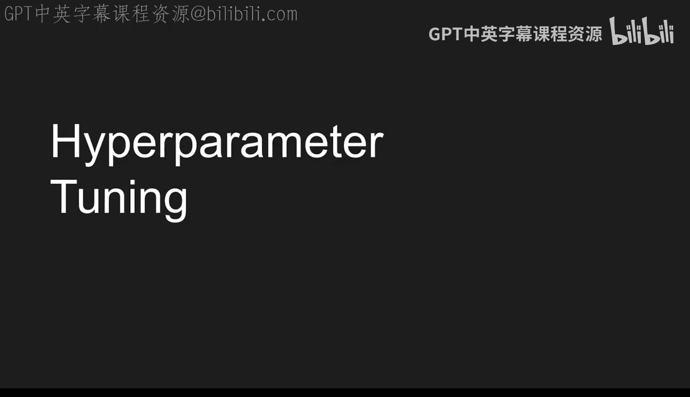

你可以通过一个API调用运行许多不同的实验，这就是实验跟踪界面的强大之处。你会在许多不同的工具中看到这一点：你希望所有内容都在一个界面中，以便可以查询、查看已运行的不同实验，并找出该实验的最佳指标。

如果你进入超参数比较功能，你还可以执行散点图，查看不同的运行，甚至可以深入研究细节，例如学习率与损失的关系。

## 并行超参数调优 🚄

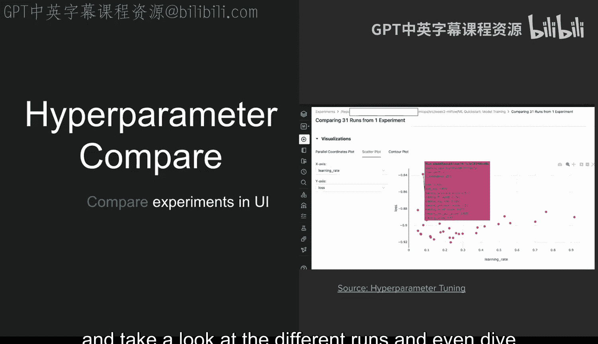

同样重要的是，你可以进行并行超参数调优，这可以让你真正优化找到解决方案的速度。

以下是实现此目的的一种方法：
*   使用Hyperopt：它提供了分布式异步超参数优化。
*   有三种不同的算法可供选择：随机搜索、Parzen估计器树（TPE）或自适应TPE。
*   你可以使用Apache Spark或MongoDB将其并行化。

因此，开始并行超参数调优有很多方法。

查看这里的代码，你可以看到在较小的集群或Databricks社区版上，进行并行化也是个好主意。但如果你有一个大型集群，可以将其设置为任意你想要的数字。

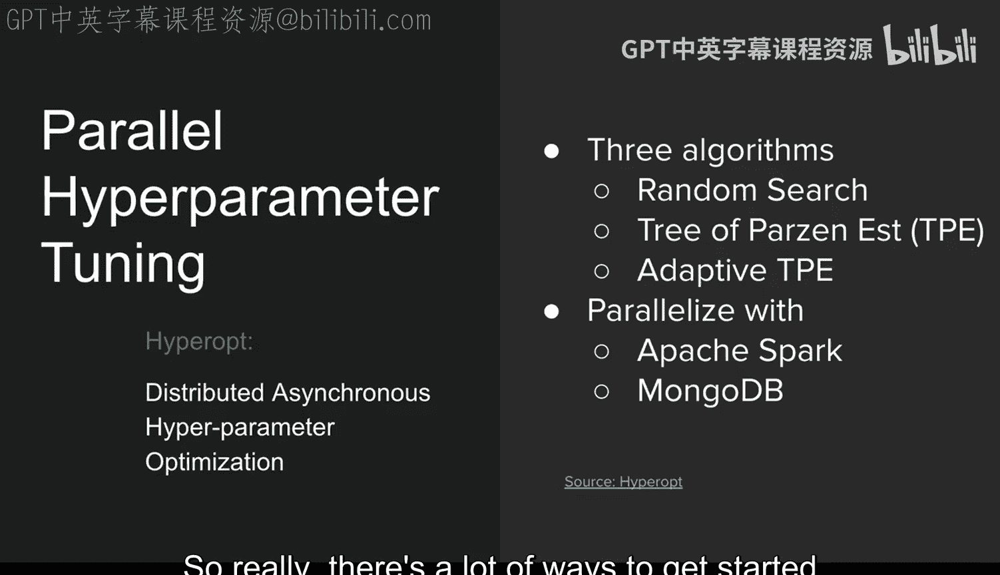

## 分析结果与最终比较 📊

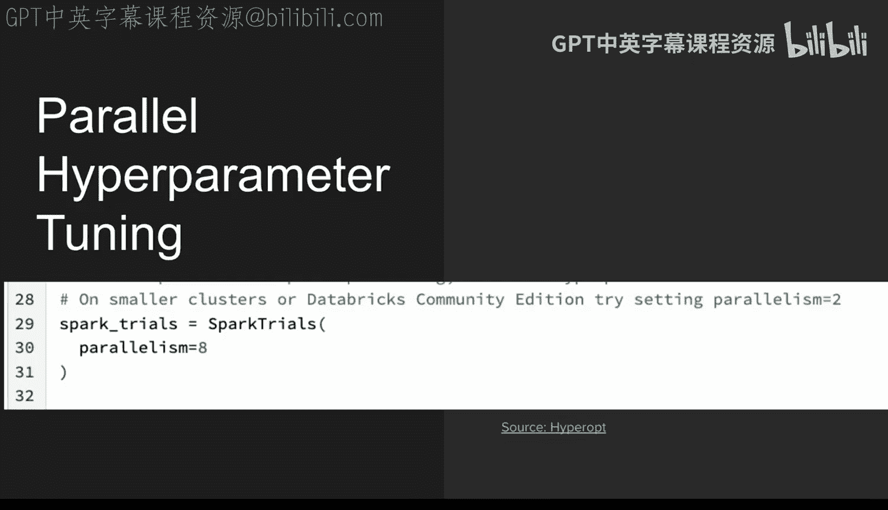

当你完成搜索运行后，最后还可以查看你关心的指标，例如可能是曲线下面积（AUC）。你可以要求查看最后10个结果，然后它会给出你执行的特定搜索查询的最佳运行，并且你可以在代码中完成所有这些操作。

最后，当你完成运行比较后，可以在这里的UI中查看所有运行，然后根据你想对这些超参数和实验做什么，展开并进行比较。

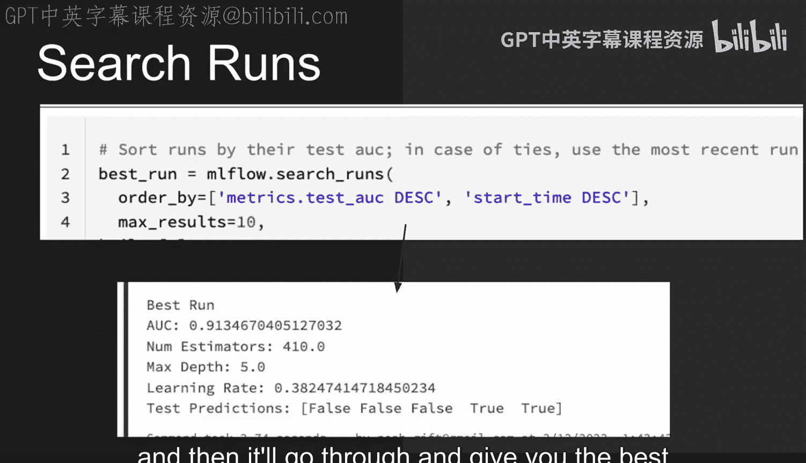

## 总结 📝

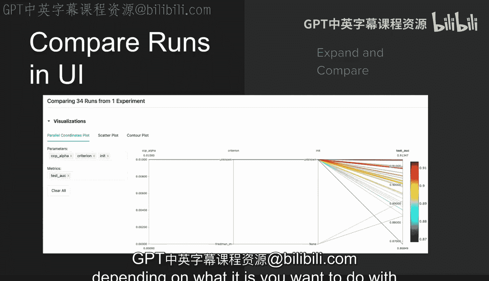

本节课中我们一起学习了在Databricks平台上集成MLflow进行机器学习实验管理的完整流程。我们从Databricks ML平台概述开始，了解了数据摄取的多种途径。接着，我们学习了如何通过创建ML集群和运行快速入门笔记本来启动项目。核心部分深入探讨了使用MLflow进行实验跟踪、模型选择以及高效的超参数调优，特别是并行调优技术。最后，我们掌握了如何分析和比较实验结果以选择最佳模型。这套工作流程为从数据准备到模型部署的端到端机器学习项目提供了强大支持。