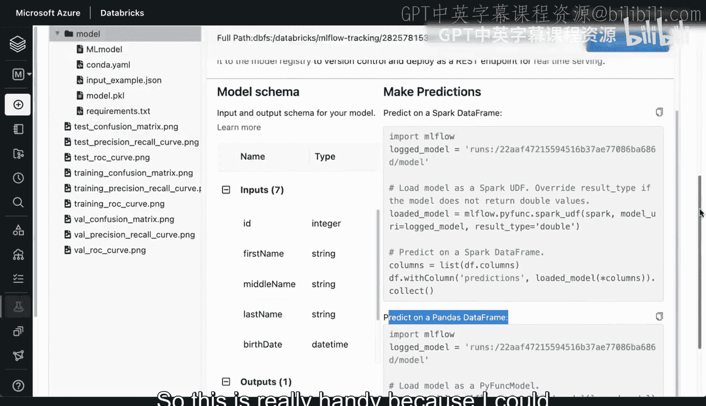
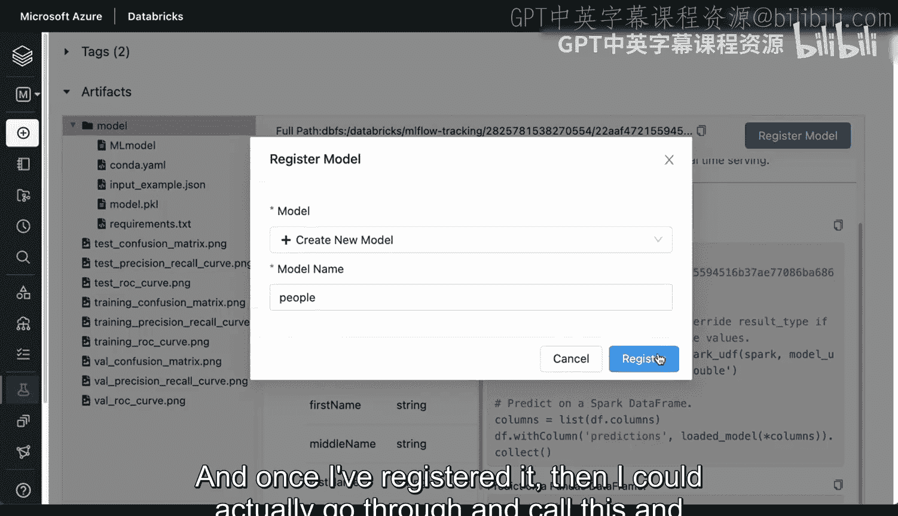
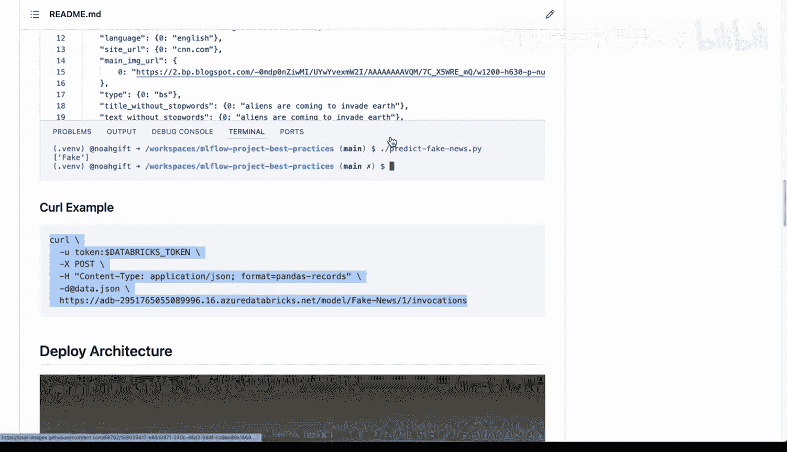
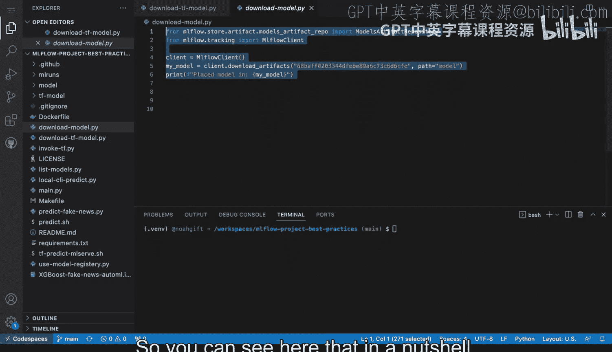
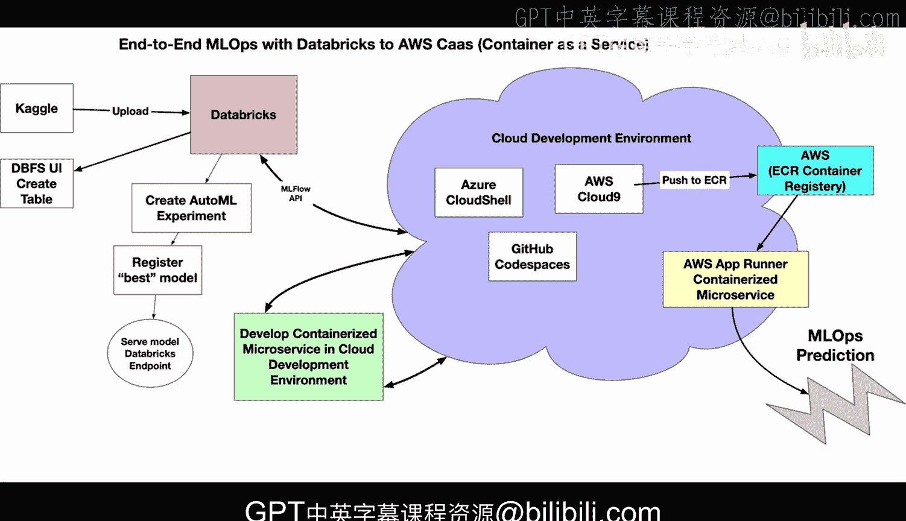

# Rust编程2-3（数据工程、DevOps）：58：MLflow与Databricks端到端机器学习工作流 🚀

在本节课中，我们将学习如何利用Databricks和MLflow构建一个端到端的机器学习运维（MLOps）工作流，并了解如何将在此平台上训练的模型迁移到其他环境中。

## 概述

我们将探讨一个完整的机器学习项目流程，从数据导入、模型训练与实验，到模型注册与部署。核心在于理解MLflow的API如何提供跨平台的灵活性，使得模型不局限于Databricks环境。

## 端到端工作流详解

上一节我们介绍了MLOps的基本概念，本节中我们来看看一个结合Databricks和MLflow的具体实现案例。

### 1. 数据准备与导入

首先，可以从Kaggle等平台获取数据集。以下是将数据导入Databricks并创建表的典型步骤：

1.  将数据集上传至Databricks。
2.  使用Databricks文件系统（DBFS）和用户界面（UI）将数据创建为表格。

### 2. 自动化实验与模型训练

数据准备完成后，可以启动自动化机器学习（AutoML）实验。实验完成后，系统会筛选出最佳模型。

### 3. 模型注册与管理

最佳模型可以被注册到Databricks的模型注册表中。注册后，模型可以被版本化和管理。如果选择通过Databricks提供服务，可以将其部署为一个端点（Endpoint）。

然而，利用MLflow的API，我们并不局限于Databricks平台。

### 4. 跨平台部署与调用

得益于MLflow的标准化模型格式和API，注册后的模型可以轻松迁移到其他云环境。以下是几种可能性：

*   可以从**Azure**、**GitHub Codespaces**、**AWS Cloud9**等任何云环境调用MLflow API。
*   可以基于模型开发**微服务**，并部署到其他环境。
*   例如，可以将模型容器化并推送到**AWS Elastic Container Registry (ECR)**，然后自动部署到**AWS App Runner**进行预测。

一旦模型通过MLflow注册，我们就拥有了极大的灵活性，几乎可以在任何平台上进行操作。

## 深入模型构件

让我们更深入地查看一个具体的模型示例。这里有一个之前通过AutoML实验训练的XGBoost模型。

查看该模型，我们可以看到它包含了所有必要的构件（Artifacts）：

*   **实际模型文件**（如 `model.pkl`）
*   **Conda环境配置文件**（`conda.yaml`）
*   **输入示例**（`input_example.json`）：展示了如何调用该模型。
*   **依赖文件**（`requirements.txt`）
*   **模型架构信息**：指明了调用时所需的数据格式（Schema）。

此外，文档还提供了具体的调用命令，例如如何在Spark DataFrame或Pandas DataFrame上进行预测。这使得我们可以直接在平台上测试和调用模型。

## 模型注册与外部调用示例

除了在平台内使用，我们还可以将模型注册到中央仓库。例如，注册一个名为 `people` 的模型。

注册后，就可以从其他平台通过API调用该模型的特定版本。这里有一个GitHub上的项目示例，它实现了一个“假新闻预测”服务。

项目创建了一个包含示例数据（如“外星人即将入侵地球”）的请求载荷（Payload），并将其POST到预测端点，成功预测该新闻为假新闻。这完整演示了如何将之前展示的模型构件包装成一个可工作的服务。

若想直接通过 `curl` 命令调用生产环境端点，仅需要一个Databricks令牌（Token）即可。同样，也可以编写预测命令来调用已注册模型的端点。

## 在GitHub Codespaces中操作模型

跨平台能力的另一个例证是GitHub Codespaces。我们可以在该环境中进行设置，与模型交互，甚至下载模型构件。

然后，可以重复本课程早先演示的步骤：使用MLflow加载模型并进行预测。这证明了模型的可移植性。

## 总结

本节课中我们一起学习了如何构建一个基于Databricks和MLflow的端到端MLOps工作流。关键在于，MLflow的API开启了远超Databricks平台本身的巨大可能性。

回顾整个流程图，核心在于**模型通过MLflow注册后，其构件和API标准化使得它可以与任何云环境对接**。这确保了机器学习项目从实验到生产的高度灵活性和可移植性。