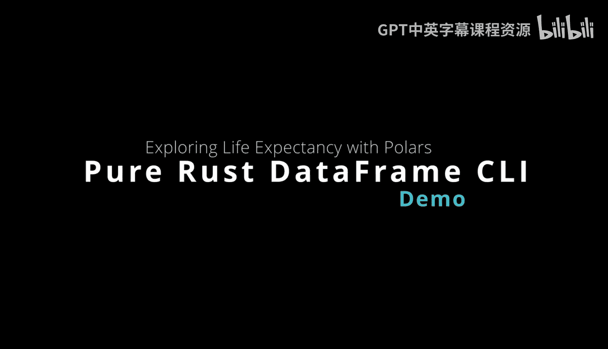
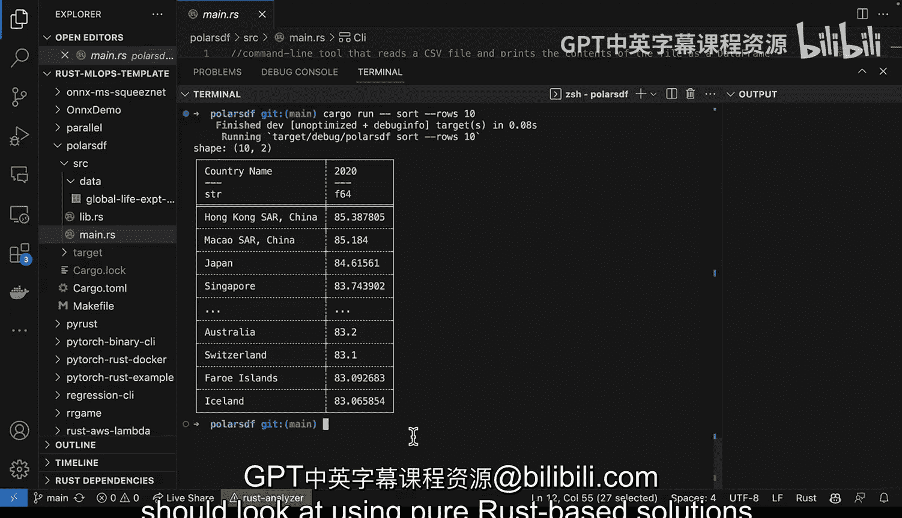

# 059：使用Polars探索全球预期寿命 📊



在本节课中，我们将学习如何使用Rust生态中的Polars库，构建一个高性能的命令行工具，用于探索和分析全球预期寿命的CSV数据集。我们将看到如何将数据处理逻辑封装成库，并通过命令行提供统一的交互界面。

---

上一节我们介绍了Polars项目的基本概念，本节中我们来看看具体的代码实现和工具构建。

首先，我们有一个`lib.rs`文件，这是放置公共工具函数的常见位置。以下是其核心内容：

```rust
use polars::prelude::*;

pub fn read_csv(path: &str) -> Result<DataFrame, PolarsError> {
    CsvReader::from_path(path)?.finish()
}

pub fn print_rows(df: &DataFrame) {
    println!("{}", df);
}

pub fn print_schema(df: &DataFrame) {
    println!("{:?}", df.schema());
}

pub fn print_shape(df: &DataFrame) {
    println!("Shape: {} rows, {} columns", df.height(), df.width());
}
```
代码中，我们使用`polars`库，并构建了一系列辅助函数。`pub`关键字将这些函数公开暴露，以便在组织内供他人使用。`read_csv`函数用于读取CSV文件，其他函数则用于打印数据框的行、模式和形状。

---

在`Cargo.toml`文件中，我们只需要两个依赖库。

```toml
[dependencies]
polars = "0.26.2"
clap = "3.2"
```
我们固定了Polars的特定版本，这是Rust确保可重现构建的一个优势。`clap`则是一个命令行参数解析库。

---

现在，让我们看看`main.rs`文件如何将整个工具整合在一起。

首先，我们设置一个常量指向数据目录，并使用`clap`配置命令行界面。

```rust
use clap::{Arg, Command};

const DATA_PATH: &str = "./data/life_expectancy.csv";

fn main() {
    let matches = Command::new("life_expectancy_explorer")
        .version("1.0")
        .author("Your Name")
        .about("Explores global life expectancy data")
        .arg(Arg::new("print").short('p').long("print").help("Prints the dataframe"))
        .arg(Arg::new("schema").long("schema").help("Prints the schema"))
        // ... 定义更多命令，如 describe, shape, sort
        .get_matches();

    // 读取数据
    let df = read_csv(DATA_PATH).expect("Failed to read CSV");

    // 根据匹配的命令执行相应操作
    if matches.contains_id("print") {
        print_rows(&df);
    } else if matches.contains_id("schema") {
        print_schema(&df);
    }
    // ... 处理其他命令
}
```
在`main`函数中，我们使用模式匹配来执行用户通过命令行输入的不同操作。例如，如果用户输入`--print`，则调用`print_rows`函数。这种结构使得添加新功能变得清晰简单。

---

以下是该工具支持的一些核心操作列表：

*   **打印数据**：查看数据集的前几行。
*   **查看模式**：了解每一列的数据类型。
*   **查看形状**：获取数据框的行数和列数。
*   **数据排序**：例如，按预期寿命对国家和地区进行排序。

---

构建完成后，我们可以运行这个工具。例如，运行`./explorer --shape`会显示数据形状为 **3行 x 66列**，包含国家名称、国家代码和指标等列。

我们还可以进行更复杂的操作，比如排序。运行`./explorer --sort`可以按预期寿命列出排名前10的国家和地区。

```bash
# 示例输出可能类似于：
1. Japan | 84.6
2. Switzerland | 83.8
3. Singapore | 83.6
4. Australia | 83.4
5. Spain | 83.4
...
```
从结果中可以清晰地看到，亚洲、澳大利亚和欧洲的一些国家和地区拥有非常高的预期寿命。这得益于我们构建的工具能够快速、清晰地展示数据。

---



本节课中我们一起学习了如何使用Rust和Polars构建一个数据探索命令行工具。总而言之，对于数据框处理，纯Rust解决方案相比传统的脚本语言（如Python或R）具有多重优势，包括**更高的安全性、出色的可移植性以及卓越的性能**。在进行高性能数据工程工具开发时，考虑采用基于纯Rust的解决方案是一个值得重视的方向。