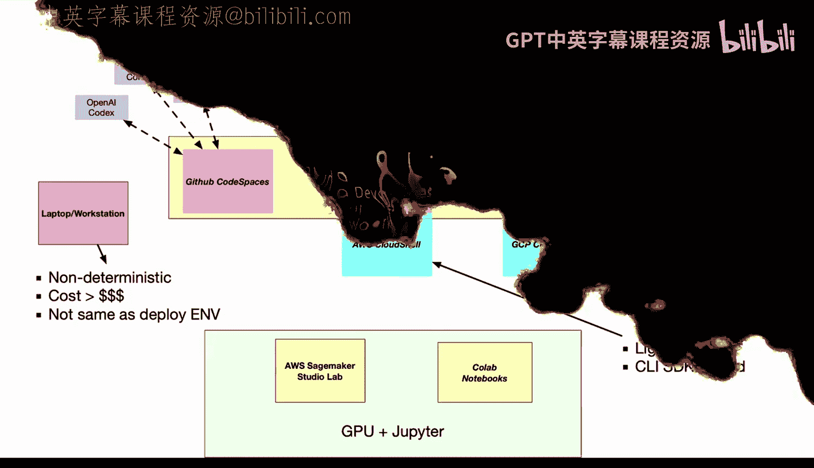
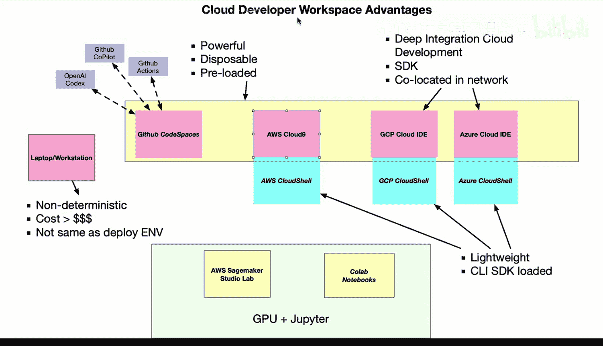
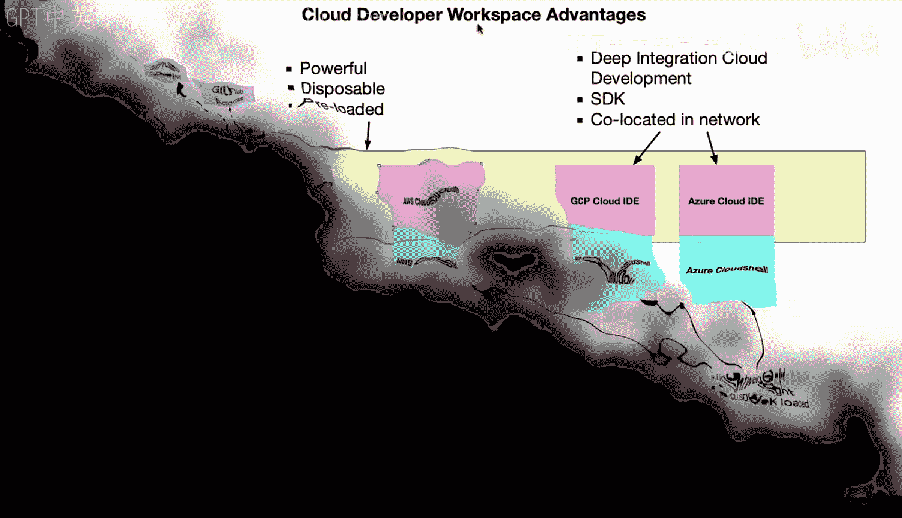

# 060：云端开发工作空间优势 🚀

在本节课中，我们将要学习云端开发工作空间的概念及其优势。我们将探讨为何这种开发模式正在成为软件工程、数据工程和机器学习等多个领域的新趋势，并对比传统本地开发环境与云端环境的差异。

## 传统本地开发环境的局限性 💻

上一节我们介绍了课程背景，本节中我们来看看传统的本地开发环境。通常，我们使用笔记本电脑或工作站进行开发。这种环境存在几个显著问题。

首先，本地环境是**非确定性的**，没有统一、有保障的运行环境。其次，环境中可能安装了您不需要的软件包，造成干扰或冲突。此外，为本地机器配置高性能硬件（如GPU和大容量固态硬盘）的成本非常高昂。

另一个关键问题是，本地开发环境通常与实际的云部署环境不一致。如果您在云端运行应用，那么本地环境（除少数例外情况）与生产环境存在差异。虽然可以使用容器技术来缓解这个问题，但这增加了复杂性。

## 云端开发环境的兴起 ☁️

既然了解了本地环境的挑战，接下来我们看看云端开发环境如何解决这些问题。目前市场上有多种云端开发环境，它们具有许多共同特点。

以下是几种主流的云端开发环境：

*   **GitHub Codespaces**：其独特优势在于与GitHub Actions（持续集成系统）和GitHub Copilot（基于OpenAI Codex的代码辅助工具）轻松集成。整个开发流程与GitHub平台紧密耦合，是一个高效的开发环境。
*   **AWS Cloud9**：提供定制化功能，包括基于角色的权限管理，无需在代码中硬编码API密钥。它与AWS Lambda、S3、API Gateway等服务深度集成，便于构建无服务器应用。
*   **AWS CloudShell**：这是一个更轻量级的版本，适合进行简单的软件工程任务，并允许在Bash、Zsh或PowerShell之间切换。
*   **GCP Cloud IDE 与 Cloud Shell**：谷歌云平台提供了自己的云端编辑器和Shell环境。
*   **Azure Cloud IDE 与 Cloud Shell**：微软Azure平台也提供了类似的云端编辑器和Shell环境。

这些环境的核心共性是：它们都是功能强大、即用即弃、预配置好的环境，并且与各自的云平台深度集成。

## 云端环境的独特优势 ⚡

在列举了主要平台后，我们来深入探讨云端开发工作空间的具体优势。这些优势正在推动开发工作流向云端迁移。

云端环境通常预装了各种开发工具包（SDK），并且其物理位置就在云数据中心内。这带来了一个革命性的好处：**数据共置**。

例如，当您需要处理TB级的数据时，如果在咖啡馆使用笔记本电脑，来回传输这些数据将非常困难且低效。但如果数据本就存储在云端，您只需在同一个云区域启动一个开发环境，就能直接、高速地访问数据，无需迁移。

## 总结 📝

本节课中我们一起学习了云端开发工作空间相较于传统本地环境的巨大优势。我们分析了本地环境在确定性、成本及与部署环境一致性方面的不足，并介绍了GitHub Codespaces、AWS Cloud9等主流云端开发环境。最后，我们重点探讨了云端环境的核心优势——深度云集成与数据共置能力，这代表了未来开发工作的趋势，非常值得开发者深入学习和采用。