# 061：Python与Rust的GCP入门

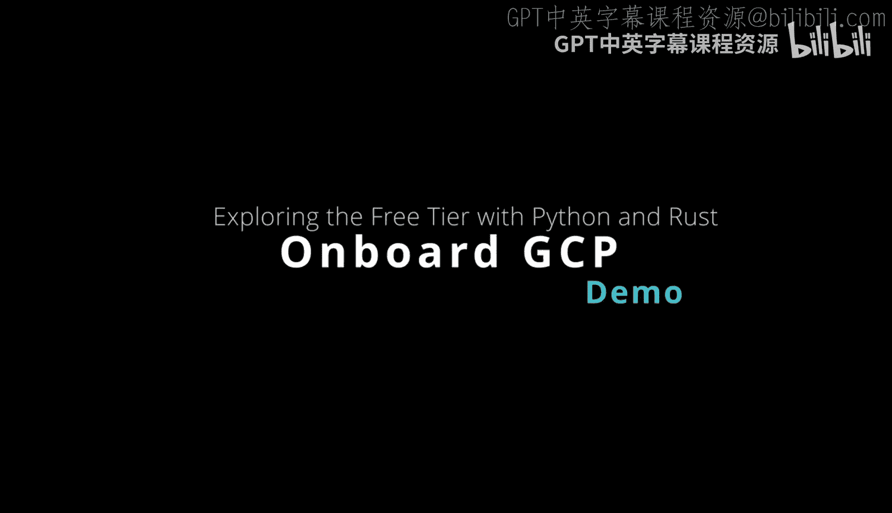

在本节课中，我们将学习如何在Google Cloud Platform（GCP）上开始使用Python和Rust进行开发。我们将从了解GCP的免费套餐开始，然后设置Cloud Shell环境，并分别运行Python和Rust的示例项目。

## 概述

GCP提供了一系列免费产品和服务，非常适合初学者和开发者进行学习和实验。我们将首先探索这些免费资源，然后通过Cloud Shell环境，快速搭建Python和Rust的开发环境，并运行简单的“Hello World”程序。

## GCP免费套餐概览

上一节我们介绍了课程目标，本节中我们来看看GCP为开发者提供的免费资源。

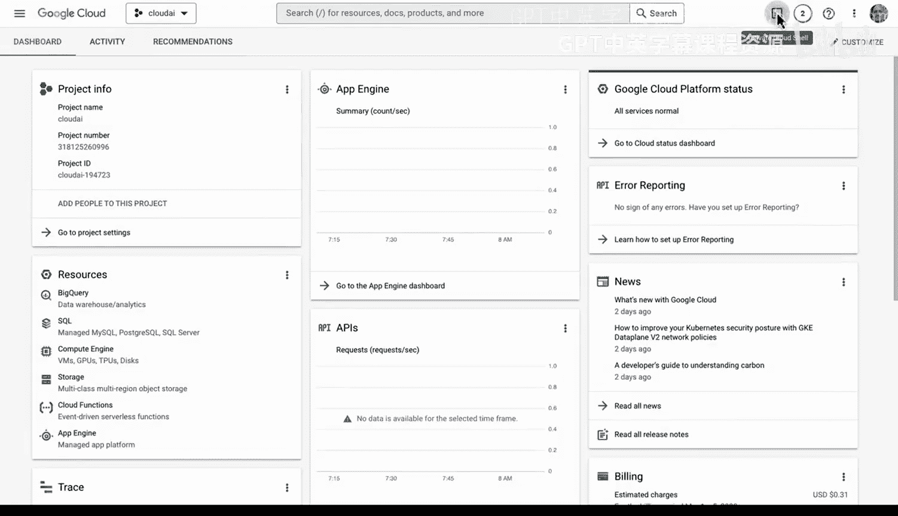

GCP免费套餐提供对20种免费产品的访问权限，以及300美元的免费信用额度。这些信用额度需要在三个月内使用。部分免费产品包括：
*   Compute Engine（计算引擎）
*   Cloud Storage（云存储）
*   BigQuery
*   Kubernetes
*   App Engine
*   Cloud Run
*   Cloud Build
*   Stackdriver
*   File Store
*   Pub/Sub
*   Cloud Functions
*   Vision AI
*   Speech-to-Text
*   Natural Language API
*   AutoML

## 开始使用Cloud Shell

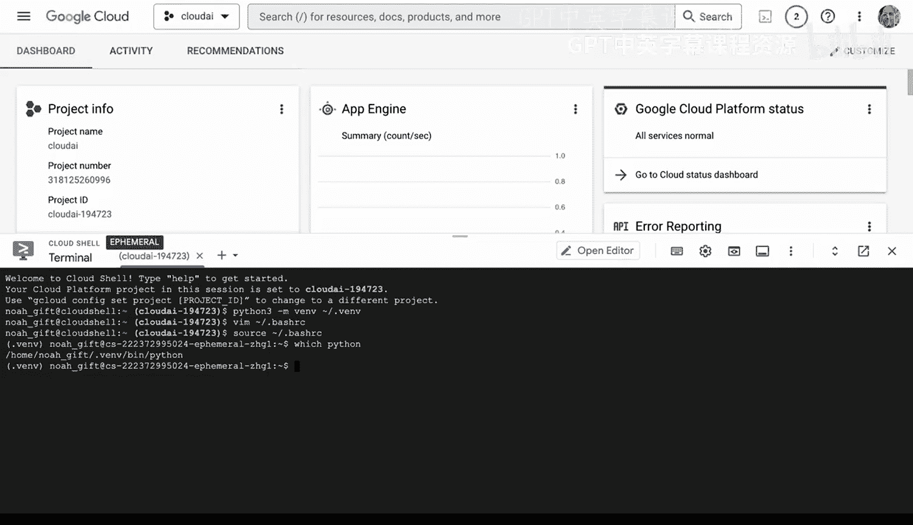

了解了GCP的免费资源后，我们进入实际操作环节。首先，我们需要进入GCP控制台并启动Cloud Shell。

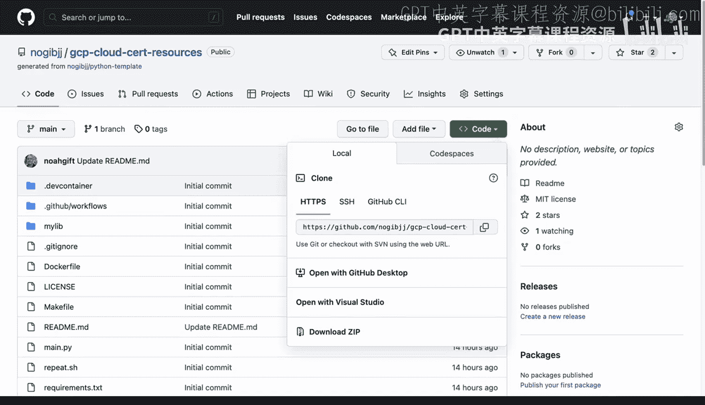

Cloud Shell是一个基于浏览器的命令行环境，内置了多种开发工具，可以立即开始构建和测试解决方案。在Cloud Shell中，我们可以轻松管理项目、运行代码和访问GCP服务。

## 设置Python开发环境

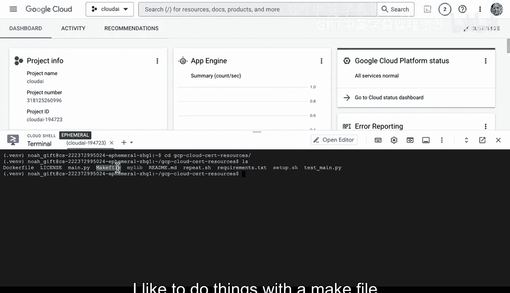

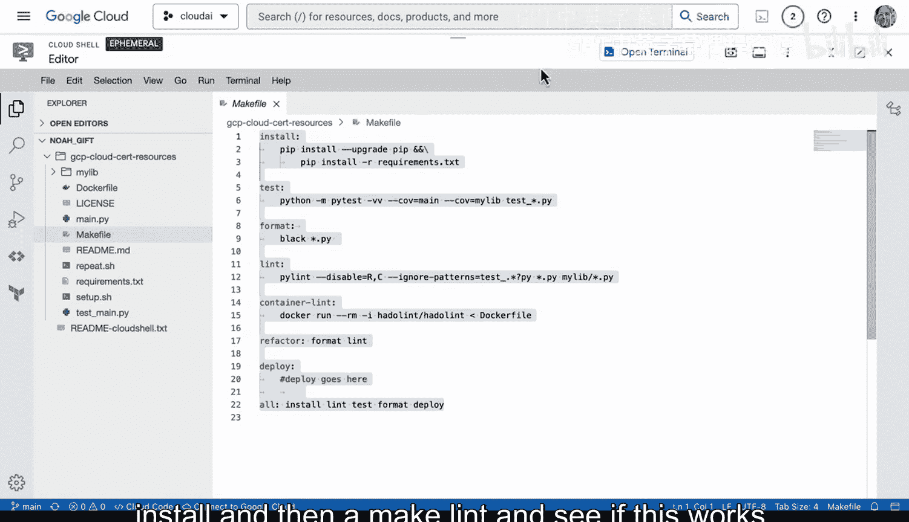

上一节我们启动了Cloud Shell，本节中我们来看看如何配置Python开发环境。

首先，创建一个Python虚拟环境，这有助于隔离项目依赖。使用以下命令创建并激活虚拟环境：
```bash
python3 -m venv .venv
source .venv/bin/activate
```
为了在每次打开Cloud Shell时自动激活虚拟环境，可以将激活命令添加到`~/.bashrc`文件中。

接下来，可以克隆一个包含示例代码的Git仓库，并安装项目依赖。以下是使用`make`命令的示例流程：
```bash
git clone <仓库地址>
cd <项目目录>
make install  # 安装依赖包
make lint     # 运行代码检查
```

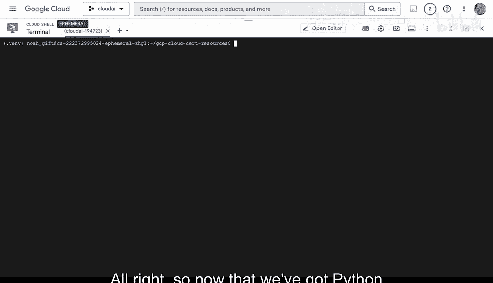

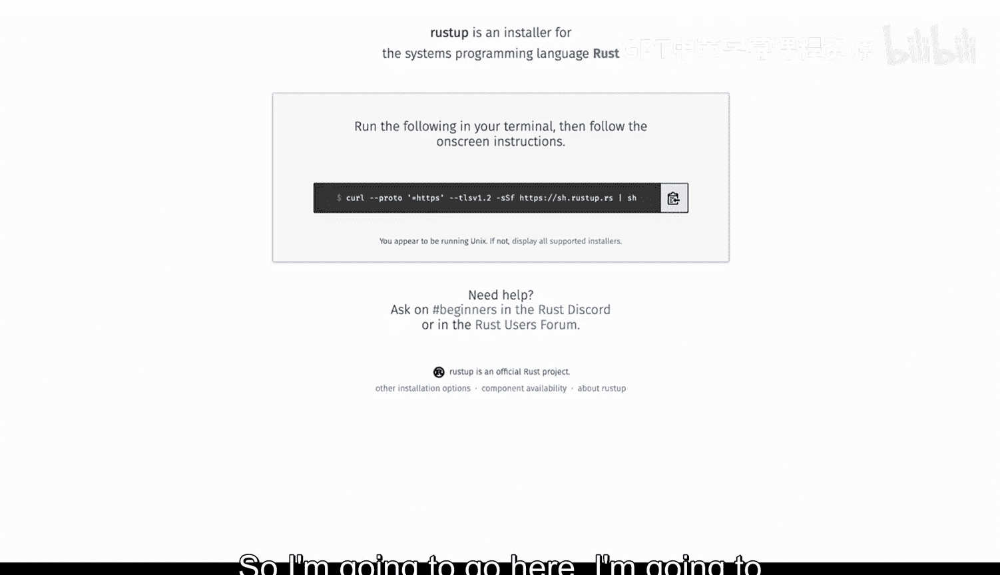

## 设置Rust开发环境

在Cloud Shell中配置好Python环境后，我们也可以轻松地安装Rust。

Rust以其高性能和内存安全性著称，在某些场景下性能远超Python。通过运行官方安装脚本，可以一键安装Rust及其包管理器Cargo：
```bash
curl --proto '=https' --tlsv1.2 -sSf https://sh.rustup.rs | sh
source $HOME/.cargo/env
```
安装完成后，可以立即创建一个新的Rust项目并运行：
```bash
cargo new hello
cd hello
cargo run
```
`cargo run`命令会编译并运行项目，输出经典的“Hello, world!”。项目结构清晰，依赖管理在`Cargo.toml`文件中进行。

## 管理GCP计算资源

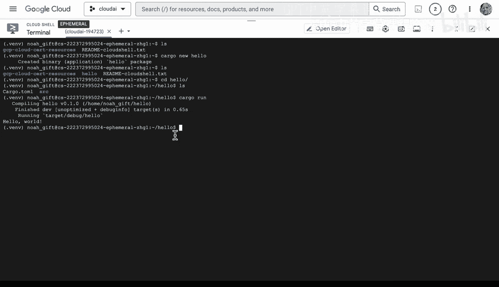

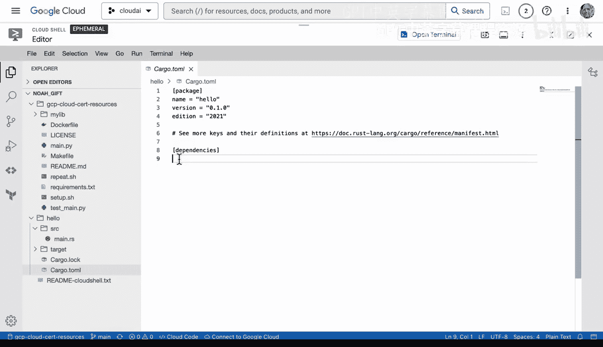

掌握了两种语言的开发环境设置后，我们来看看如何在GCP上管理计算资源，例如虚拟机实例。

在GCP控制台中，可以直观地创建和管理Compute Engine虚拟机实例。创建时，界面上会清晰显示不同配置机器的预估每小时和每月费用，帮助控制成本。

更重要的是，几乎所有操作都可以通过`gcloud`命令行工具完成，这对于自动化和脚本编写非常有用。例如，要列出当前项目中的所有虚拟机实例，可以使用：
```bash
gcloud compute instances list
```
要获取某个命令的详细帮助信息，可以运行`gcloud help [COMMAND]`。GCP的设计是面向命令行的，熟悉命令行将极大地提升使用效率。

## 总结

本节课中我们一起学习了在Google Cloud Platform上入门Python和Rust开发的基础步骤。

我们首先了解了GCP丰富的免费套餐。然后，通过Cloud Shell快速搭建了开发环境：为Python项目创建了虚拟环境并管理依赖；为Rust项目安装了工具链并运行了示例。最后，我们还学习了如何在控制台和命令行中查看与管理GCP的计算资源。

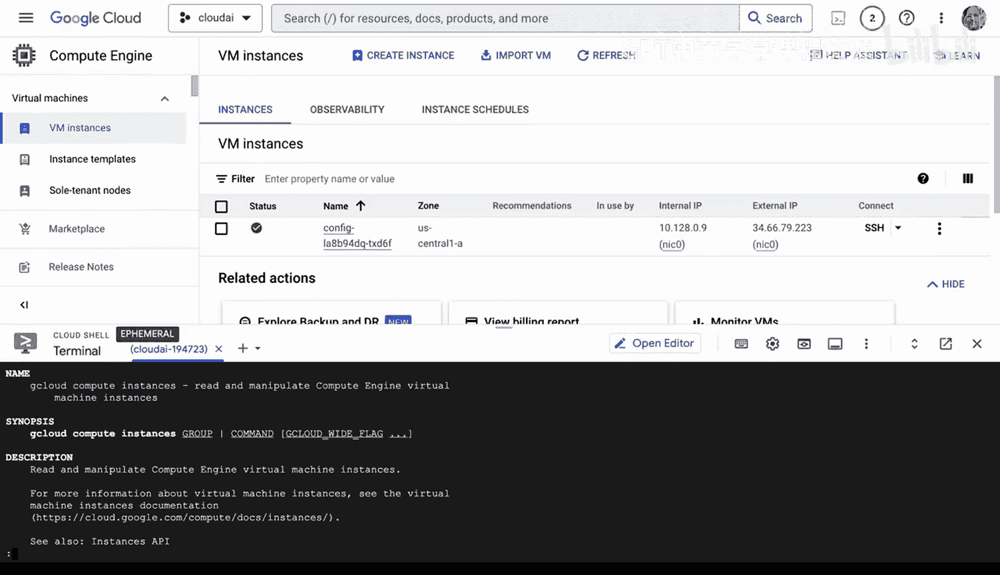

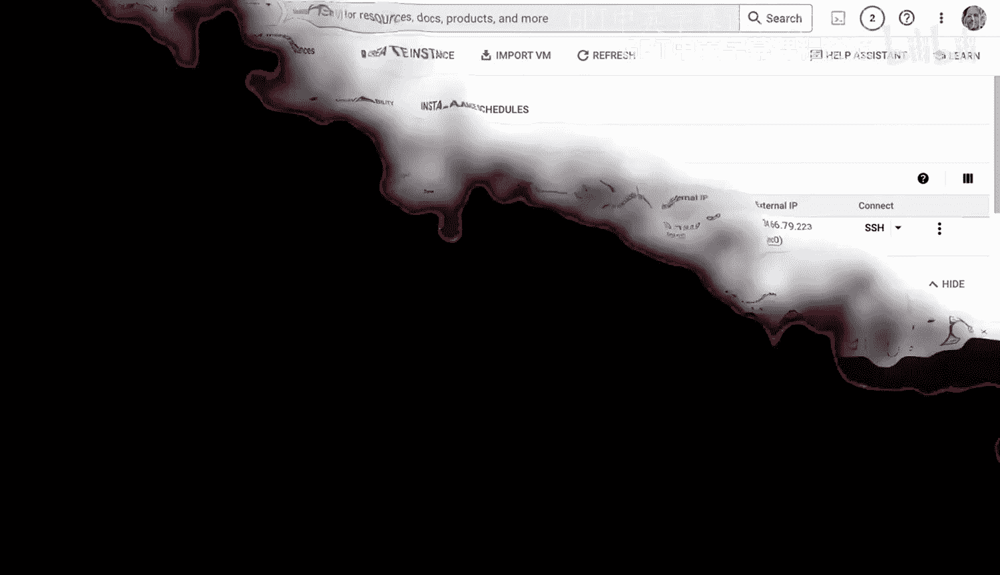

通过本教程，你应该已经掌握了在GCP上开始进行Python和Rust开发的基本流程，可以自行尝试这些命令并探索更多功能。