# Rust编程2-3（数据工程、DevOps）：64：在AWS CloudShell中快速原型化AI API 🚀


在本节课中，我们将学习如何利用AWS CloudShell和命令行工具，快速原型化和测试AWS的AI服务，特别是Amazon Comprehend。我们将从简单的文本情感分析开始，逐步构建一个从网页抓取数据、进行实体提取和统计分析的完整数据科学流程。

---

## 概述

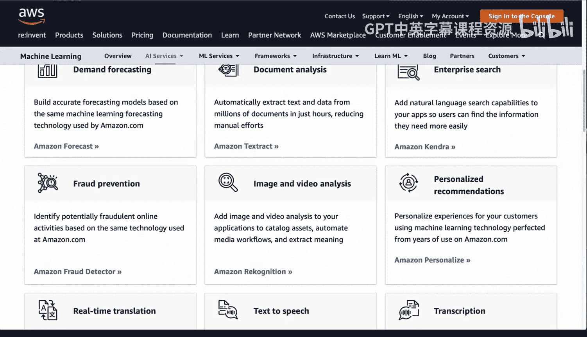

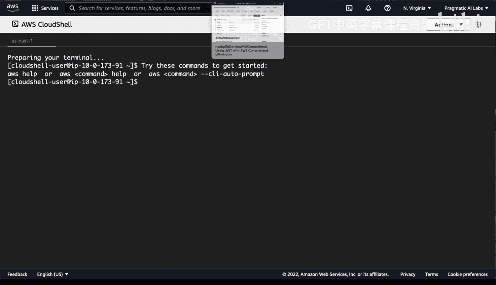

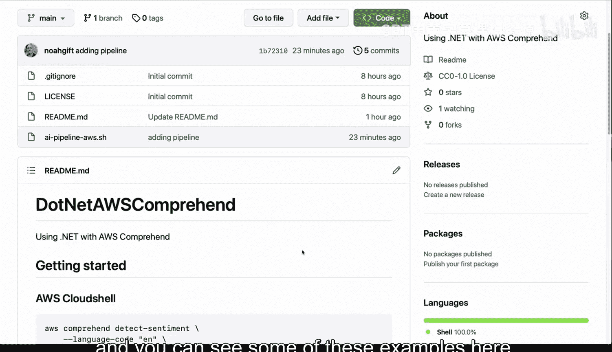

AWS提供了丰富的AI服务，从高级文本分析、自动代码审查到聊天机器人和预测等。我们将重点介绍Amazon Comprehend，这是一个用于自然语言处理（NLP）的服务。我们将使用AWS CloudShell，这是一个基于浏览器的命令行工具，无需在本地安装任何软件，即可快速测试和原型化想法。

---

## 启动与基础命令

首先，我们打开AWS CloudShell。要开始使用Amazon Comprehend服务，可以在命令行中输入 `aws comprehend` 并查看帮助信息。

```bash
aws comprehend help
```

执行上述命令会显示所有可用的子命令，例如 `batch-detect-dominant-language`、`classify-document` 等。这为我们提供了服务功能的概览。

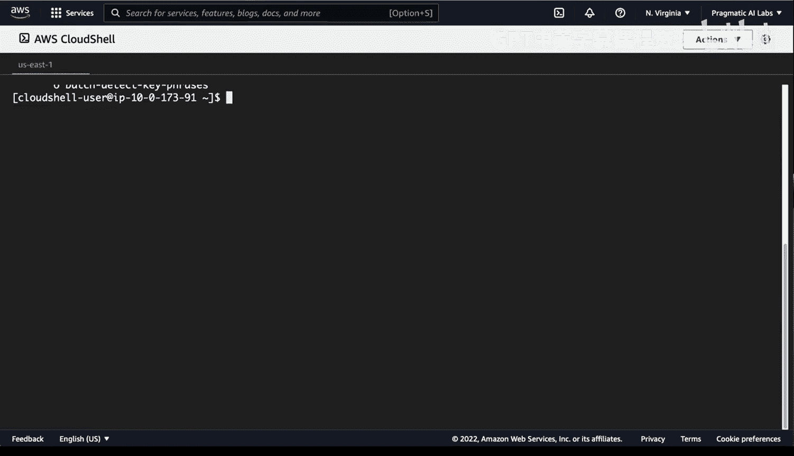

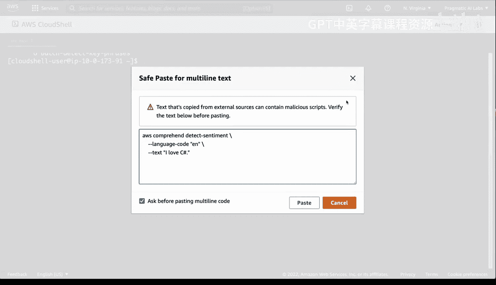

---

## 进行情感分析

接下来，我们尝试一个简单的文本情感分析。我们将分析“I love C#”这句话的情感倾向。

```bash
aws comprehend detect-sentiment \
    --language-code "en" \
    --text "I love C#"
```

执行命令后，服务会返回一个JSON格式的结果，其中包含 `Sentiment` 字段，其值可能是 `POSITIVE`、`NEGATIVE` 或 `NEUTRAL`。对于我们的例子，预期会返回 `POSITIVE`。

这个简单的例子展示了如何快速调用AI API。然而，实际应用通常涉及更复杂的数据源和更大的文本量。

---

## 处理外部数据源

直接从命令行输入文本是有限的。为了处理更复杂的数据，例如网页内容，我们需要从外部获取文本。

一个方法是使用名为 `links` 的命令行网页浏览器工具。我们可以先安装它：

```bash
sudo yum install links -y
```

安装完成后，我们可以使用 `links` 的 `-dump` 参数将网页的文本内容输出到终端。例如，获取维基百科上关于阿尔伯特·爱因斯坦的页面：

```bash
links -dump https://en.wikipedia.org/wiki/Albert_Einstein
```

这会将整个页面的文本内容输出到控制台。但Amazon Comprehend的 `detect-sentiment` 命令一次只能处理少于5000字节的文本。

---

## 处理文本长度限制

为了遵守5000字节的限制，我们需要从获取的网页文本中截取前5000个字节。我们可以结合使用 `head` 命令和管道操作。

首先，将网页文本输出，然后通过管道传递给 `head -c 5000` 命令来截取前5000字节：

```bash
links -dump https://en.wikipedia.org/wiki/Albert_Einstein | head -c 5000
```

现在，我们有了符合长度要求的文本。为了在后续命令中方便地使用这段文本，我们可以将其存储在一个Bash变量中。

---

## 使用变量存储文本

在Bash中，我们可以使用反引号或 `$()` 语法将命令的输出赋值给一个变量。

```bash
TEXT=$(links -dump https://en.wikipedia.org/wiki/Albert_Einstein | head -c 5000)
```

要验证变量是否已正确存储文本，可以使用 `echo` 命令：

```bash
echo $TEXT
```

现在，变量 `$TEXT` 中包含了我们截取后的维基百科文本，可以用于后续的AI分析。

---

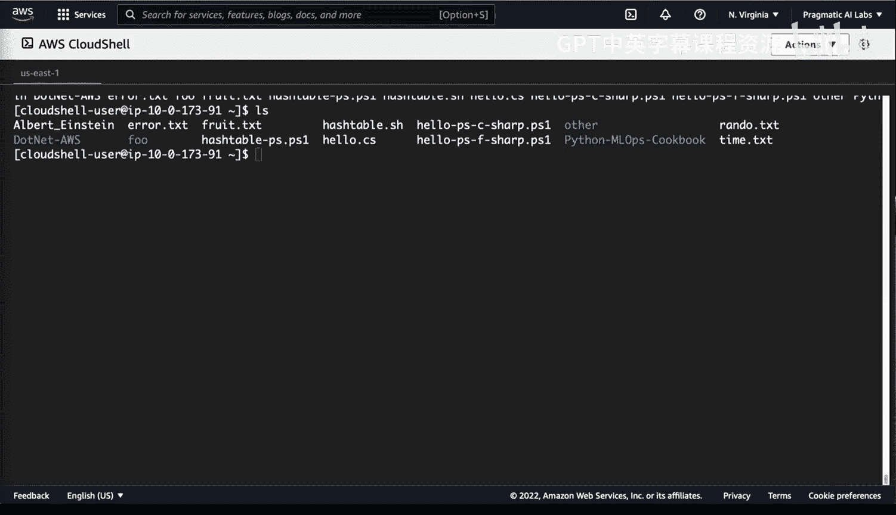

## 对变量文本进行情感分析

有了存储在变量中的文本，我们可以将其传递给AWS Comprehend进行情感分析。关键点在于，我们需要将变量作为 `--text` 参数的值传递。

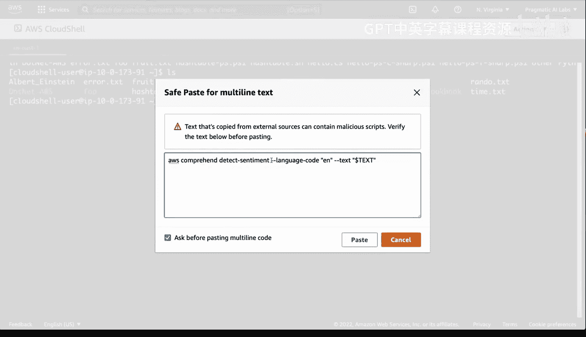

```bash
aws comprehend detect-sentiment \
    --language-code "en" \
    --text "$TEXT"
```

执行此命令后，服务会分析这5000字节文本的整体情感。对于一篇百科全书文章，结果可能显示为 `NEUTRAL`（中性），但也可能包含相当比例的 `POSITIVE`（积极）情绪，这反映了文章作者对主题人物的普遍正面评价。

这展示了如何将外部数据源与AI服务动态结合。

---

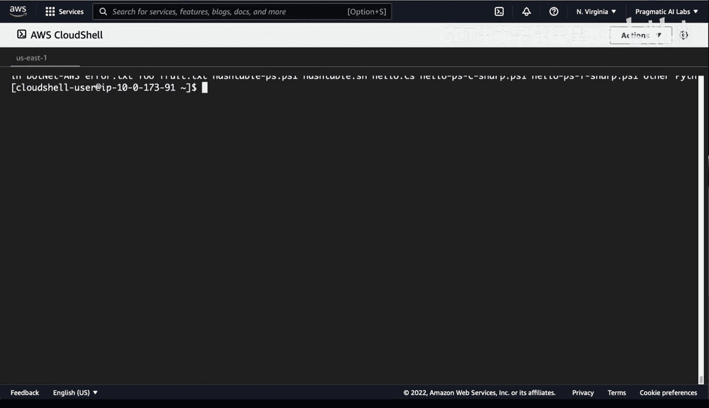

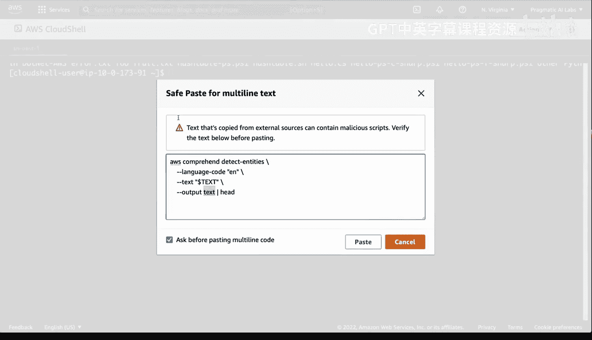

## 进阶分析：实体提取

除了情感分析，Amazon Comprehend还能从文本中提取命名实体（如人名、地点、组织）。我们使用 `detect-entities` 子命令，并指定输出格式为文本以便于后续处理。

```bash
aws comprehend detect-entities \
    --language-code "en" \
    --text "$TEXT" \
    --output text
```

命令执行后，会返回一个列表，其中包含识别出的实体及其类型（例如，“Albert Einstein” 被识别为 “PERSON”）。原始输出格式可能包含多列信息。

---

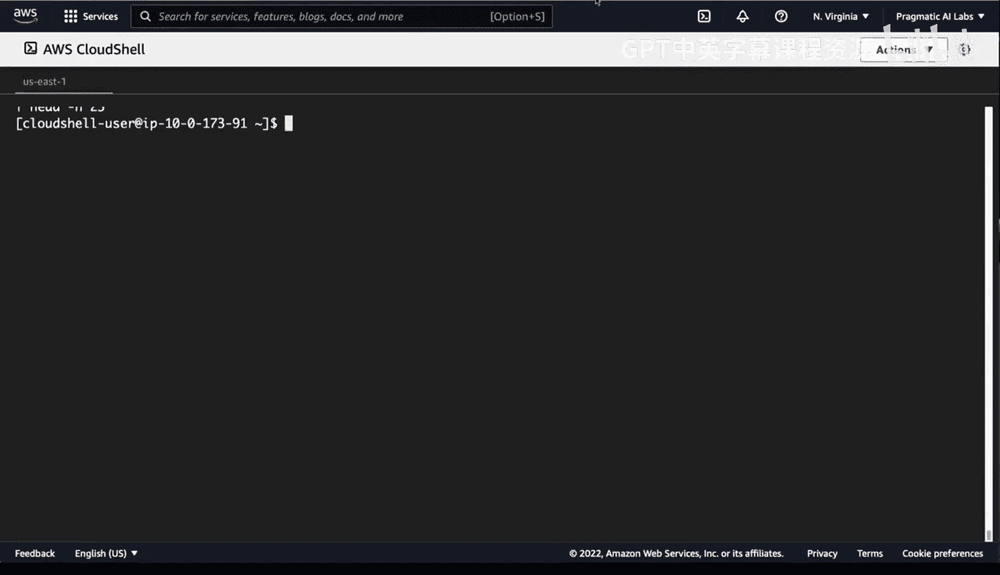

## 构建数据处理管道

为了进行更深入的分析，例如统计哪个实体出现最频繁，我们可以将AWS Comprehend的命令嵌入到Bash管道中。这允许我们进行数据清洗、排序和计数。

以下是一个复杂的管道命令示例，它执行实体提取、清洗文本、排序并统计出现频率最高的实体：

```bash
aws comprehend detect-entities --language-code "en" --text "$TEXT" --output text | \
  awk '{print $2}' | \
  tr '[:upper:]' '[:lower:]' | tr -d '[:punct:]' | sed '/^$/d' | \
  sort | \
  uniq -c | \
  sort -nr | \
  head -10
```

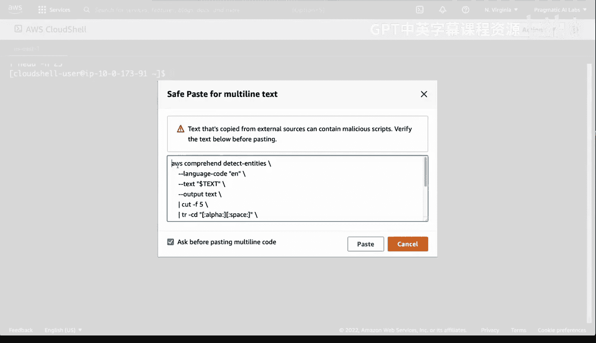

让我们分解这个命令：
1.  **`aws comprehend ...`**: 提取实体并以文本格式输出。
2.  **`awk '{print $2}'`**: 提取输出结果中的第二列（实体名称）。
3.  **`tr '[:upper:]' '[:lower:]'`**: 将所有文本转换为小写，确保“Einstein”和“einstein”被视作同一实体。
4.  **`tr -d '[:punct:]'`**: 删除标点符号。
5.  **`sed '/^$/d'`**: 删除可能存在的空行。
6.  **`sort`**: 对实体名称进行排序，这是 `uniq -c` 工作的前提。
7.  **`uniq -c`**: 统计每个唯一实体出现的次数。
8.  **`sort -nr`**: 按计数降序排序。
9.  **`head -10`**: 只显示出现频率最高的前10个实体。

运行此命令后，你会得到一个列表，显示在关于爱因斯坦的文章中，如“einstein”、“university”、“german”等实体出现的频率最高。这种快速洞察对于数据探索和原型设计非常有用。

---

## 总结

本节课中，我们一起学习了如何在AWS CloudShell中利用命令行快速原型化AI应用。

我们首先介绍了如何使用 `aws comprehend` 进行基础的文本情感分析。接着，为了解决分析外部数据的需求，我们引入了 `links` 工具来抓取网页文本，并学会了使用 `head` 命令和变量来处理文本长度限制。最后，我们构建了一个复杂的数据处理管道，将实体提取、文本清洗、排序和频率统计串联起来，实现了快速的数据洞察。

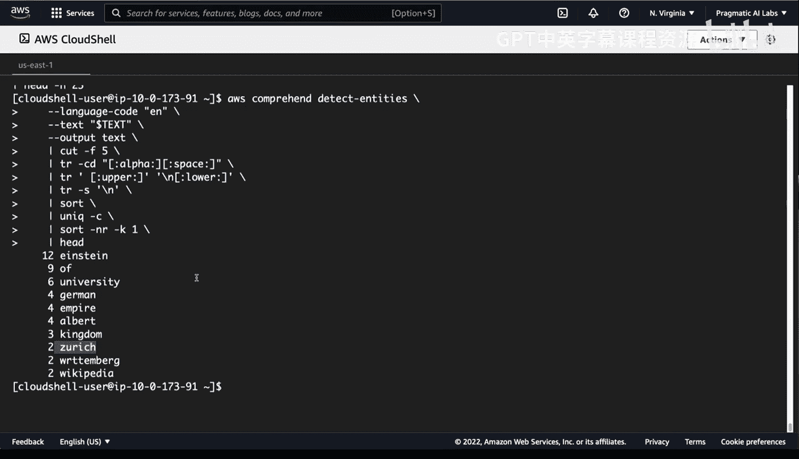

通过这种方法，你无需立即编写Python、C#或R语言代码，就能在CloudShell中快速测试AI API的功能并验证想法，极大地加速了数据科学和AI应用的原型开发过程。