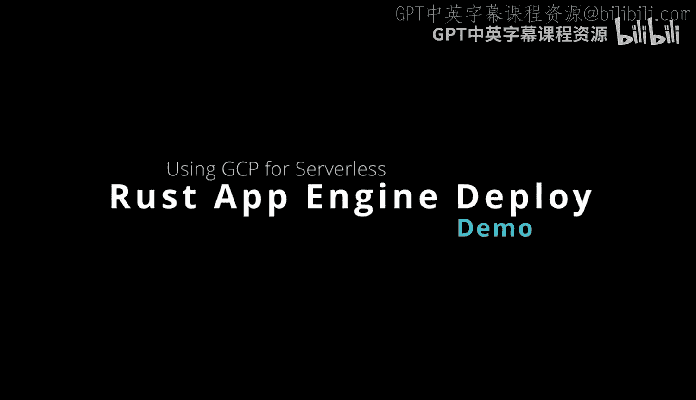
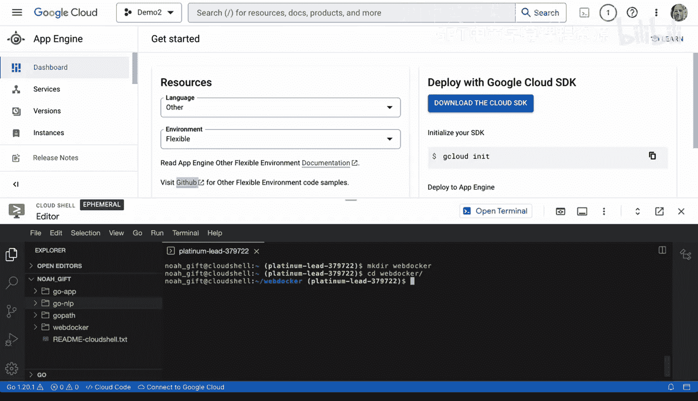
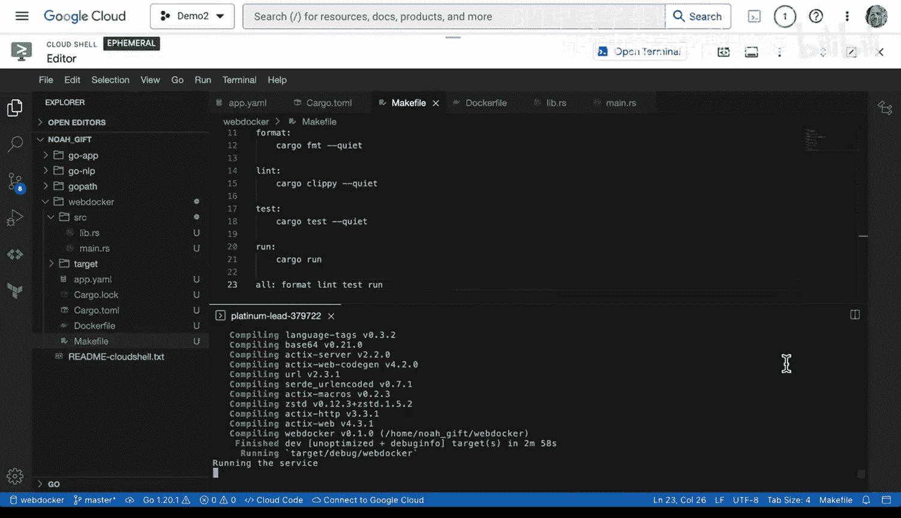
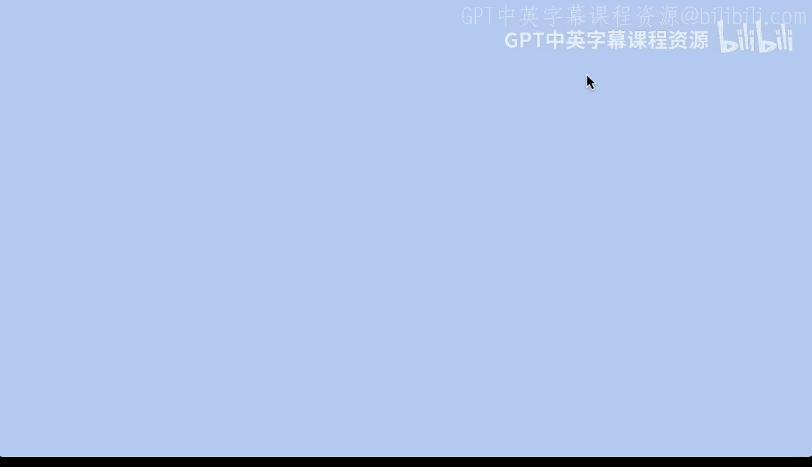
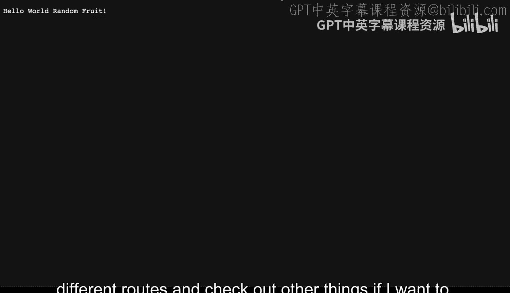
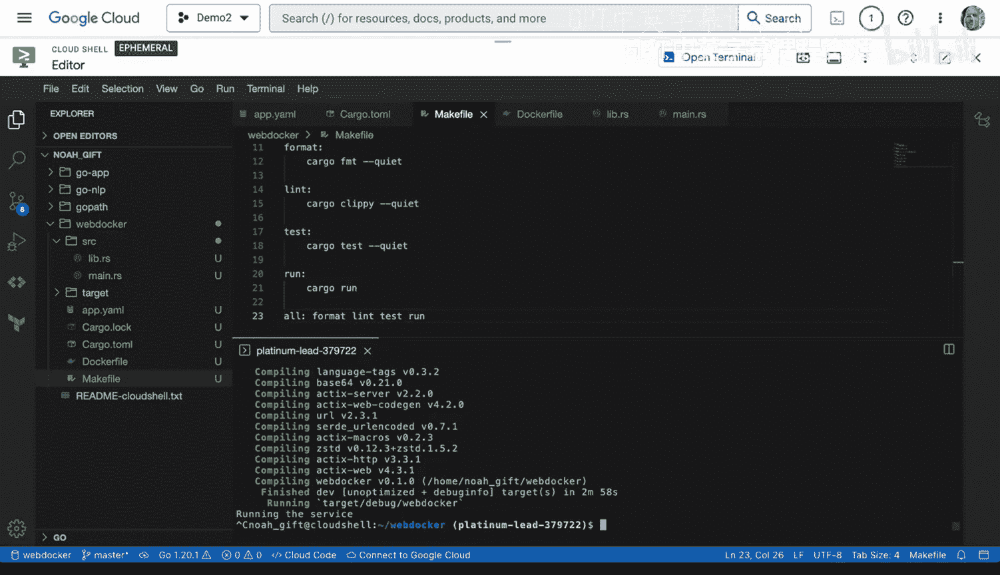
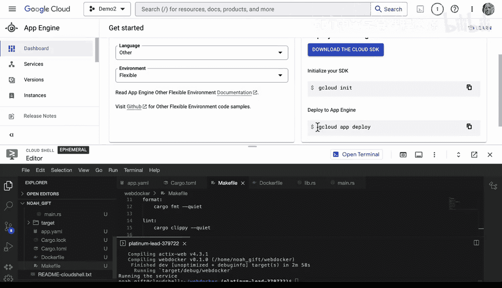
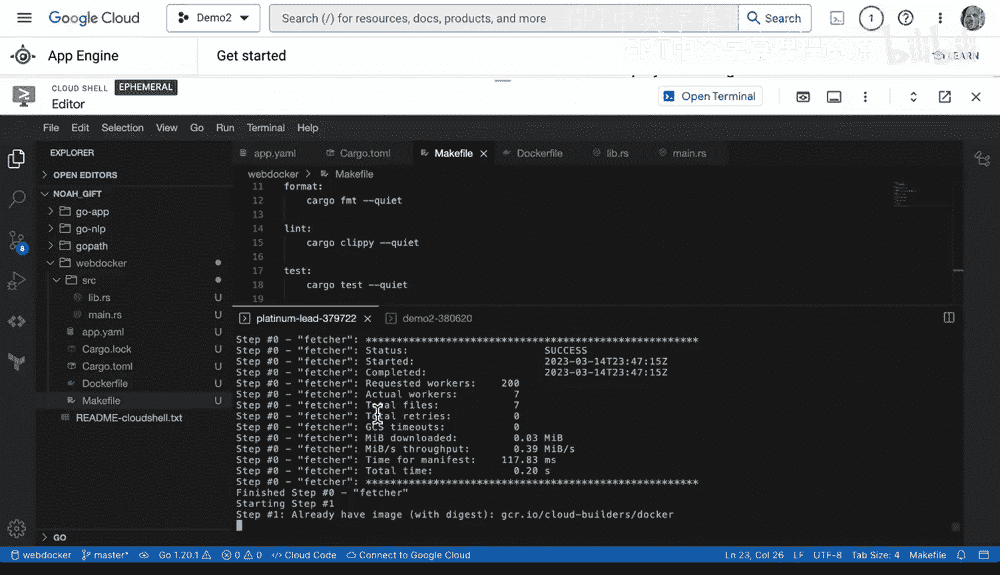
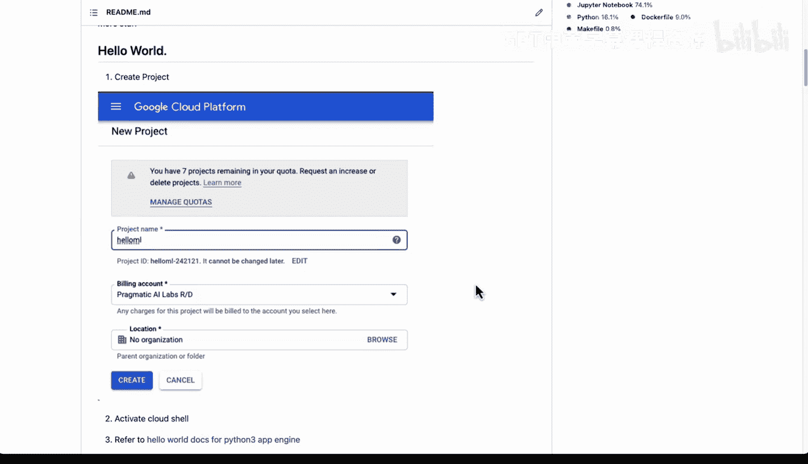

# 066：GCP App Engine Rust部署演示 🚀



在本教程中，我们将学习如何将一个用Rust编写的微服务部署到Google Cloud Platform的App Engine上。我们将从创建项目开始，逐步配置并最终完成部署。

---

## 概述

我们将创建一个简单的Rust Web服务，并将其部署到GCP App Engine的灵活环境中。整个过程包括：创建项目结构、编写配置文件、构建Docker镜像，以及使用GCP命令行工具进行部署。

---

## 创建项目目录与配置文件

首先，我们需要创建一个项目目录，并进入该目录。



```bash
mkdir web_docker
cd web_docker
```

接下来，创建App Engine的配置文件 `app.yaml`。这个文件用于告知App Engine我们的应用配置。

```yaml
runtime: custom
env: flex
```

## 初始化Rust项目

现在，我们需要初始化一个Rust项目。使用Cargo工具来创建项目文件。

```bash
cargo init --name web_docker
```

此命令会生成 `Cargo.toml` 文件。接下来，我们需要添加项目依赖。以下是 `Cargo.toml` 文件中需要包含的依赖项示例：

```toml
[dependencies]
actix-web = "4"
serde = { version = "1", features = ["derive"] }
rand = "0.8"
```

## 创建Dockerfile

为了在App Engine的灵活环境中运行，我们需要一个Dockerfile来定义容器。创建一个 `Dockerfile` 文件。

```dockerfile
FROM rust:1.68 as builder
WORKDIR /usr/src/app
COPY . .
RUN cargo build --release

FROM debian:buster-slim
COPY --from=builder /usr/src/app/target/release/web_docker /usr/local/bin/web_docker
CMD ["web_docker"]
```

这个Dockerfile使用多阶段构建，首先在Rust环境中编译应用，然后将编译好的二进制文件复制到一个轻量级的Debian镜像中。

## 编写应用代码

现在，我们来编写Rust应用的源代码。首先，创建 `src/lib.rs` 文件，用于定义一些辅助函数。

```rust
use rand::Rng;

pub fn generate_random_fruit() -> String {
    let fruits = vec!["Apple", "Banana", "Cherry", "Date", "Elderberry"];
    let mut rng = rand::thread_rng();
    fruits[rng.gen_range(0..fruits.len())].to_string()
}
```

接着，创建 `src/main.rs` 文件，用于定义Web服务的路由。

```rust
use actix_web::{web, App, HttpResponse, HttpServer, Responder};
use web_docker::generate_random_fruit;

async fn health_check() -> impl Responder {
    HttpResponse::Ok().body("OK")
}

async fn version() -> impl Responder {
    HttpResponse::Ok().body("v1.0.0")
}

async fn random_fruit() -> impl Responder {
    let fruit = generate_random_fruit();
    HttpResponse::Ok().body(format!("Welcome random fruit: {}", fruit))
}

#[actix_web::main]
async fn main() -> std::io::Result<()> {
    HttpServer::new(|| {
        App::new()
            .route("/health", web::get().to(health_check))
            .route("/version", web::get().to(version))
            .route("/", web::get().to(random_fruit))
    })
    .bind("0.0.0.0:8080")?
    .run()
    .await
}
```

## 添加Makefile（可选）

为了简化构建和部署流程，可以添加一个 `Makefile`。这个文件可以帮助我们记录和管理各种操作命令。





```makefile
.PHONY: run build deploy clean

run:
	cargo run

build:
	cargo build --release

deploy:
	gcloud app deploy

clean:
	rm -rf target
```





## 本地测试应用



在部署之前，我们需要在本地测试应用是否能够正常运行。使用以下命令启动应用：

```bash
cargo run
```

应用启动后，可以通过浏览器访问 `http://localhost:8080` 来验证服务是否正常工作。如果看到“Welcome random fruit: [水果名]”的响应，说明应用运行成功。

## 部署到GCP App Engine

在部署之前，建议删除 `target` 目录，以避免将不必要的构建文件上传。

```bash
rm -rf target
```

接着，设置GCP构建超时时间，因为Rust编译可能需要较长时间。



```bash
gcloud config set app/cloud_build_timeout 1600
```

最后，使用以下命令将应用部署到App Engine：

```bash
gcloud app deploy
```

部署过程可能需要一些时间。一旦完成，应用就会在GCP上运行。

## 探索其他语言部署

App Engine支持多种编程语言。例如，如果你想使用Python，可以选择官方的Python 3.7运行时。你还可以通过添加 `cloudbuild.yaml` 文件来实现自动部署。App Engine提供了一个非常灵活的环境，可以轻松地在Rust、Python、Go等语言之间切换。

---



## 总结


在本教程中，我们学习了如何将一个Rust微服务部署到GCP App Engine。我们从创建项目目录和配置文件开始，然后初始化Rust项目并编写应用代码。接着，我们创建了Dockerfile来定义容器，并在本地测试了应用。最后，我们使用GCP命令行工具将应用部署到生产环境。通过这个过程，你可以看到GCP App Engine为不同语言提供了灵活的部署选项。