# 067：容器化Rust Actix微服务部署到AWS 🚀


## 概述
在本教程中，我们将学习如何将一个使用Actix-web框架编写的Rust微服务进行容器化，并最终部署到AWS App Runner服务上。我们将涵盖项目结构、Docker镜像构建以及AWS部署的完整流程。

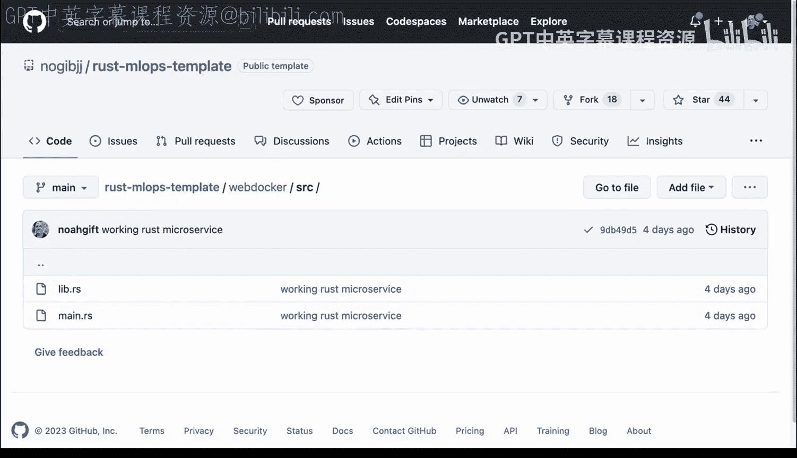

## 项目结构概览
首先，我们来看一个典型的容器化Actix微服务项目结构。这个结构与我参与的许多项目类似。

以下是项目的主要文件：
*   `Makefile`
*   `Dockerfile`
*   `Cargo.toml`
*   `lib.rs`
*   `main.rs`

接下来，让我们深入分析每个部分。

## 深入代码分析
上一节我们概述了项目结构，本节中我们来看看具体的代码实现。

### Dockerfile配置
`Dockerfile` 使用Rust作为构建器环境。这种方法的好处是能够利用所有必要的开发资源进行构建，然后将最终产物推入一个新的、更精简的容器中。这是一种构建非常小巧容器镜像的优雅方式。

构建完成后，新容器会暴露8080端口，并设置一个名为 `web_docker` 的入口点。

**Dockerfile 关键部分示例：**
```dockerfile
FROM rust:latest as builder
# ... 构建步骤 ...
FROM debian:buster-slim
# ... 复制二进制文件 ...
EXPOSE 8080
ENTRYPOINT [“./web_docker”]
```

### 依赖与库文件
`Cargo.toml` 文件包含了项目依赖，例如 `rand` 和 `actix-web`。

`lib.rs` 文件中的逻辑相对简单。它定义了一个公开函数，用于随机返回一种水果。因为是公开函数，所以可以在 `main.rs` 中被调用。

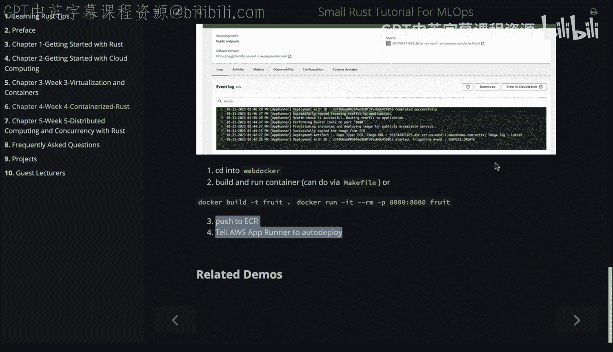

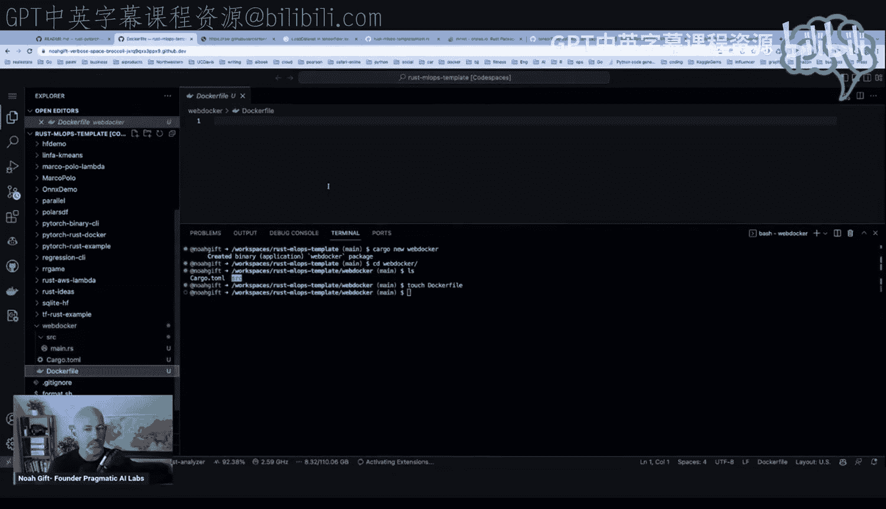


**lib.rs 示例：**
```rust
pub fn random_fruit() -> String {
    let fruits = vec![“apple”, “banana”, “cherry”, “date”, “elderberry”];
    // ... 随机选择并返回水果 ...
}
```

### 主程序入口
`main.rs` 文件的结构类似于Flask或FastAPI应用。它导入依赖项，调用库函数，并设置各个API端点。

以下是定义的端点：
*   `/`：根路径
*   `/fruit`：获取随机水果
*   `/health`：健康检查
*   `/version`：版本信息

在 `main` 函数中，我们注册了所有这些服务。整个过程非常直观。

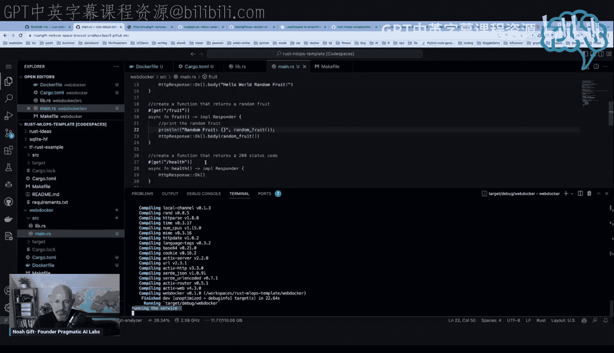

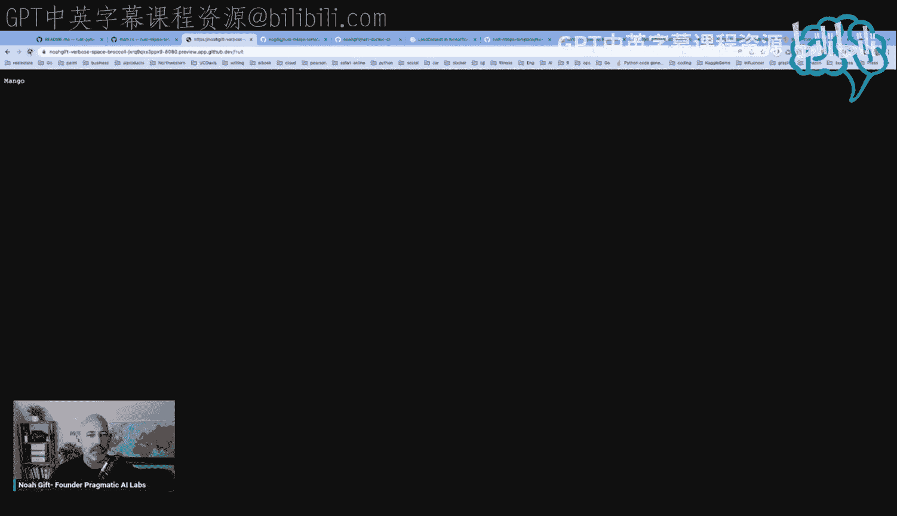

**main.rs 路由设置示例：**
```rust
#[get(“/fruit”)]
async fn get_fruit() -> impl Responder {
    HttpResponse::Ok().json(serde_json::json!({“fruit”: random_fruit()}))
}
```

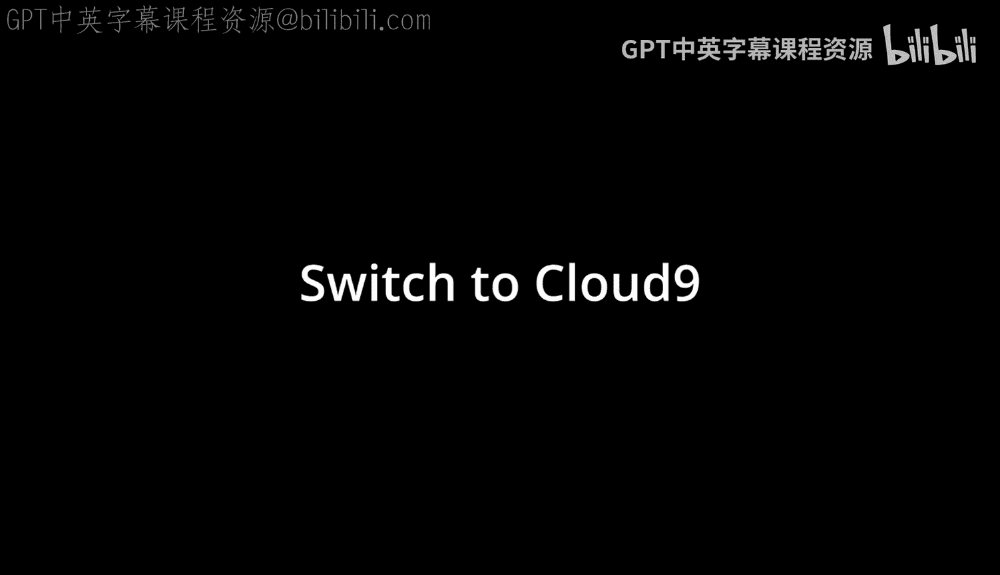

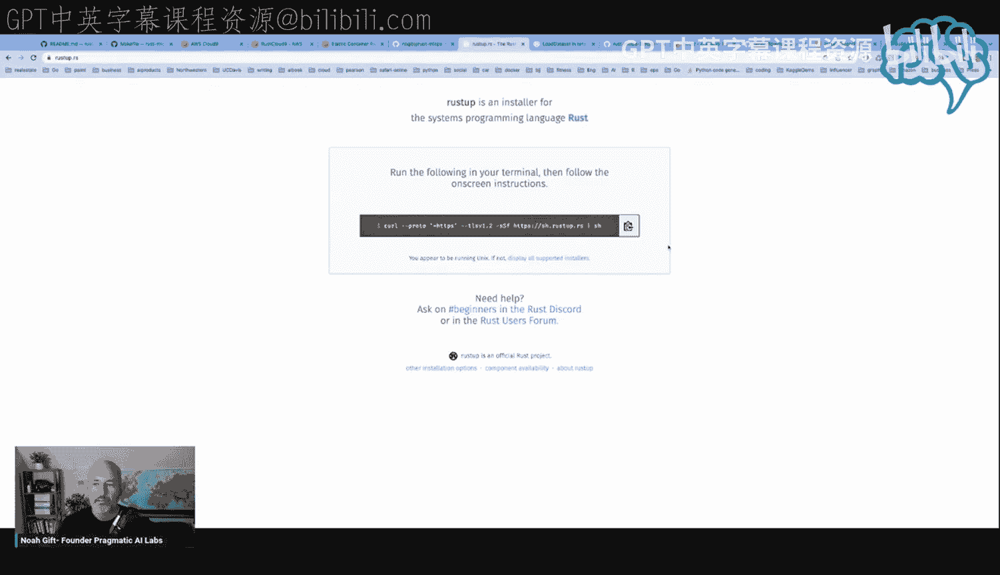

## 本地构建与运行
了解了代码结构后，我们来看看如何在本地构建和运行这个服务。

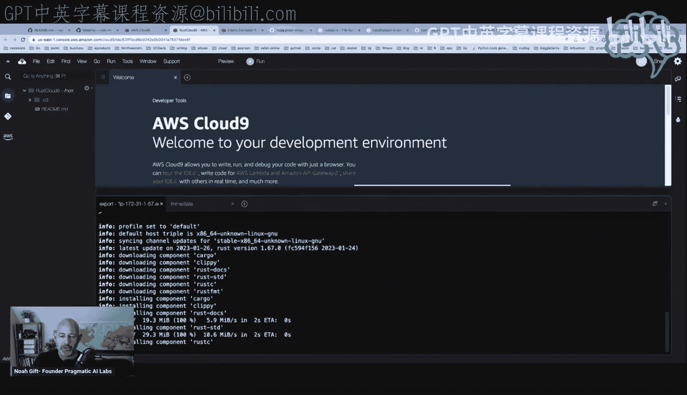

使用项目中的 `Makefile` 或直接运行Docker命令，可以轻松完成构建。

以下是构建和运行的步骤：
1.  运行 `make format` 命令来编译和启动服务。
2.  编译过程会在标准输出显示信息。
3.  服务启动后，可以在浏览器中预览。

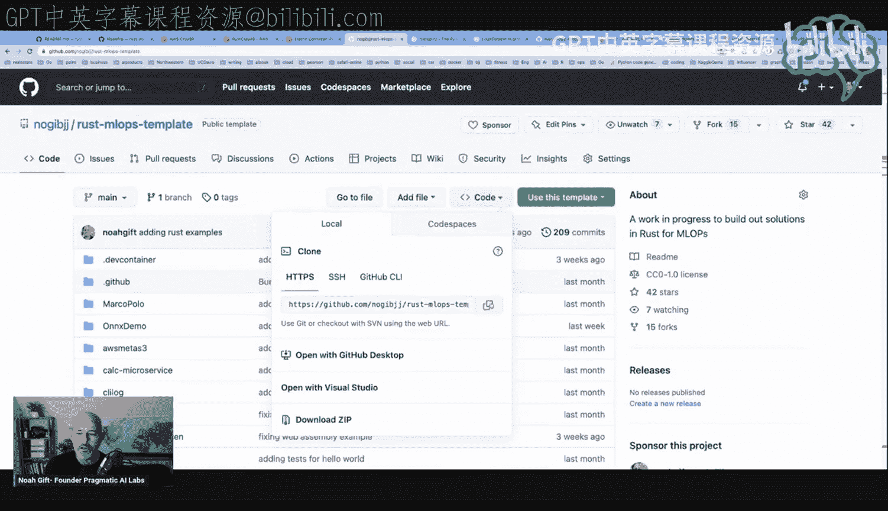

打开浏览器访问相应地址，可以看到根路径的欢迎信息。访问 `/fruit` 端点，每次刷新都会返回一个随机的水果名称，例如“apple”、“pineapple”、“grapes”等。同时，控制台也会打印出这些信息。

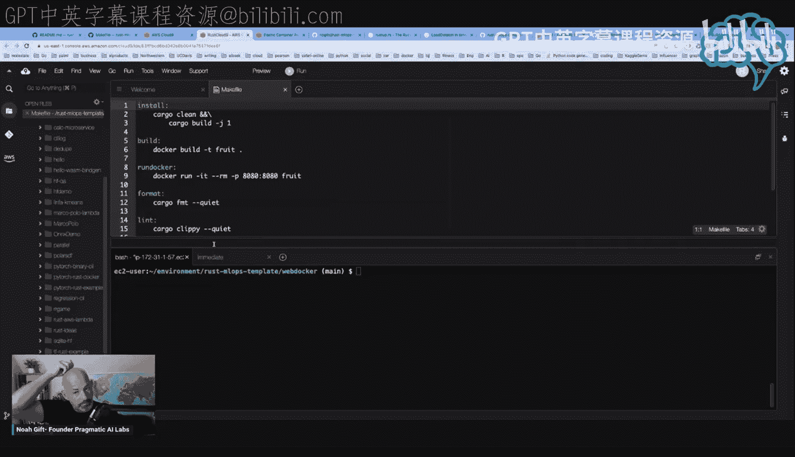

这展示了Rust和Actix-web的高效与简洁。

## 在Cloud9环境中构建
为了演示云上构建，我们将在AWS Cloud9环境中重复这一过程。

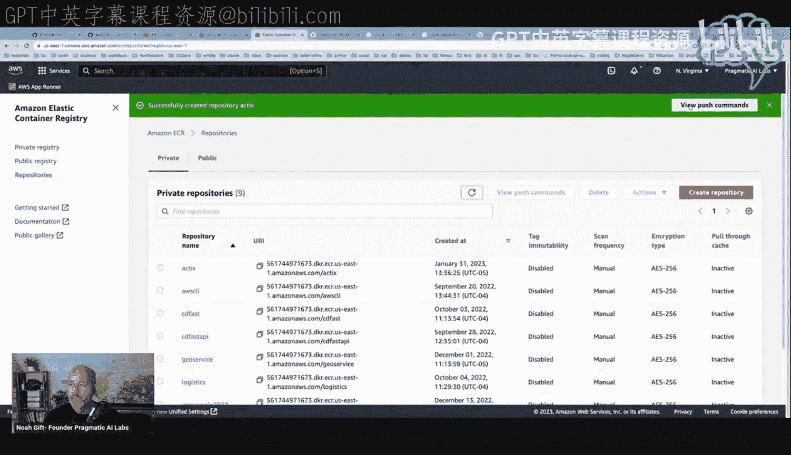

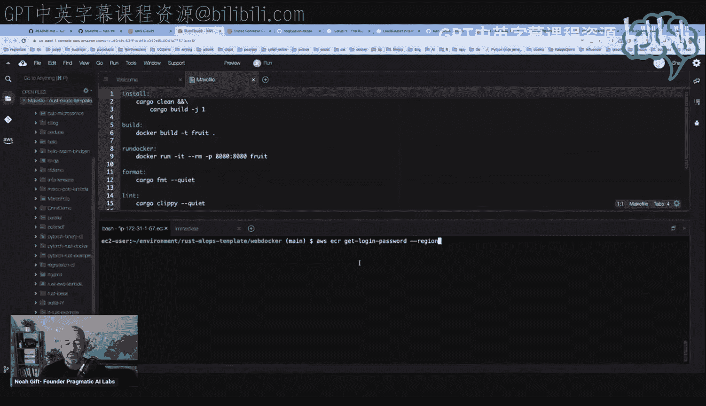

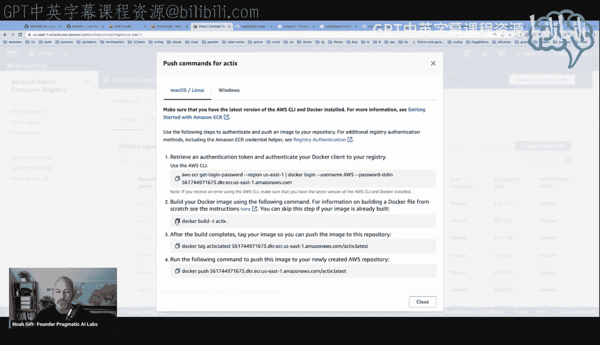

首先，需要克隆项目仓库。我们使用HTTPS方式克隆，因为这里只需要构建容器，无需推送代码。

环境准备步骤如下：
1.  设置相关环境变量。
2.  配置Cargo环境。
3.  进入项目目录 `web_docker`。

在 `web_docker` 目录中，我们可以参考 `Makefile`，或直接使用为AWS Elastic Container Registry (ECR) 调整后的Docker命令进行构建和标记。

执行 `docker build -t actix-service .` 命令。这个过程会花费一些时间，它展示了在云开发环境中构建Rust容器镜像的流程。

## 部署到AWS App Runner
镜像构建完成后，就可以进行部署了。Rust生成的容器镜像体积非常小，通常不到100MB，这使得部署变得非常轻量和快速。

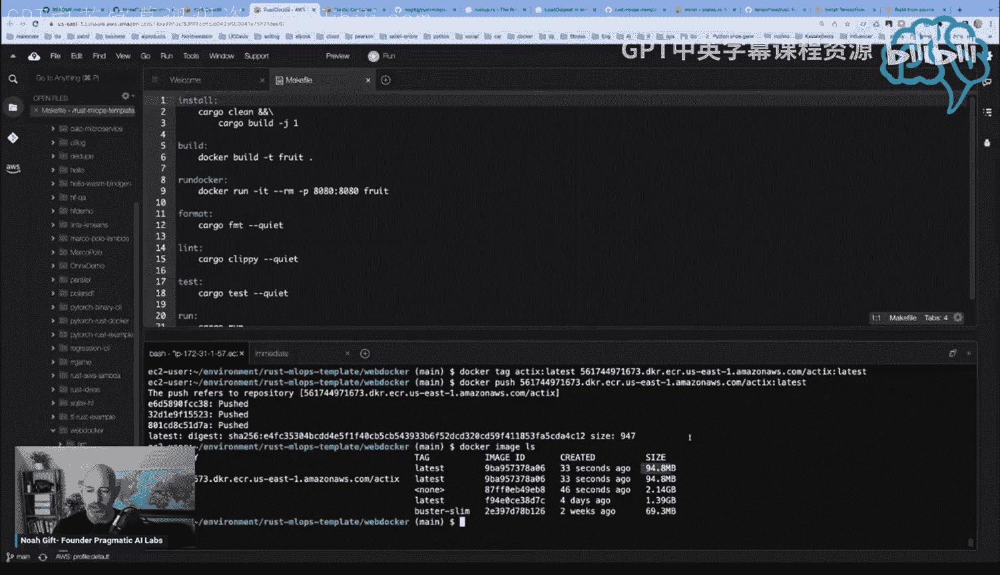

部署到AWS App Runner的步骤如下：
1.  在AWS控制台进入App Runner服务。
2.  选择“创建服务”，然后选择“容器注册表”。
3.  选择我们刚刚构建并推送到ECR的镜像（例如 `actix-service`）。
4.  选择手动部署（后续可以配置为自动部署，即每次推送新镜像到ECR时自动更新服务）。
5.  为服务命名（例如 `rust-actix-demo`）。
6.  完成配置并创建服务。

App Runner会自动处理负载均衡、扩缩容等运维工作。部署完成后，我们会获得一个可访问的服务URL。

## 验证部署结果
部署成功后，我们可以验证服务是否正常运行。

通过访问App Runner提供的服务端点：
*   访问根路径 `/`，会看到定义的欢迎消息。
*   访问 `/fruit` 端点，会返回随机的JSON格式水果数据。
*   访问 `/health` 端点，会返回健康检查状态。

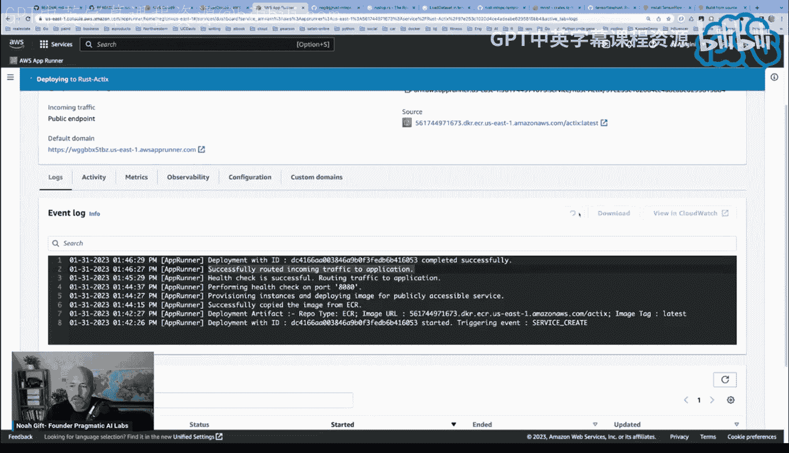

这证明我们的Rust Actix微服务已经成功容器化并运行在AWS云上。其高性能和小体积镜像的优势在此得以充分体现。

## 总结
本节课中我们一起学习了将一个Rust Actix-web微服务容器化并部署到AWS App Runner的完整流程。

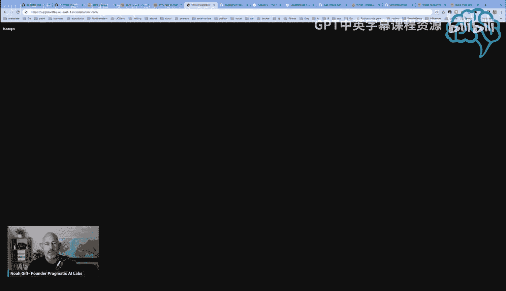

我们首先分析了项目结构，然后解读了`Dockerfile`和Rust源代码。接着，我们在本地和Cloud9环境中完成了镜像构建。最后，我们将镜像推送到AWS ECR，并通过App Runner服务成功部署，验证了所有功能。

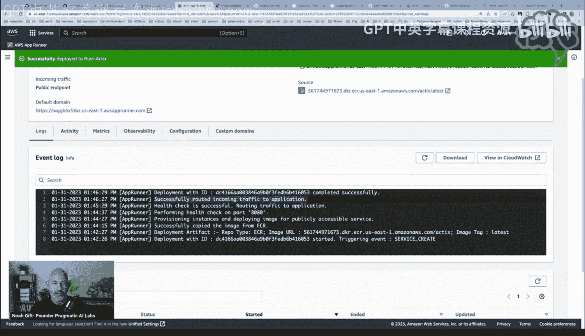

这个过程展示了使用Rust构建云原生微服务的巨大优势：极高的性能、极小的资源占用以及简洁的部署体验。Actix-web框架使得编写高效的Web服务变得非常简单。