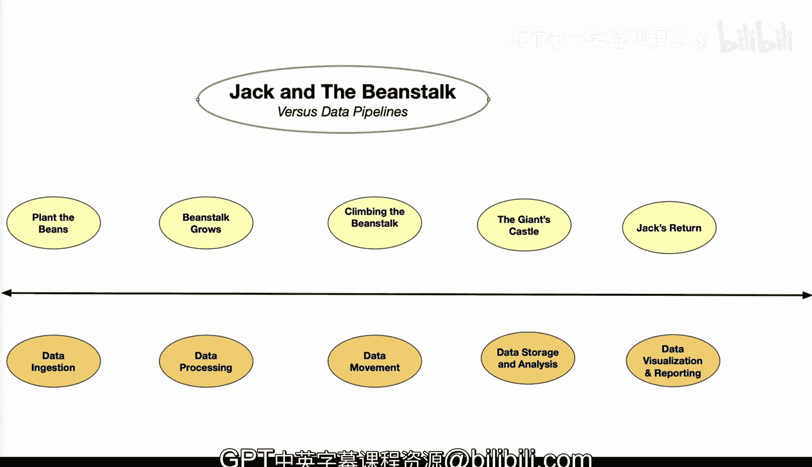

# 068：杰克与魔豆数据管道 🧙‍♂️🌱

在本节课中，我们将通过童话故事《杰克与魔豆》的类比，来学习构建数据管道的基本概念和步骤。我们将把故事中的每个关键情节，对应到数据工程中的具体环节，帮助你直观地理解数据从原始状态到产生价值的完整旅程。

---

## 故事回顾 📖

从前，在一个小村庄里，住着一个名叫杰克的男孩。杰克的家庭拥有一个农场，但农场已不再高产。他的母亲决定卖掉他们唯一的资产——一头奶牛。在去往当地市场的路上，杰克遇到了一位神秘老人。老人提出用魔法豆子交换奶牛。杰克对这个提议很感兴趣，用奶牛换来了魔法豆子，并跑回了家。他的母亲非常生气，将豆子扔出窗外，并让杰克饿着肚子去睡觉。但令杰克惊讶的是，一夜之间，豆子发芽长成了一棵巨大的、直达云端的豆茎。

---

## 类比数据管道 🔄

现在，让我们将这个故事与数据管道进行比较。

上一节我们回顾了杰克的故事，本节中我们来看看如何将这个故事映射到数据工程的各个阶段。

### 播种豆子 🌱

这类似于**数据摄取**。就像魔法豆子被播种到土壤中一样，数据摄取是将数据导入、传输、加载和处理，以供后续在存储或数据库中使用。杰克播种豆子的行为就类似于这个过程。

**核心概念**：`数据摄取 = 导入(数据源) + 传输(网络) + 加载(存储)`

### 豆茎生长 🌳

这对应着**数据处理**。随着豆子长成巨大的豆茎，数据也需要经历一个转换过程。在数据处理中，原始数据被清洗、验证、聚合和汇总，以提供有意义且高质量的数据。

以下是数据处理的关键步骤：
*   **清洗**：修正错误、处理缺失值。
*   **验证**：确保数据符合预定义的规则和格式。
*   **聚合**：将多个数据点合并为摘要信息。
*   **汇总**：生成统计摘要或报告。

### 攀爬豆茎 🧗

这象征着**数据移动**。杰克攀爬豆茎的冒险类似于数据移动。它涉及将数据从一个位置、状态或格式传输到另一个。在管道中，这可能涉及将数据从一个存储平台移动到另一个，或从云端移动到边缘设备。

**核心概念**：`数据移动：源位置/格式 -> 目标位置/格式`

### 巨人城堡 🏰

这代表**数据存储与分析**。云端的巨人城堡里藏有宝藏，这类似于数据本身——你需要存储、管理、分析数据并寻找洞察，就像杰克发现巨人的宝藏一样有用。

### 杰克归来 🏡

最后一步是杰克的归来，这对应**数据可视化与报告**。最终，杰克胜利地带着宝藏返回村庄，这象征着数据可视化和报告。因为你能够获得反馈，并将其以可用的形式呈现，从而做出数据驱动的决策。这很像杰克与母亲分享财富并改善他们的生活。

---

## 总结 📝

本节课中，我们一起学习了如何通过《杰克与魔豆》的故事来理解数据管道。就像杰克与魔豆的冒险一样，数据管道是数据的一段激动人心的旅程。它获取原始数据，对其进行转换，并将其转化为有价值的洞察，从而丰富企业或组织的决策过程。在一个数据驱动的世界里，他们从此过上了幸福的生活。