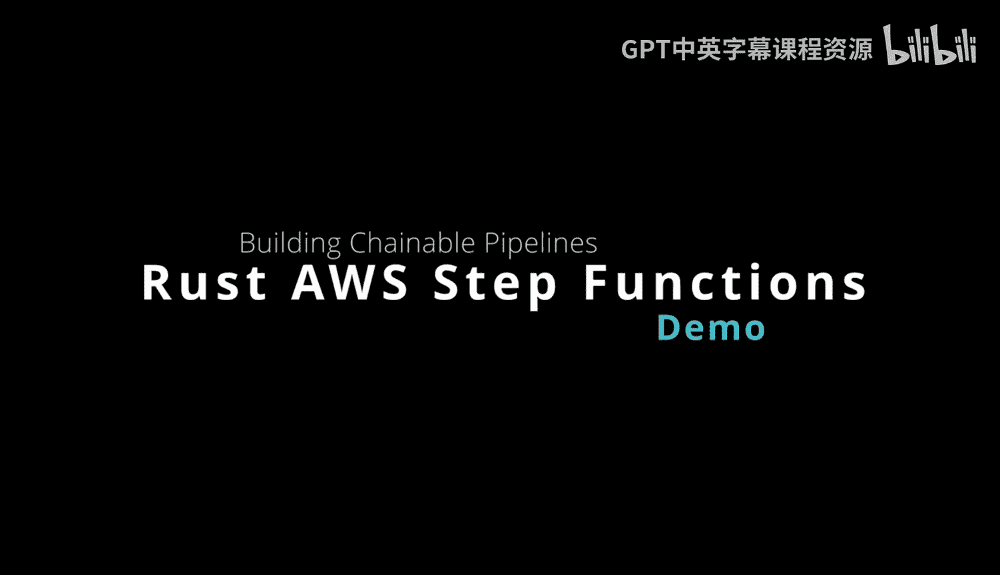
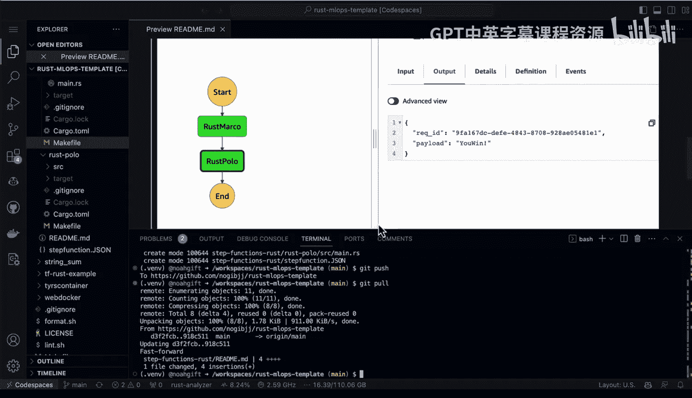
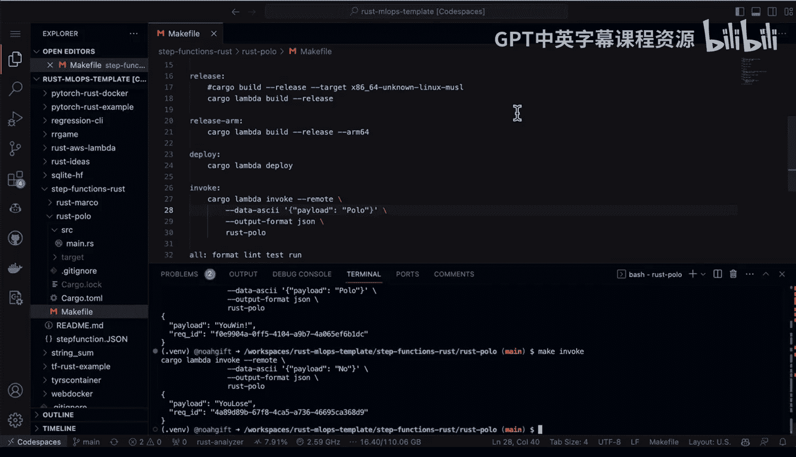
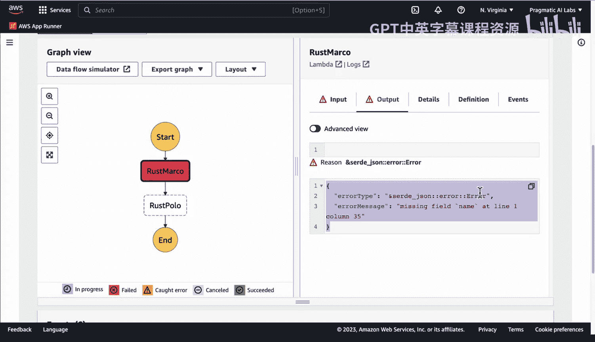

# 071： 使用 Rust 构建 AWS Step Functions 管道 🚀



在本节课中，我们将学习如何使用 Rust 语言来构建 AWS Step Functions 无服务器工作流。我们将创建两个简单的 Lambda 函数，并将它们串联成一个工作流，体验 Step Functions 强大的编排和调试能力。

## 概述

AWS Step Functions 是一种用于编排无服务器工作流的强大服务。它允许你将多个操作（如 Lambda 函数）链接在一起，将一个函数的输出作为另一个函数的输入。其可视化界面使得创建工作流就像搭积木一样简单直观，并且提供了出色的执行过程追踪和调试功能。我们将使用 Rust 和 `cargo-lambda` 工具来实现这一切。



## 创建第一个 Lambda 函数（Rust Marco）

首先，我们需要创建工作流中的第一个 Lambda 函数。我们将使用 `cargo-lambda` 这个优秀的库来快速搭建项目。

以下是创建和配置 `rust-marco` 函数的步骤：

1.  **创建项目**：使用 `cargo lambda new rust-marco` 命令创建一个新的 Lambda 项目。
2.  **编写函数逻辑**：在 `src/main.rs` 中，我们定义处理程序。函数接收一个包含 `name` 字段的 JSON 输入。
3.  **核心逻辑**：检查输入的 `name` 值。如果它是 “Marco”，则返回 `{“body”: “polo”}`；否则，返回 `{“body”: “nobody”}`。
4.  **添加追踪**：集成 `tracing` 库以便在 AWS 控制台中进行调试。
5.  **构建与部署**：使用 `make release` 和 `make deploy` 命令（或直接使用 `cargo lambda` 命令）来构建和部署函数。

让我们看看核心的处理函数代码：

```rust
async fn function_handler(event: LambdaEvent<Value>) -> Result<Value, Error> {
    let (event, _context) = event.into_parts();
    let name = event["name"].as_str().unwrap_or("");

    // 核心逻辑：判断并生成响应体
    let body = if name == "Marco" { "polo" } else { "nobody" };

    tracing::info!("Processed name: {}, returning body: {}", name, body);

    let resp = json!({ "body": body });
    Ok(resp)
}
```

## 创建第二个 Lambda 函数（Rust Polo）

接下来，我们创建工作流中的第二个 Lambda 函数 `rust-polo`。它将接收第一个函数的输出作为输入。

以下是 `rust-polo` 函数的关键点：

1.  **项目创建**：同样使用 `cargo lambda new rust-polo` 创建。
2.  **函数逻辑**：这个函数期望一个包含 `body` 字段的 JSON 输入（来自 `rust-marco` 的输出）。
3.  **核心逻辑**：检查 `body` 字段的值。如果它是 “polo”，则返回 `{“result”: “you win”}`；否则，返回 `{“result”: “you lose”}`。

其处理函数的核心代码如下：

```rust
async fn function_handler(event: LambdaEvent<Value>) -> Result<Value, Error> {
    let (event, _context) = event.into_parts();
    let body = event["body"].as_str().unwrap_or("");

    // 核心逻辑：根据收到的 body 判断输赢
    let result = if body.contains("polo") { "you win" } else { "you lose" };

    tracing::info!("Received body: {}, result: {}", body, result);

    let resp = json!({ "result": result });
    Ok(resp)
}
```

## 在 AWS 控制台中组装 Step Functions 工作流

现在，我们已经有了两个可以独立运行的 Lambda 函数。接下来，我们将在 AWS 管理控制台中，像搭积木一样将它们组合成一个工作流。

上一节我们创建了两个 Rust Lambda 函数，本节中我们来看看如何在 AWS 控制台中将它们连接起来。

以下是创建 Step Functions 状态机的步骤：

1.  在 AWS Step Functions 控制台点击“创建状态机”。
2.  在可视化设计器中，从左侧拖拽一个 **Lambda 调用** 任务到画布中。
3.  配置该任务，选择我们部署好的 `rust-marco` 函数。
4.  从第一个任务右侧拉出一条线，再拖拽第二个 **Lambda 调用** 任务。
5.  配置第二个任务，选择我们部署好的 `rust-polo` 函数。
6.  保存并命名状态机（例如 `rust-marco-polo-chain`）。

至此，一个简单的工作流就创建完成了。第一个任务的输出会自动成为第二个任务的输入。



## 执行与调试工作流

工作流创建好后，我们可以立即执行它并观察其运行过程。

以下是执行和查看工作流详情的方法：

1.  在状态机页面，点击“开始执行”。
2.  在输入框中，提供初始 JSON 数据，例如：`{“name”: “Marco”}`。
3.  点击“开始执行”后，你可以实时看到执行流程。
4.  点击每个执行步骤，可以展开查看该步骤的 **输入**、**输出** 以及任何 **错误信息**。

例如，当输入为 `{“name”: “Marco”}` 时，执行路径将是：
*   `rust-marco` 接收 `{“name”: “Marco”}`，输出 `{“body”: “polo”}`。
*   `rust-polo` 接收 `{“body”: “polo”}`，输出 `{“result”: “you win”}`。

如果输入是 `{“name”: “Other”}`，路径将是：
*   `rust-marco` 输出 `{“body”: “nobody”}`。
*   `rust-polo` 输出 `{“result”: “you lose”}`。

这种可视化的执行历史对于理解数据流和调试复杂工作流至关重要。

## 总结



本节课中我们一起学习了如何使用 Rust 构建 AWS Step Functions 无服务器工作流。我们首先使用 `cargo-lambda` 工具创建并部署了两个简单的 Lambda 函数。然后，我们在 AWS 控制台中通过拖拽的方式，将这两个函数连接成了一个可执行的工作流。最后，我们执行了该工作流，并利用 Step Functions 提供的可视化工具观察了数据的传递过程和调试信息。这种方法使得构建可维护、可调试的分布式应用变得异常简单和高效。