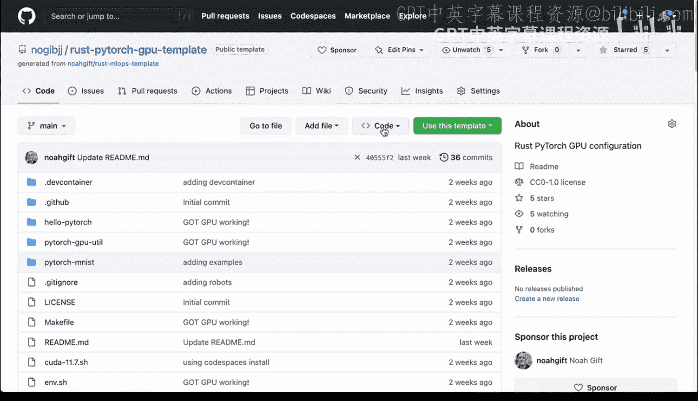
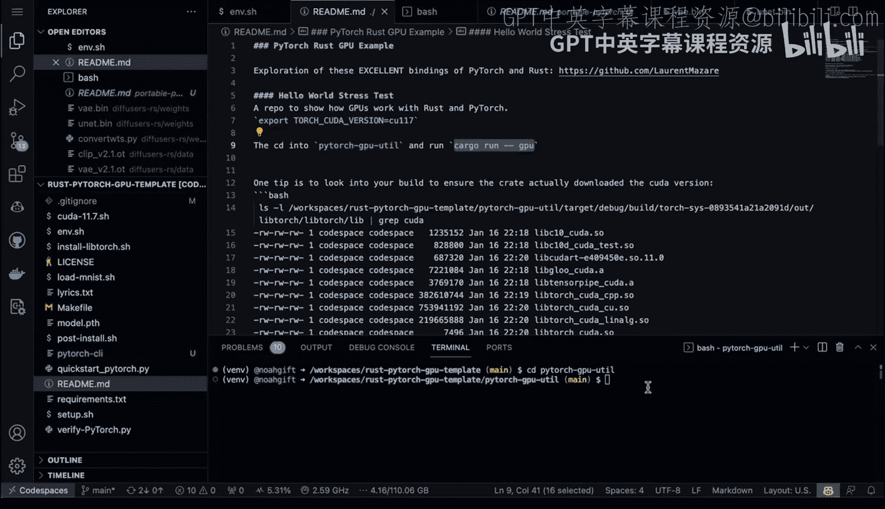
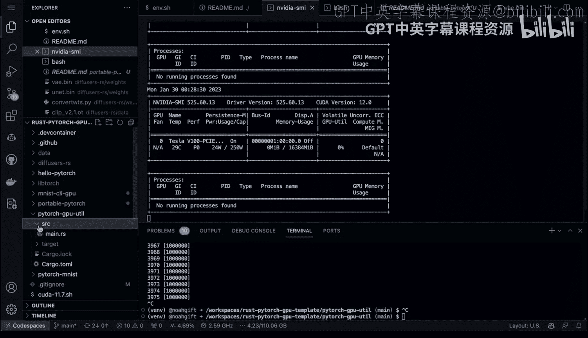
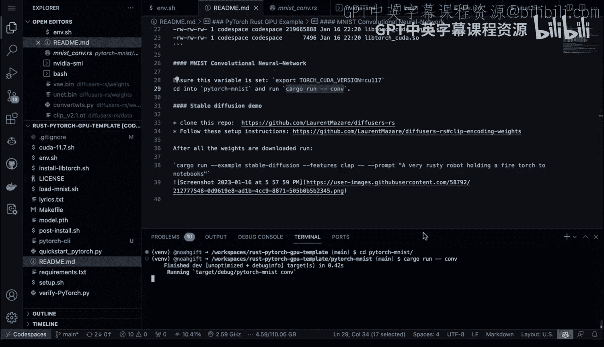
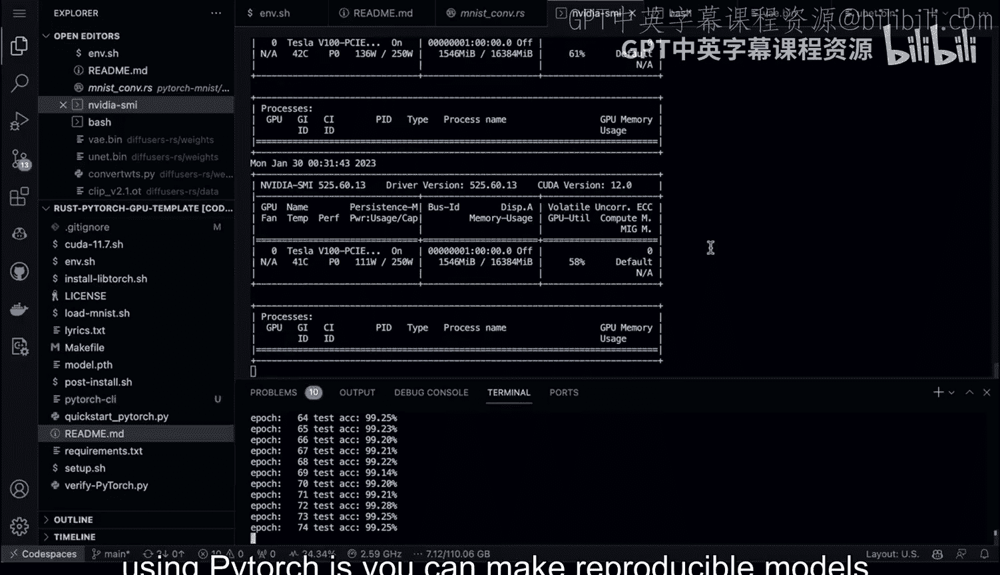
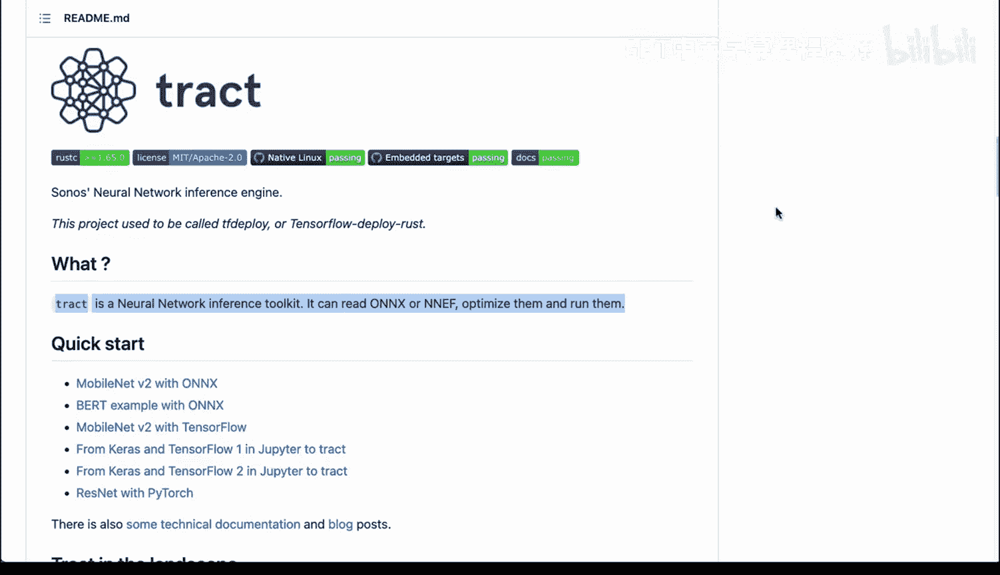

# 076：Rust GPU与Hugging Face翻译器实战 🚀

在本节课中，我们将学习如何在Rust中使用PyTorch进行模型训练，并利用GPU加速推理过程。我们还将探讨Firecracker这一由Rust编写的、支撑AWS Lambda的服务器技术，以证明Rust在生产环境中的强大能力。

---

## 关于Rust实用性的探讨

我经常听到关于使用Rust的一种犹豫：它是一种较新的语言（尽管自2010年就已存在），人们担心它能否用于真实世界。

首先，我将引导你了解如何使用PyTorch训练模型，并通过Rust的PyTorch绑定在GPU上调用它们。其次，我将简要介绍Firecracker。Firecracker是什么？它是一项由AWS编写的、为AWS Lambda提供支持的服务器技术。可以想象，世界上最大规模的服务器端执行环境就在AWS上，他们是云计算领域的巨头。事实上，他们最受欢迎的服务之一AWS Lambda就是用Rust编写的。我认为这足以打消“Rust不能用于生产环境”的想法，这完全是无稽之谈。我还将向你展示，如果你要构建PyTorch应用，为何应重点考虑使用能够像AWS Lambda一样扩展到数百万并发请求的技术，并采用Rust这样的技术。

---

## 深入Firecracker

现在，让我们深入了解Firecracker。这里我打开了一篇AWS博客文章，其中最初在2018年宣布了Firecracker——一种用于无服务器计算的轻量级虚拟化技术。

你可以看到它带来了一系列巨大的好处：可以在125毫秒内启动一个微虚拟机，它是一个经过实战检验、低开销的开源项目。当AWS用它来支持Lambda这样的服务时，你就知道它的重要性了。

如果查看这里的源代码，我们实际上可以查看Firecracker微虚拟机内正在积极开发的所有生产代码。

查看实际的架构页面，你可以看到这是一个用Rust构建的非常复杂的服务。这个Firecracker可以在一个实例上扩展到数千个多租户微虚拟机。因此，它是构建微虚拟机的一种极其高效的方式。

---

## Rust与PyTorch GPU绑定实战

这项技术显然非常适合推理任务。事实上，因为我们知道PyTorch有Rust绑定，我们可以直接使用这项强大的基于Rust的技术。

让我们进入Rust PyTorch GPU模板。我将再次进入我的代码空间。

接下来，我将向你展示使用PyTorch与GPU是多么简单。浏览这里，我查看了一些不同的项目。我有一个“portable-pytorch”项目，还有一个“pytorch-mnist”项目。

如果查看README，我们可以看看我一直在尝试的一些不同项目。让我们开始吧。我们浏览到这里，打开README。

在最开始的部分，有一个对这些绑定的探索。如果我想进行压力测试，这是一个有趣的例子。

首先，我会`cd`进入这个目录。如果我直接输入`cargo run --gpu`，我也可以在上面打开另一个shell。

然后，我可以执行`nvidia-smi -l 1`，我们将看到这个GPU实际上很快就会达到饱和状态。这确实是观察你能做什么的一种有趣方式。看，我们通过运行这段Rust代码使GPU饱和了。

如果我想查看代码本身，它并不复杂。我们进入`pytorch-gpu`目录，查看`src`文件夹里的源代码。这是一个非常小的函数，只有几行代码。你实际上可以指定GPU目标并进行操作。这段代码主要是复制了原作者的主要代码。

如果我想查看`mnist-cli-gpu`，我们也可以看看。我`cd`进入那个目录。

我们可以进入并运行`mnist-cli-gpu`。这段代码是做什么的？这里有一个库，包含我的原始代码，然后我可以将其拉入一个命令并执行。所以，这里只需要很少量的代码就能让一切运行起来。

---

## 训练模型示例

我认为另一个有趣的例子是实际训练模型的能力。让我们进入`pytorch-mnist`目录。

我向上导航，进入`pytorch-mnist`。同样，我们可以查看源代码，看看它并不复杂。

我们进入`pytorch-mnist`并查看这里的源代码。这里有多个文件，但重要的是这里的卷积神经网络文件。

你可以看到，这里导入了那些绑定，设置了结构来进行几次不同的迭代，最后这部分是我实际构建神经网络的地方，然后我运行我的代码。所以，它和查看Python代码没有太大不同。

如果我们想运行并复现它，只需要运行这个命令。如果我们运行并训练它，它将执行那个卷积神经网络训练任务。

然后，我们应该能够看到GPU在此过程中被使用。看，它被击中了一点。它应该很快就会活跃起来。好了，开始了。

我们看到这个东西迅速使GPU饱和，让它全速运转，我们能够训练这个模型。所以，对于想要使用高性能系统编程语言来训练深度学习模型的人来说，这确实是一个相当不错的工具。

---

## 使用Rust PyTorch绑定的优势

我使用Rust的PyTorch绑定的经验是，它们非常出色。你可以看到，它还有一个很好的副作用：打包比Python简单得多，因为它使用Cargo。这使得在需要安装任何东西时，操作变得非常容易。你只需使用Cargo生态系统并将工具打包在一起。

最后，使用PyTorch的一个重大且有趣的收获是，你可以创建可复现的模型。一个很好的例子是，在这个程序运行时，我可以看看一个叫“sotrack”的东西。这确实是一个新兴趋势，我认为人们正在认真考虑如何使用像ONNX这样的便携格式来打包模型，组装工具，然后将这些工具提供给其他人。我认为这确实是MLOps的一个版本：将你的模型打包并实际分发给其他人。

---

## 总结与鼓励

我强烈鼓励大家看看这个。越多的人进行演示，越多的人用Rust这样的系统编程语言查看这些示例，我认为MLOps社区将深深受益于这类通用工具。

好了，下次见。