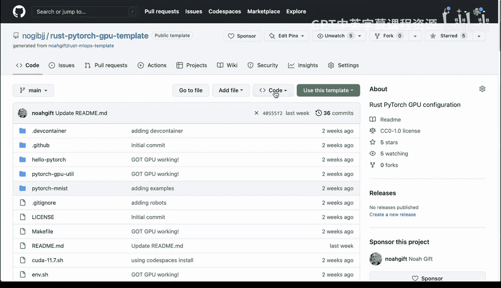
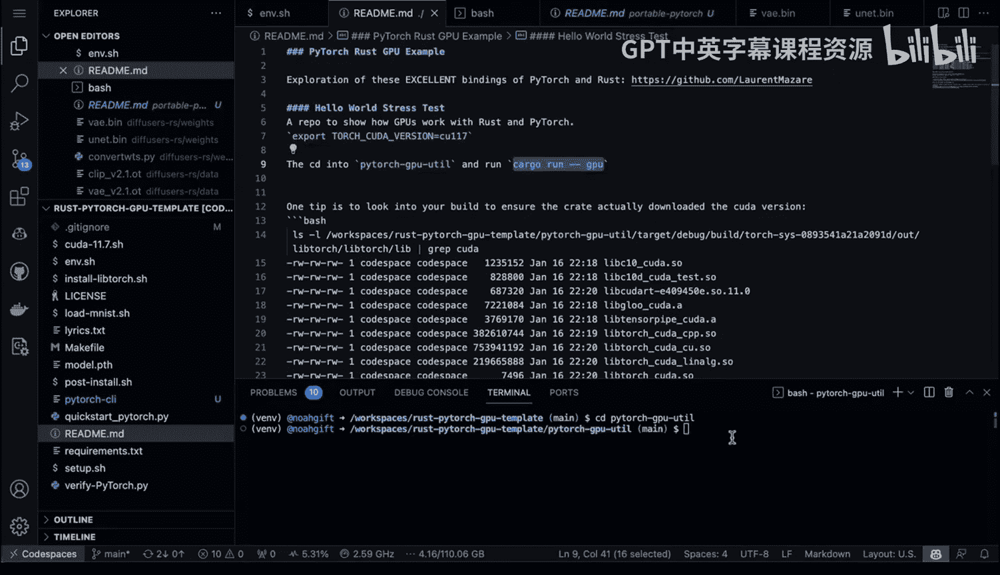
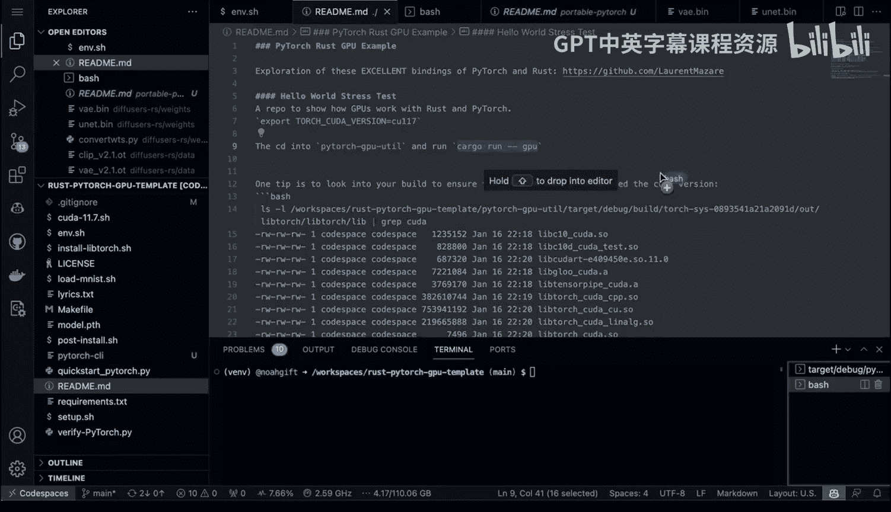
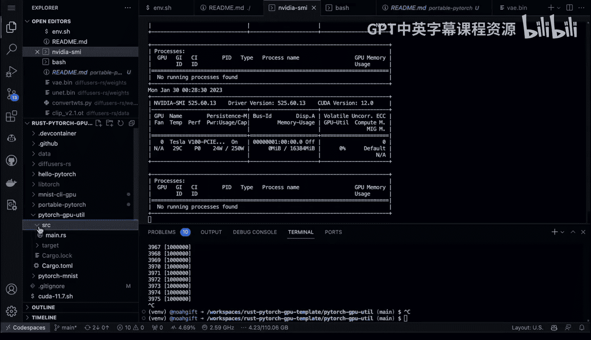
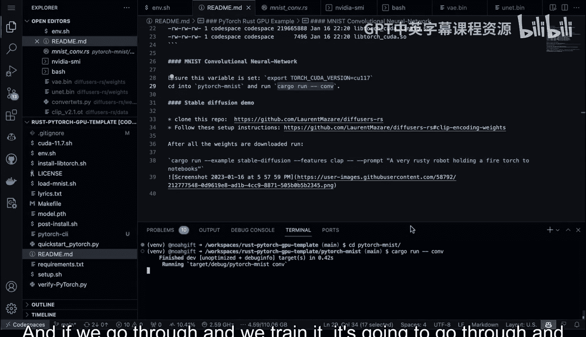
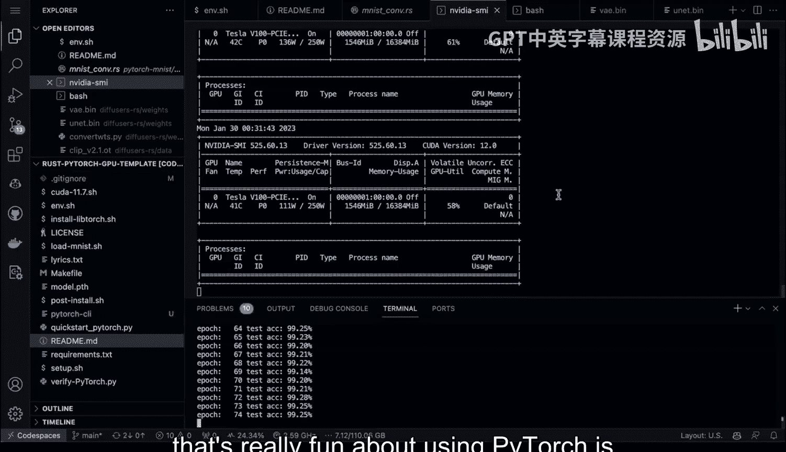
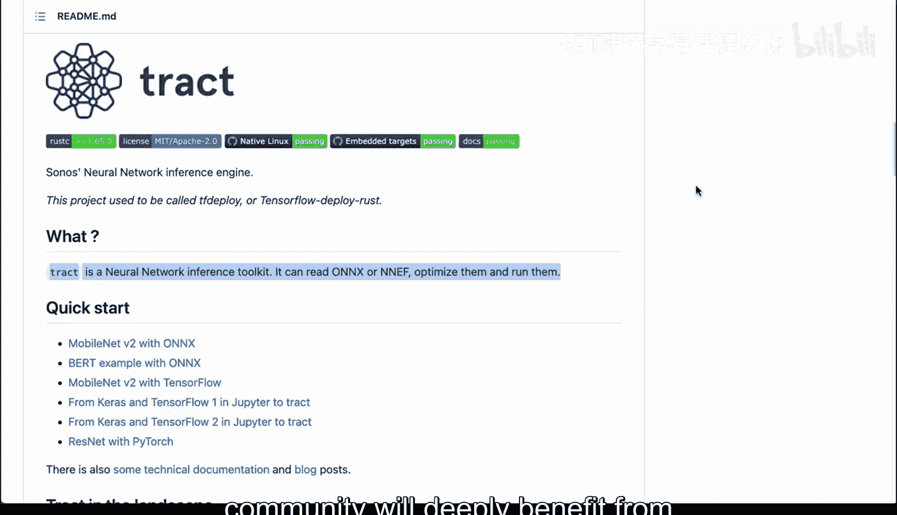

# 077：Rust与PyTorch高性能方案 🚀


在本节课中，我们将学习如何在Rust中使用PyTorch进行高性能模型训练与推理，并探讨Rust在生产环境中的实际应用案例，以消除关于Rust是否适用于真实世界的疑虑。

## 概述

Rust自2010年诞生以来，已发展为一门成熟的系统编程语言。然而，许多人仍对其在生产环境中的应用持观望态度。本节将通过两个核心示例来证明Rust的实用性：首先，展示如何使用Rust的PyTorch绑定进行GPU加速的模型训练与推理；其次，介绍由AWS开发并用于支撑其Lambda服务的Firecracker技术，它正是用Rust编写的，这有力地证明了Rust处理大规模、高并发生产负载的能力。

## Firecracker：Rust在生产中的典范

上一节我们提到了对Rust生产适用性的疑虑，本节中我们来看看一个重量级的实际案例——Firecracker。

Firecracker是一项由AWS开发的基于服务器的技术，专门用于驱动AWS Lambda服务。作为云计算领域的巨头，AWS选择使用Rust来构建其最受欢迎的服务之一的核心组件，这本身就极具说服力。Firecracker是一个轻量级虚拟化方案，专为无服务器计算设计。



以下是Firecracker的主要优势：
*   它能在125毫秒内启动一个微虚拟机。
*   它是一个经过实战检验、低开销的开源项目。
*   它能在单个实例上扩展到数千个多租户微虚拟机，效率极高。

这项技术非常适合用于模型推理等场景。鉴于PyTorch提供了Rust绑定，我们可以将这种强大的Rust技术与深度学习结合起来。

## 在Rust中使用PyTorch与GPU





现在，让我们进入实践环节，看看如何在Rust中轻松使用PyTorch并调用GPU。

### 示例一：GPU压力测试

首先，我们来看一个简单的GPU压力测试示例。这个例子可以直观地展示Rust如何利用GPU进行计算。



以下是运行该测试的核心代码框架：
```rust
// 示例代码：初始化Tensor并移至GPU
let device = Device::cuda_if_available();
let tensor = Tensor::randn(&[1000, 1000], (Kind::Float, device));
// ... 后续进行密集计算以饱和GPU
```
执行这段代码后，通过 `nvidia-smi` 命令可以观察到GPU利用率迅速达到饱和状态。这证明了通过Rust PyTorch绑定操作GPU的便捷性与高效性。

### 示例二：训练MNIST模型

接下来，我们看一个更实际的例子：使用卷积神经网络训练MNIST手写数字识别模型。

以下是构建神经网络的关键代码结构：
```rust
// 示例代码：定义卷积神经网络结构
struct Net {
    conv1: nn::Conv2D,
    conv2: nn::Conv2D,
    fc1: nn::Linear,
    fc2: nn::Linear,
}



impl Net {
    fn new() -> Net {
        Net {
            conv1: nn::conv2d(1, 32, 5, Default::default()),
            conv2: nn::conv2d(32, 64, 5, Default::default()),
            fc1: nn::linear(1024, 1024),
            fc2: nn::linear(1024, 10),
        }
    }
}
// ... 后续包含前向传播、损失计算和优化器步骤
```
运行此训练脚本时，GPU同样会被有效利用，整个过程与使用Python编写PyTorch代码的体验差异不大，但获得了Rust在性能和安全性上的额外优势。

## Rust PyTorch的优势总结

本节课中我们一起学习了Rust与PyTorch结合的高性能方案。回顾整个过程，可以总结出以下几个关键优势：

1.  **高性能系统编程**：Rust允许开发者使用一门高性能的系统编程语言来训练深度学习模型，兼顾效率与控制力。
2.  **出色的绑定与工具链**：Rust的PyTorch绑定质量极高，并且利用Cargo包管理器，使得依赖管理和项目构建比Python的`pip`+`virtualenv`更加简单和一致。
3.  **促进模型可复现与分发**：使用Rust有助于以更可靠的方式打包模型。结合ONNX等便携式格式，可以更好地将模型工具化并分发给他人。这正体现了MLOps的一个核心思想：将模型作为产品进行封装和分发。



我们鼓励更多人尝试并演示这类结合系统编程语言Rust的示例。随着此类工具的成熟与普及，整个MLOps社区都将从中受益。



我们下次见！👋