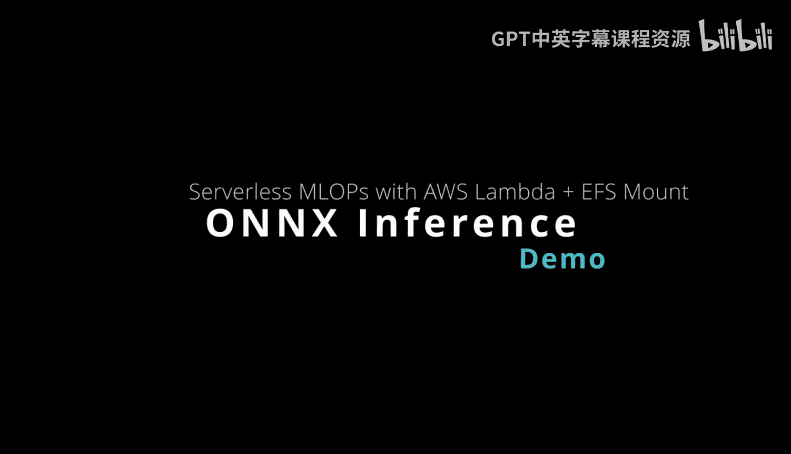
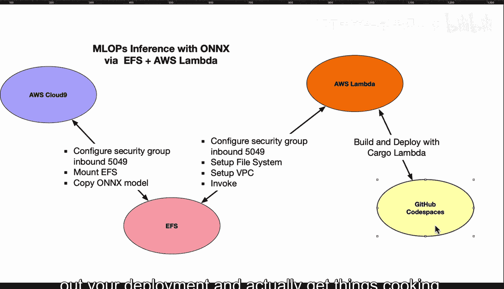
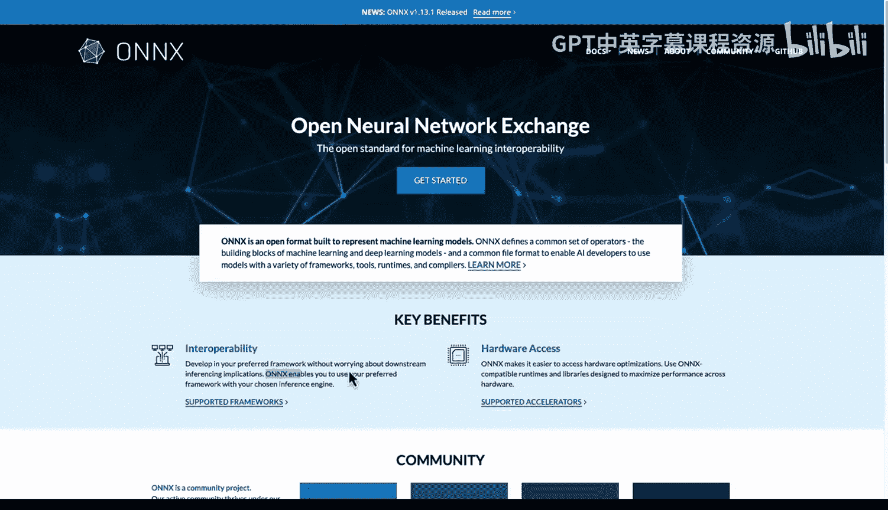
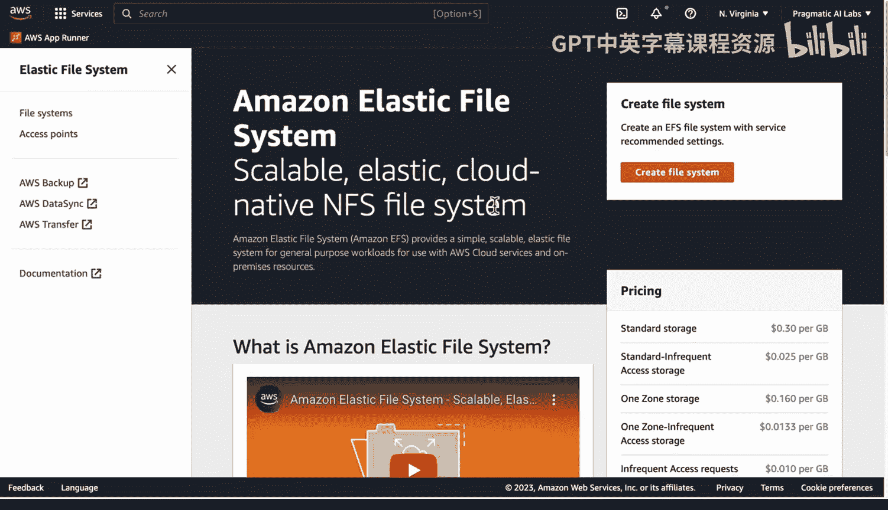
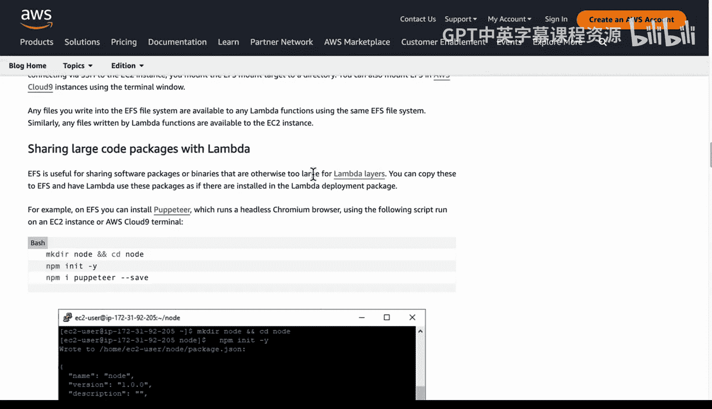
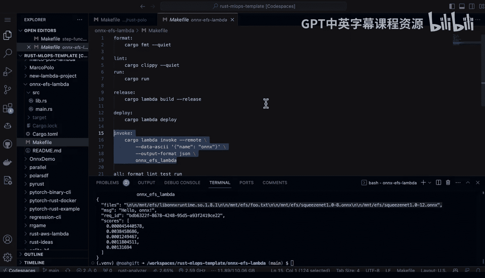
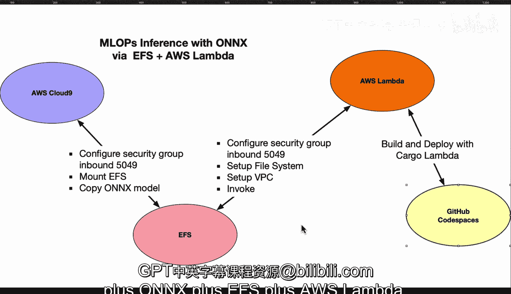

# 078：使用AWS Lambda与EFS部署ONNX模型推理服务 🚀



在本教程中，我们将学习如何结合使用AWS Lambda、EFS（弹性文件系统）和ONNX模型格式，通过Rust语言构建一个无服务器的机器学习推理服务。我们将逐步介绍环境配置、模型部署和代码实现。

## 概述

本项目的核心目标是利用无服务器技术（AWS Lambda）来提供机器学习模型推理服务。通过将ONNX模型存储在EFS上，并使用高性能的Rust语言编写推理逻辑，我们可以实现易于部署、无需管理基础设施的解决方案。

## 架构与准备工作

首先，我们需要理解整个架构的工作流程。核心组件包括AWS Lambda函数、EFS文件系统以及一个能够访问EFS的开发环境（如AWS Cloud9）。Lambda函数将通过VPC访问EFS中存储的ONNX模型文件。

以下是实现此架构需要完成的关键步骤列表：

1.  **创建并配置EFS文件系统**：这是存储ONNX模型的地方。
2.  **设置安全组规则**：确保相关服务（如Cloud9、Lambda）可以通过端口5049与EFS通信。
3.  **配置AWS Lambda**：为Lambda函数设置VPC、文件系统挂载点和访问点。
4.  **开发与测试Rust推理代码**：编写能够从EFS加载ONNX模型并执行推理的Rust程序。

接下来，我们将详细探讨每个步骤。





## 步骤一：创建与配置EFS

我们需要在AWS控制台中创建一个EFS文件系统。创建过程通常使用默认设置即可。

创建完成后，关键步骤是将其挂载到开发环境（例如Cloud9实例）上。在EFS控制台的“附件”选项卡中，选择“使用EFS挂载助手”选项，并按照提供的命令在Cloud9终端中执行。此命令会将EFS卷挂载到指定目录。



**重要提示**：必须配置安全组，允许从Cloud9实例（以及后续的Lambda函数）通过端口5049访问EFS。您需要在EFS关联的安全组中添加入站规则。

## 步骤二：配置AWS Lambda

现在，我们需要创建一个Lambda函数，并配置其访问EFS的能力。

首先，在Lambda函数的配置中，需要将其放入一个VPC。这个VPC必须包含我们之前为EFS配置的、允许5049端口通信的安全组。

其次，我们需要为Lambda设置文件系统。在Lambda函数的配置页面，找到“文件系统”部分。这里需要提供：
*   **文件系统ID**：您创建的EFS的ID。
*   **访问点ARN**：需要在EFS控制台中创建一个“访问点”，并将其ARN填写在此处。
*   **本地挂载路径**：Lambda函数内部访问EFS的路径，例如 `/mnt/efs`。

AWS官方文档《在无服务器应用程序中将Amazon EFS用于Lambda》提供了此过程的详细步骤指南，建议参考。

## 步骤三：开发Rust推理代码

完成基础设施配置后，我们可以专注于Rust代码的开发。代码的核心任务是：从EFS挂载点加载ONNX模型文件，并运行推理。

以下是一个简化的代码结构示例：

```rust
// 引入必要的库，如onnxruntime-rs
use onnxruntime::{environment::Environment, session::Session};

fn load_model_from_efs(model_path: &str) -> Session {
    // 从EFS挂载路径（如 `/mnt/efs/squeezenet.onnx`）创建模型会话
    let environment = Environment::builder().build().unwrap();
    let session = environment
        .new_session_builder()
        .unwrap()
        .with_model_from_file(model_path)
        .unwrap();
    session
}



fn run_inference(session: &Session, input_data: &[f32]) -> Vec<f32> {
    // 准备输入，运行推理，并返回结果
    // ... 具体实现取决于模型输入输出格式
    vec![]
}
```

在Lambda的主处理函数中，可以调用 `load_model_from_efs` 来初始化模型，然后对每个传入的请求调用 `run_inference`。

一个实用的调试技巧是，在代码中添加一个辅助函数，用于列出EFS挂载点下的文件，以确认模型文件已正确就位。

## 步骤四：测试与部署

为了简化测试和部署流程，可以创建一个 `Makefile`。例如：

```makefile
invoke:
	cargo lambda invoke --remote \
		--data-ascii '{"input": "sample_data"}'
```

这个命令会使用 `cargo-lambda` 工具将本地代码打包并部署到AWS Lambda，然后发送一个测试负载来触发函数。在输出日志中，您应该能看到模型加载成功和推理执行的记录。



对于开发环境，推荐使用GitHub Codespaces，它可以提供预配置的容器环境，并轻松集成CI/CD流程，方便进行迭代测试。

## 总结

本节课我们一起学习了构建基于AWS Lambda、EFS和ONNX的Rust推理服务的完整流程。我们首先了解了架构概览，然后逐步完成了EFS文件系统的创建与挂载、AWS Lambda的VPC与文件系统配置，最后探讨了Rust推理代码的核心逻辑与测试部署方法。



这种组合（Rust + ONNX + EFS + AWS Lambda）提供了一种高性能、易维护且成本高效的无服务器ML推理方案，预计将在越来越多的组织中得到应用。记住关键点：确保端口5049的通信畅通，遵循EFS挂载指南，并在Lambda中正确配置文件系统访问点。