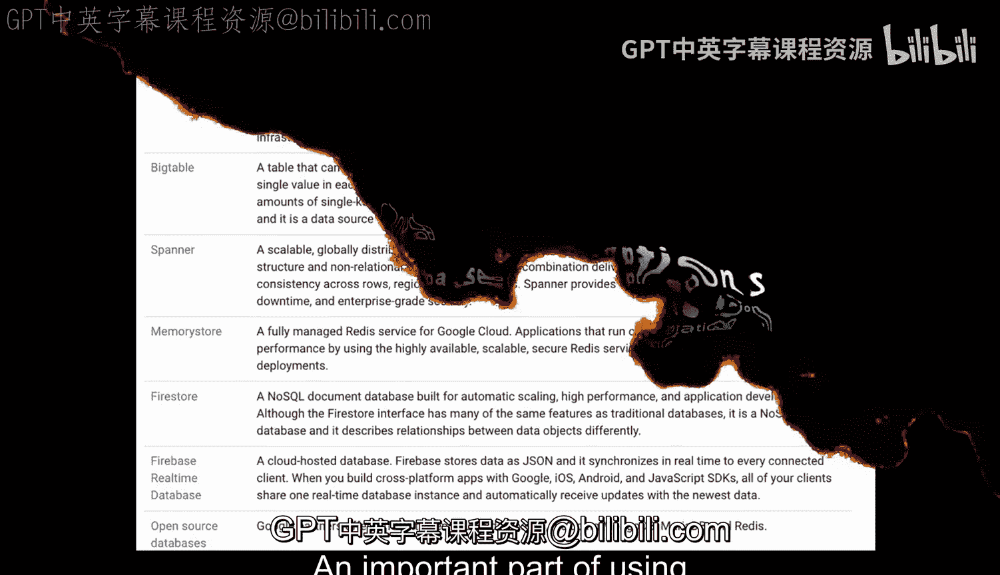
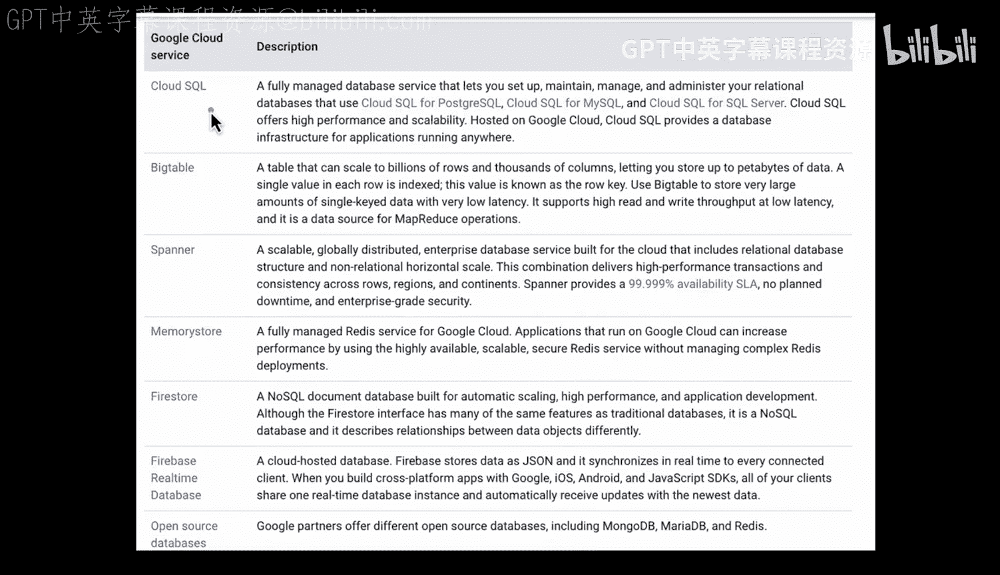

# 081：GCP数据库选型指南 🗄️

在本节课中，我们将学习如何在Google Cloud Platform（GCP）上选择合适的数据库服务。我们将逐一分析GCP提供的多种数据库选项，了解它们各自的特点、适用场景以及权衡取舍。

## 概述

在GCP上使用数据库的一个重要环节，是权衡不同类型的专用数据库解决方案之间的利弊。每种数据库都有其独特的设计目标和优势，理解这些差异是做出正确技术选型的关键。

## 数据库选项详解

以下是GCP提供的核心数据库服务，我们将逐一进行介绍。

### Cloud SQL ☁️

上一节我们概述了数据库选型的重要性，本节中我们首先来看看Cloud SQL选项。

Cloud SQL是一项全托管的数据库服务，允许您维护传统类型的数据库，例如PostgreSQL、MySQL或SQL Server数据库。其核心优势在于，它允许您利用Google Cloud的基础设施来承担繁重的运维工作。

因此，对于已经对上述常见开源数据库有深厚经验的人来说，这是一个非常好的解决方案。

### Bigtable 📊

接下来我们看看Bigtable选项。Bigtable可以扩展到数十亿行和数千列。例如，如果您拥有PB级别的数据，这可能是一个首先值得关注的选项。

Bigtable的每一行都被索引，其索引值是一个已知的行键（row key）。这是一种不同类型的解决方案，其特点是**单键数据访问**且延迟极低。因此，它支持在低延迟下实现非常高的读写吞吐量，适用于MapReduce类型的操作。

### Cloud Spanner 🌍

另一个GCP独有的独特产品是Cloud Spanner。这是一个全球分布式企业级数据库服务。其一大区别在于，它从一开始就是为全球规模而设计的。

它也是一个**非共享、水平可扩展的关系型数据库**。这两者都是其内部可用的特性。此外，它还为您提供了非常高的服务等级协议（SLA）和企业级安全性。

因此，如果您想构建一个全球规模的系统，Cloud Spanner将是一个很好的解决方案。

### Memorystore (Redis) ⚡

我们还有Memorystore，这是一项托管的Redis服务。这是一个基于缓存的系统，允许您管理一个缓存数据库。

这在以下场景中非常有用：例如存储游戏中的状态，或者存储那些需要频繁使用但本身不一定需要频繁更改的数据。

### Firestore 🔥

我们还有Firestore。Firestore是一个NoSQL文档数据库，专为自动扩展而构建。这几乎是一种无服务器类型的解决方案，因为您是在服务之上进行构建，而不是自己管理服务。

对于应用程序开发人员来说，Firestore也是一个非常合适的选择。

### Firebase Realtime Database 📱

此外，还有Firebase Realtime数据库。这是一个基于JSON的解决方案，允许您为Google、iOS、Android和JavaScript构建跨平台应用程序。

通过使用这些高级服务，您可以非常快速地构建应用。

### 开源数据库 🐧

当然，GCP也支持开源数据库。您可以使用MongoDB、MariaDB、Redis等。

## 选型考量与总结

总而言之，您在这里有许多不同的选择。例如，在Spanner解决方案中，它从一开始就具备全球扩展能力。如果您想构建一个向全球分发新闻内容的新闻机构，这可能是一个很好的解决方案。

如果您的公司已经有很多基于PostgreSQL的解决方案，并且正在迁移到云端，那么您可能会选择Cloud SQL选项。

了解这些选择的优缺点至关重要。您可以选择一种解决方案，或者结合几种解决方案，为您的组织在Google Cloud上创造独特的价值主张。

在本节课中，我们一起学习了GCP上主要的数据库服务选项，包括Cloud SQL、Bigtable、Cloud Spanner、Memorystore、Firestore、Firebase Realtime Database以及对开源数据库的支持。理解每种服务的核心特性和适用场景，是设计高效、可扩展云架构的基础。