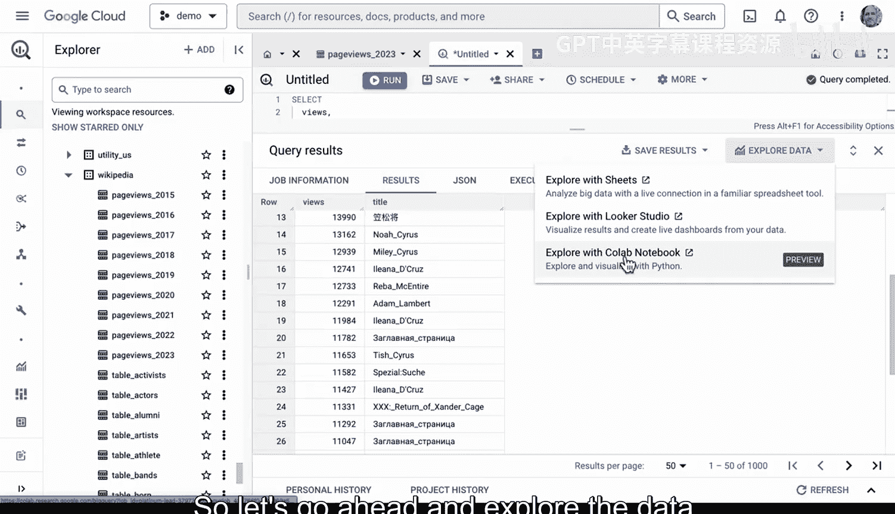
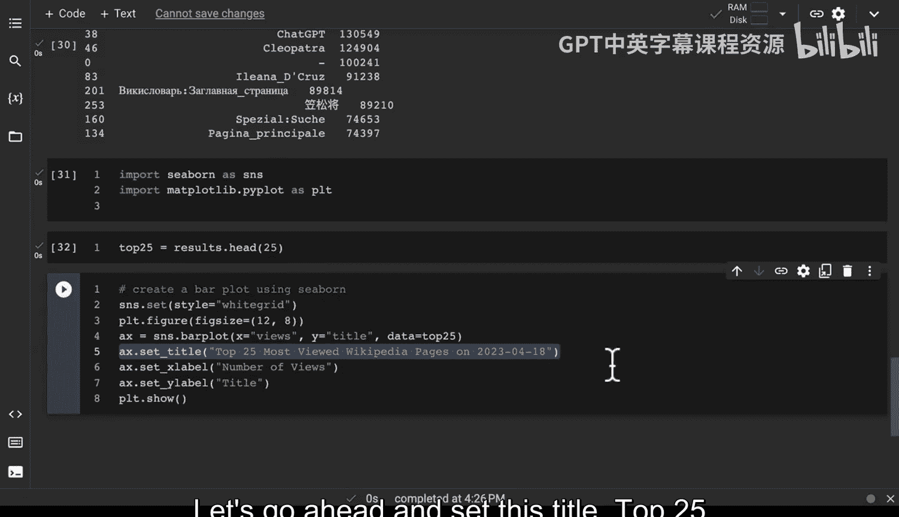
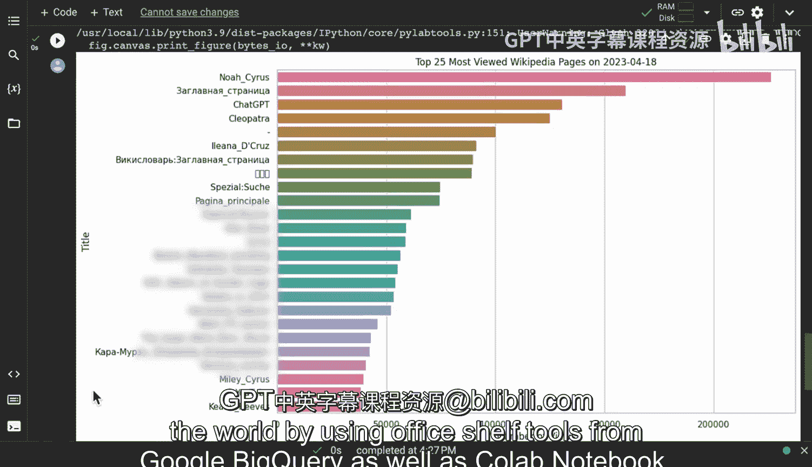

# 084：构建BigQuery到Colab的数据管道 📊


在本节课中，我们将学习如何构建一个非常贴近实际的数据清洗与可视化管道。我们将使用Google BigQuery作为数据源，通过迭代式查询来探索和清洗数据，最终在Google Colab笔记本中使用Python和Seaborn库进行数据分析和可视化。

---

## 概述

我们将从一个公开的维基百科页面浏览数据表开始。目标是找出特定日期（4月18日）内浏览量最高的页面。这个过程涉及多个阶段：首先在BigQuery中编写和迭代优化SQL查询以获取和初步清洗数据，然后将查询结果导入Colab笔记本，在Python环境中进行进一步的数据处理和最终的可视化呈现。

---

## 在BigQuery中初步查询数据

首先，我们需要在BigQuery中查看数据。我们使用的表包含维基百科的页面浏览数据，字段包括日期、小时、维基项目、页面标题和浏览量。

以下是我们编写的初始查询，目的是获取2023年4月18日浏览量最高的前1000条记录：

```sql
SELECT views, title
FROM `bigquery-public-data.wikipedia.pageviews_2023`
WHERE date = '2023-04-18'
ORDER BY views DESC
LIMIT 1000
```

运行此查询后，我们得到了结果，但其中包含了许多我们并不关心的条目，例如“Main_Page”（维基百科主页）或一些特殊页面。这些条目会干扰我们对实际热门内容的理解。

---

## 迭代优化查询以清洗数据

上一节我们运行了初步查询，发现结果中包含大量无关条目。本节中，我们将通过添加过滤条件来优化SQL查询，以排除这些噪音数据。

我们需要修改查询，排除标题为“Main_Page”、以“Special:”开头或属于特定维基项目（如“Wikipedia:”）的记录。优化后的查询如下：

```sql
SELECT views, title
FROM `bigquery-public-data.wikipedia.pageviews_2023`
WHERE date = '2023-04-18'
  AND title != ‘Main_Page’
  AND NOT STARTS_WITH(title, ‘Special:’)
  AND NOT STARTS_WITH(title, ‘Wikipedia:’)
ORDER BY views DESC
LIMIT 1000
```

运行这个优化后的查询，结果得到了显著改善。但我们发现，仍然存在一些其他语言的主页（例如“Hauptseite”是德语的主页）。因此，我们需要继续迭代优化。

我们再次修改查询，添加一个条件来排除标题中包含“_page”的记录。以下是进一步优化后的查询：

```sql
SELECT views, title
FROM `bigquery-public-data.wikipedia.pageviews_2023`
WHERE date = ‘2023-04-18’
  AND title != ‘Main_Page’
  AND NOT STARTS_WITH(title, ‘Special:’)
  AND NOT STARTS_WITH(title, ‘Wikipedia:’)
  AND NOT title LIKE ‘%_page’
ORDER BY views DESC
LIMIT 1000
```

经过几次这样的迭代，我们最终获得了一个相对干净、只包含实际文章页面的数据集。这种迭代式查询和过滤是数据清洗中的常见做法。

---

## 将数据导入Colab进行Python分析

在BigQuery中完成初步的数据筛选后，我们获得了更干净的数据集。接下来，我们将把查询转移到Google Colab笔记本中，利用Python环境进行更灵活的分析和处理。

首先，我们需要在Colab中设置环境并验证身份以访问BigQuery。然后，执行与上一节最终版相同的SQL查询，并将结果加载到一个Pandas DataFrame中。

以下是实现此步骤的核心代码：

```python
# 设置BigQuery客户端并运行查询
from google.colab import auth
auth.authenticate_user()

query = “””
SELECT views, title
FROM `bigquery-public-data.wikipedia.pageviews_2023`
WHERE date = ‘2023-04-18’
  AND title != ‘Main_Page’
  AND NOT STARTS_WITH(title, ‘Special:’)
  AND NOT STARTS_WITH(title, ‘Wikipedia:’)
  AND NOT title LIKE ‘%_page’
ORDER BY views DESC
LIMIT 1000
“””

# 将查询结果加载到DataFrame
import pandas as pd
results = pd.read_gbq(query, project_id=‘YOUR_PROJECT_ID’)
print(results.head())
```



现在，数据已经以结构化的DataFrame形式存在于Python环境中，我们可以方便地使用Pandas进行各种操作。

---

## 在Python中进行进一步的数据处理

上一节我们将数据成功导入Colab。本节中，我们将在Python中对DataFrame进行进一步处理，例如对重复标题的浏览量进行求和，以得到每个页面的总浏览量。

我们注意到原始数据中可能因为不同小时段而有重复的标题。为了得到每个页面的总浏览量，我们需要按标题进行分组求和。

以下是按标题分组并汇总浏览量的代码：

```python
# 按‘title’分组，并对‘views’求和
results_aggregated = results.groupby(‘title’)[‘views’].sum().reset_index()
# 按总浏览量降序排列
results_aggregated = results_aggregated.sort_values(by=‘views’, ascending=False)
print(results_aggregated.head(10))
```

这个操作将数据聚合，使我们能更清晰地看到每个页面的受欢迎程度，为下一步的可视化做好准备。

---

## 使用Seaborn创建可视化图表

经过清洗和聚合，我们得到了最终的数据集。现在，我们可以使用Seaborn库来创建图表，直观地展示2023年4月18日维基百科上最受欢迎的页面。

我们将选取总浏览量排名前25的页面，并创建一个条形图。

以下是创建可视化图表的完整代码：

```python
import seaborn as sns
import matplotlib.pyplot as plt

# 获取前25名
top_25 = results_aggregated.head(25)

# 设置图表样式
sns.set_style(“whitegrid”)
plt.figure(figsize=(12, 8))

# 创建条形图
bar_plot = sns.barplot(x=‘views’, y=‘title’, data=top_25, palette=“viridis”)
bar_plot.set_xlabel(‘Total Views’)
bar_plot.set_ylabel(‘Page Title’)
bar_plot.set_title(‘Top 25 Most Viewed Wikipedia Pages on 2023-04-18’)



plt.tight_layout()
plt.show()
```

运行这段代码后，我们将得到一个清晰的条形图。从图中可以直观看出，在指定日期，“NoA_Cyrus”和“ChatGPT”等页面获得了极高的浏览量。

---

## 总结



本节课中，我们一起学习并实践了一个完整的数据管道构建过程。我们从Google BigQuery中的原始数据出发，通过迭代编写SQL查询来逐步清洗和筛选数据。然后，我们将查询迁移到Google Colab笔记本中，利用Python的Pandas库进行数据聚合，最后使用Seaborn库生成了直观的可视化图表，成功展示了特定日期内维基百科上最受欢迎的页面。这个流程涵盖了数据工程中从提取、转换到加载和可视化（ETL-V）的核心步骤。