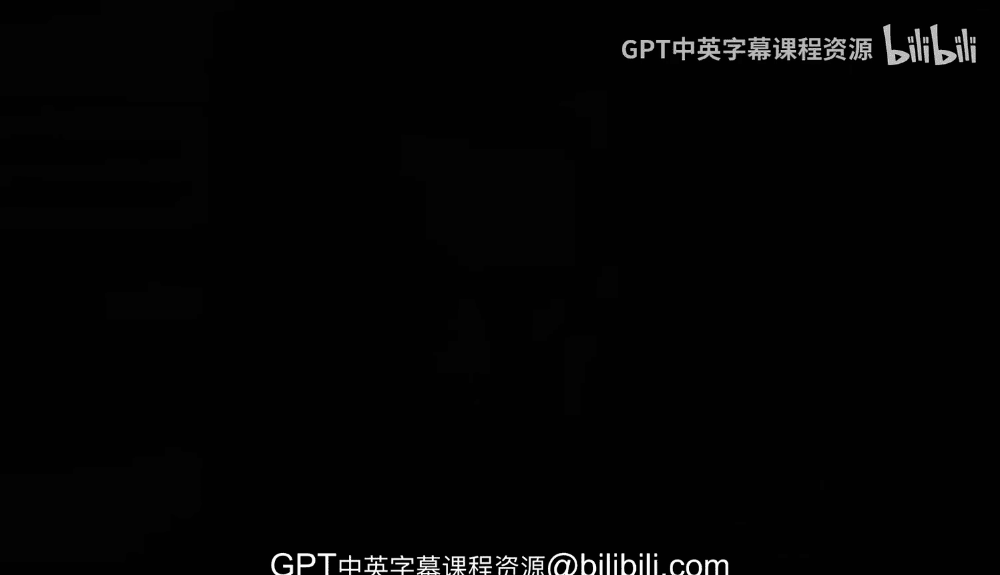

# 091：课程概述 🚀

在本课程中，我们将学习如何运用Rust编程语言来增强和实现DevOps的核心概念。DevOps领域非常广泛，要涵盖所有内容需要付出相当大的努力。

## 课程焦点与核心理念

因此，在本课程中，我们将聚焦于使用Rust。与许多其他方法不同，我认为Rust在此处拥有独特的机会，能够真正增强整个DevOps理念。

我们将从DevOps的基础支柱——**自动化**开始，然后在此基础上扩展到其他部分，例如与系统编程集成、CI/CD（持续集成/持续交付）以及测试应用程序。

## 学习方法与实践应用

现在以及在整个课程中，我们将看到这些概念被应用。重要的是，我们学习概念，然后使用新技术来应用它们。在本例中，我们将大量使用Rust。

同时，观察所有这些概念和组件最终如何协同运作也很有趣。

## 最终目标：综合项目实践

最后，我们将把所有内容整合在一起。我们将看到一个从头到尾的项目，并学习如何应用我们在整个课程中学到的概念，为我们正在开发的软件创建一个健壮的管道。

我们将尝试检查不同的场景：当我们需要自动化时会发生什么，当我们需要测试和验证时会发生什么。所有这些概念都将在整个过程中得到解释，然后我们将以非常实践和动手的方式应用它们。

---

本节课中，我们一起学习了本课程的核心目标：即通过Rust语言来实践和深化DevOps的自动化、集成与测试等关键概念，并最终通过一个完整的实战项目来综合运用所学知识。