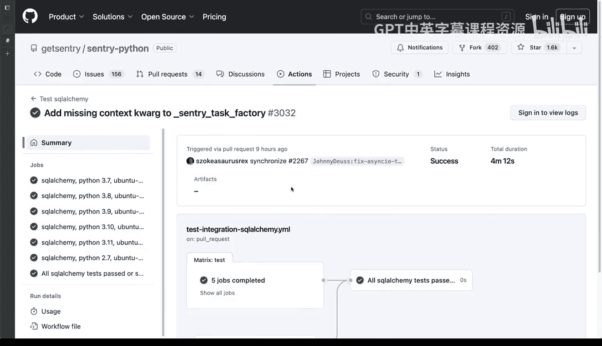
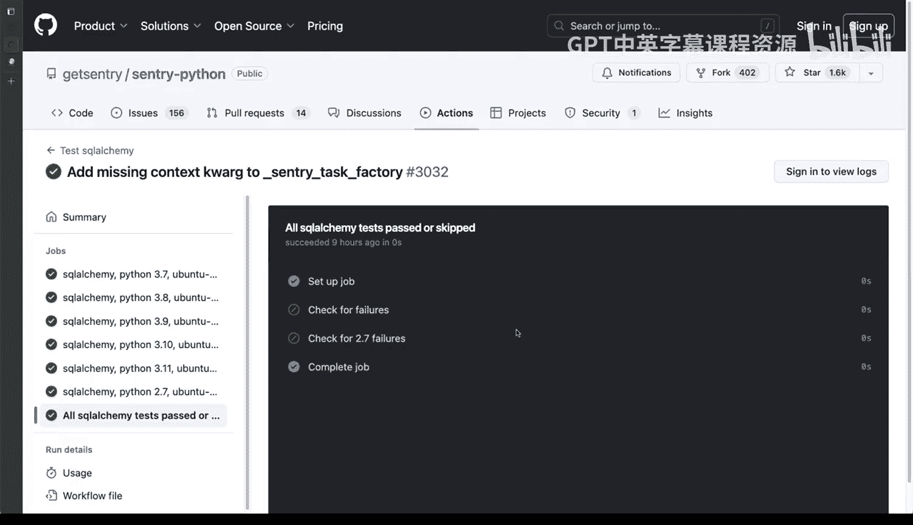
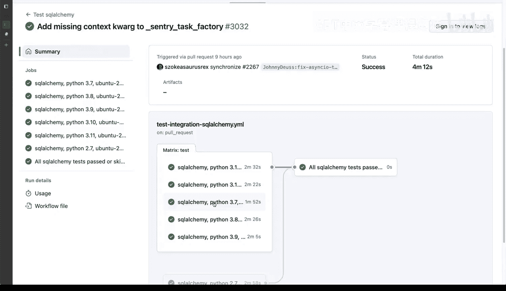
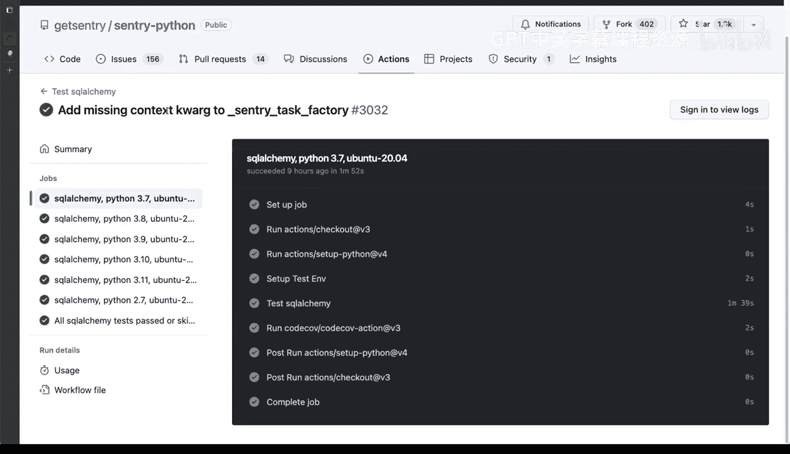
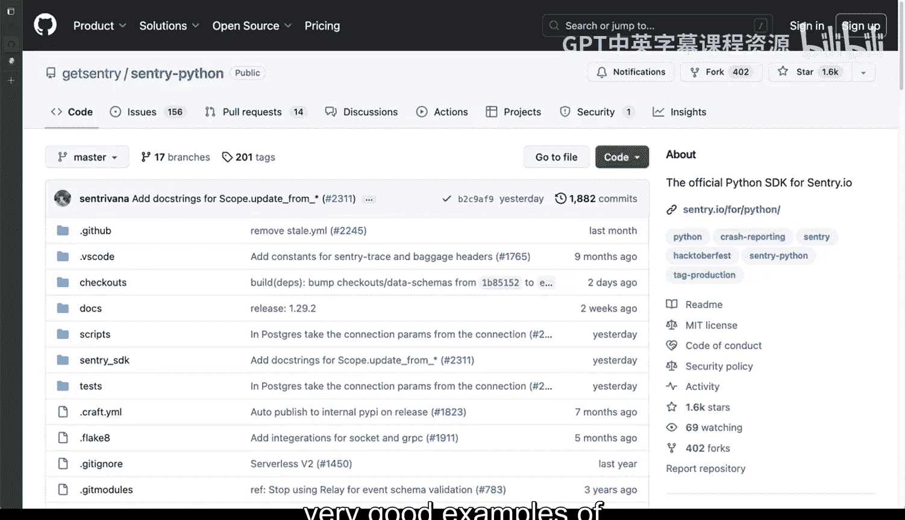

# 097：实际应用中的DevOps案例 🚀

在本节课中，我们将通过分析两个真实世界的开源项目，来了解DevOps理念在实践中的应用。我们将重点关注它们的持续集成/持续交付（CI/CD）流程，看看大型项目如何通过自动化来确保代码质量和发布可靠性。

上一节我们介绍了DevOps的基本概念，本节中我们来看看这些概念在真实项目中的具体体现。

## 项目一：Cython项目的GitHub Actions工作流

第一个案例来自Cython项目，具体是它的C-Python SDK。我们不会深入其内部实现，而是重点观察其GitHub Actions部分，即CI/CD流程。

与其他项目类似，你可以看到这里有许多工作流在运行。其中包括CodeQL、C语言检查以及更多工作流。其中一些是测试，另一些则不一定是测试。你可以看到这里正在进行大量的组合测试与验证。

以下是该项目CI/CD流程的一些关键特点：

*   **矩阵测试**：项目会测试不同Python版本（如Bodo 3、p27）与不同环境的组合。这确保了代码在各种预期运行环境下的兼容性。
*   **多重检查**：工作流中包含了广泛的检查和验证步骤，覆盖了代码安全、风格、构建和测试等多个方面。
*   **发布流程**：项目的发布工作流定义了清晰的步骤。例如，它需要特定版本号，然后执行环境设置、代码克隆（使用特定令牌）以及一个名为`action-prelude`的专用操作来处理发布所需的一切准备工作。

总之，发布一个版本需要经过多个步骤，并且要通过一个包含不同选项、分支和版本类型的“矩阵”进行大量验证。

## 项目二：CEF项目的Jenkins实例

第二个案例来自CEF项目，它使用Jenkins作为CI/CD平台。Jenkins是全球最流行的CI/CD平台之一。观察这个项目的测试和验证规模，非常具有说服力。

这里不仅有CEF构建，还运行着各种各样的任务。观察左侧的“构建执行器状态”，你可以看到许多节点正在等待构建任务。这些“空闲”节点表明这是一个分布式系统，所有节点都在等待作业分配。

想象一下，如果一个100人的开发团队同时推送代码，这些任务会被逐个路由到可用节点上进行构建和验证。有些节点有名称，有些则没有。目前大部分节点处于空闲状态。

滚动页面，你会看到一些正在运行的任务。有些任务显示为红色，表示可能失败或卡住。通常，这些构建任务平均需要大约一小时完成。你可以看到有些任务通过，有些失败，这与GitHub Actions的反馈类似，让你对项目状态有一个清晰的概览。

真实的DevOps实践正是围绕这些自动化和持续集成/交付平台展开的。在这个案例中是Jenkins，之前是GitHub Actions。这让你了解到，要管理所有这些环节需要具备怎样的能力。

像你在这里看到的文档构建等任务，都是逐步添加到项目中的。当我参与贡献时，这个项目并非一开始就拥有所有这些。我们可能从一两个节点开始，然后增加到十个，再尝试弄清楚如何扩展。现在，它已经拥有大约50到60个节点同时进行构建。

## 总结与核心要点

本节课中我们一起学习了两个将DevOps理念付诸实践的优秀项目案例。

*   **Cython项目**：展示了如何利用**GitHub Actions**和**矩阵测试**来实现复杂的多环境验证和自动化发布流程。
*   **CEF项目**：展示了如何利用**Jenkins**分布式构建系统来应对大规模、高并发的开发需求，并通过可视化的节点状态管理构建任务。

这两个项目都是现实世界中实施全面检查与验证的绝佳范例，清晰地展示了DevOps在提升软件交付效率与质量方面的强大作用。