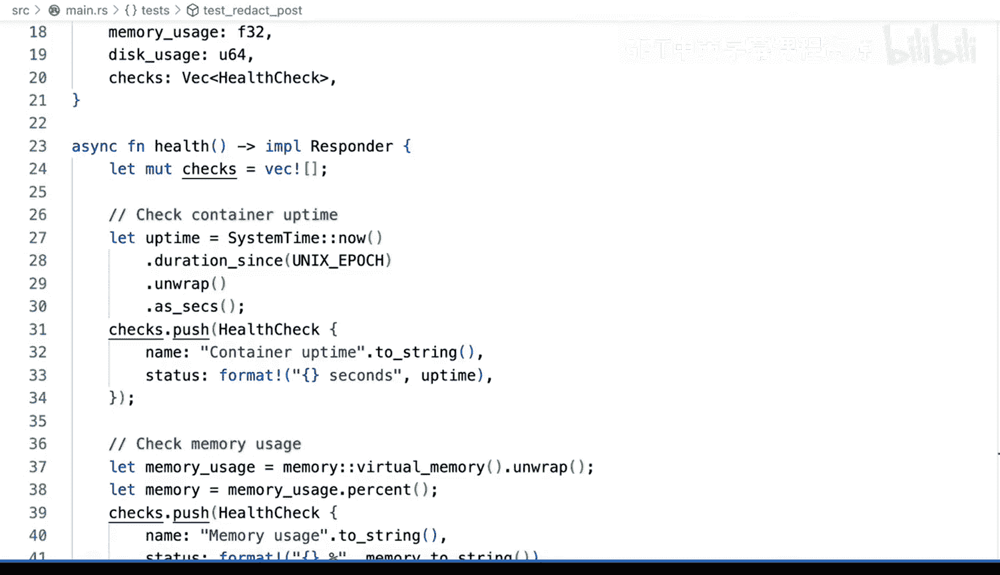

# 100：测试与验证 🧪


在本节课中，我们将要学习软件工程中的一个核心实践：测试与验证。我们将通过一个名为“redactor”的Rust示例项目，了解测试的重要性、如何编写测试，以及如何确保代码在投入生产前是可靠的。

## 概述

测试是确保软件质量的关键环节。无论您是系统管理员转型为软件工程师，还是负责DevOps实践，理解并应用测试都能帮助您验证系统配置和代码变更的正确性。本节将介绍测试的基本概念，并通过实际代码演示如何编写和运行测试。

## 测试的重要性

当我开始从系统管理员向软件工程师转型时，测试是我必须快速掌握的核心概念之一。软件工程的最佳实践，如测试，不仅适用于常规的软件开发项目，也适用于系统配置管理。通过测试，您可以确保您的变更不会破坏现有功能，从而在部署到生产环境时更有信心。

## 示例项目：Redactor

我们使用一个名为“redactor”的Rust项目作为示例。项目的具体细节并不重要，重点是理解其中的测试部分。项目代码涉及内存使用、端点处理等多个方面。如果您刚加入一个团队并看到这样的代码，首要问题应该是：如何确保这个我现在负责的项目能正确运行？即使您不是开发者，而是负责实施DevOps实践，也需要与软件工程师协作，确保一切正常工作。

## 测试类型：功能测试

测试有多种类型，其中之一是功能测试。功能测试意味着您需要运行应用程序，并让测试遍历应用程序的多个不同层次、步骤或部分。通常，应用程序会以某种方式运行，测试则需要通过应用程序的多个组件来执行。

在我们的Rust项目中，功能测试会进行一些断言。让我们来看第一个测试：

```rust
#[test]
fn test_index() {
    // 配置并创建用于测试的服务
    let app = test::init_service(App::new().configure(config)).await;
    // 向网站根路径发送GET请求
    let req = test::TestRequest::get().uri("/").to_request();
    // 接收响应并检查状态码
    let resp = test::call_service(&app, req).await;
    assert!(resp.status().is_success());
}
```

这个测试验证了对网站根路径（由`/`定义）的GET请求是否成功。它配置并创建了测试服务，发送请求，然后检查响应状态是否正确。这是一个非常基础的测试。

## 改进测试

虽然简单的测试没问题，但如果测试失败，您可能需要更清晰的上下文来了解失败原因。让我们看看另一个测试，这是一个POST请求测试：

```rust
#[test]
fn test_redact_post() {
    // 发送包含JSON体的POST请求
    let req = test::TestRequest::post()
        .uri("/redact")
        .set_json(&json!({"persons": ["Alfr Smith", "John Do"]}))
        .to_request();
    // 检查响应内容是否符合预期
    let resp = test::call_service(&app, req).await;
    let body = test::read_body(resp).await;
    assert_eq!(body, "person1 and person2 went to the store");
}
```

这个测试的名称`test_redact_post`可以更具体一些。我们可以使用更具描述性的名称，例如`test_redact_post_request_successfully_transforms_text`。清晰的测试名有助于在测试失败时快速定位问题。

## 运行测试

我们可以使用Cargo运行测试。在终端中执行`cargo test`命令，可以看到测试运行并全部通过。然而，看到测试通过并不总是最有用的；我们更需要知道当测试失败时会发生什么。

为了演示失败情况，我们可以在代码中故意引入一个拼写错误，然后再次运行测试。您会看到测试失败，并输出详细的错误信息，包括断言失败和差异对比。例如：

```
thread 'test_redact_post' panicked at 'assertion failed: `(left == right)`
  left: `"person1 and person2 went to the store"`,
 right: `"person1 and person2 went to teh store"`',
```

在CI/CD系统中（我们将在后续课程中介绍），自动化测试运行时，您需要确保所有测试都能通过。如果看到测试失败，您必须理解失败原因，并采取措施修复它。

## 测试覆盖与验证

测试和验证是自动化CI/CD平台的核心组成部分。每当您想要将代码部署到生产环境时，都需要确保一切正常工作。例如，我们的示例项目有一个健康检查端点（`/health`），但目前没有对应的测试。如果这个端点失败，您应该添加或建议添加测试，以验证其在生产环境中的关键功能。

## 总结



本节课中我们一起学习了测试与验证的基本概念及其在软件工程和DevOps中的重要性。我们通过一个Rust项目示例，了解了如何编写和运行功能测试，如何改进测试以提高可读性和可维护性，以及如何在CI/CD流程中利用测试来确保代码质量。记住，无论使用何种编程语言或技术栈，这些测试概念都是普遍适用的。