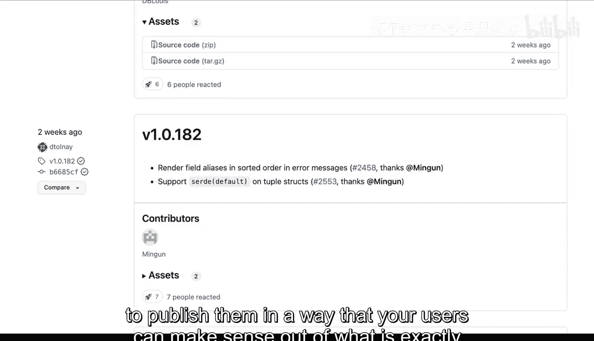

# Rust编程：2-3：打包与版本管理 📦


在本节课中，我们将要学习Rust项目中至关重要的两个概念：**打包**与**版本管理**。它们是任何软件项目，尤其是涉及依赖管理的项目，不可或缺的组成部分。

## 概述：为什么打包与版本管理重要？

打包与版本管理是任何项目的重要部分。当你处理的软件项目不涉及打包或版本管理，并且还缺乏源代码或版本控制时，情况会变得相当复杂。

上一节我们介绍了项目结构的基础，本节中我们来看看如何管理项目的发布与依赖。

## 深入理解版本号 🔢

让我们以Rust社区包仓库 **crates.io** 为例。在这里，我们可以找到一个非常流行的包：`serde`，它是一个用于序列化JSON的库。

在`serde`的页面上，首先我们看到的是版本号，例如 `1.0.183`。版本号之所以重要，是因为它允许我们像版本控制或源代码控制一样，精确定位一个可以使用的特定发布版本。

这对于定义项目依赖至关重要。版本号通常遵循**语义化版本控制**规范。这不仅对创建版本很重要，也能让安装工具（如Cargo）理解如何处理依赖。

例如，版本号 `1.0.183` 包含三个部分：
*   `1`：主版本号
*   `0`：次版本号
*   `183`：修订号

如果你声明依赖为 `1`，而不关心后两位数字，那么 `1.0.183` 或 `1.2.54` 都能满足你的要求。这允许你以灵活的方式定义依赖。

## 版本控制中的标签与发布 🏷️

每个在crates.io上的包通常都链接到一个代码仓库（如GitHub）。在仓库中，**标签** 是一个关键概念。

标签允许你为某个时间点的提交打上一个有意义的标记，而不仅仅是一个校验和。例如，在`serde`的GitHub仓库中，我们可以看到两周前为版本 `1.0.183` 创建了标签。

**发布** 通常是基于标签创建的。它不仅仅是标签，还可能包含发布说明、编译好的二进制文件等附加信息。点击 `1.0.183` 这个发布，我们可以看到该版本包含的具体变更。

这非常重要，因为它让我们能够精确地知道某个功能或修复是在何时发布，从而帮助其他开发者准确选择他们想在项目中使用的版本。

## 语义化版本控制详解 📚

之前提到了语义化版本控制，它至关重要，因为它为我们提供了一种描述依赖关系的方式，并明确了每个数字的含义。

语义化版本号遵循 **主版本号.次版本号.修订号** 的格式，每个部分都有特定含义：

以下是每个版本号段变化的含义：

1.  **主版本号**：当你做了**不兼容的 API 修改**时递增。
    *   例如，从 `1.0.0` 升级到 `2.0.0` 可能意味着有破坏性变更。如果从 `v0` 到 `v1`，也通常表示有向后不兼容的更改。

2.  **次版本号**：当你以**向后兼容的方式添加了新功能**时递增。
    *   例如，`2.0.0` 与 `2.1.0` 是兼容的。只要主版本号相同，次版本号的增加不会导致现有功能失效。

3.  **修订号**：当你做了**向后兼容的问题修复**时递增。
    *   例如，从 `2.0.0` 到 `2.0.1`，通常意味着修复了一些错误，但没有添加新功能或破坏现有API。

现在你就能明白为什么这很重要了。你可以开始以一种可理解的方式声明你的依赖。例如，在 `Cargo.toml` 文件中：
```toml
[dependencies]
serde = “1.0” # 允许任何 1.x.x 版本，但不包括 2.0.0
```

## 实践意义与总结 ✅

语义化版本号并非总是被严格遵循，开发者有时可能会随意地更新主版本号。但最佳实践是遵循语义化版本控制的规则。

这样做的重要性在于：它允许你回滚到特定版本，查看变更发生的时间，并以一种让你的用户能够理解不同发布之间确切含义的方式来发布软件。

**本节课中我们一起学习了：**
*   **打包**和**版本管理**对软件项目的重要性。
*   如何通过**语义化版本控制**来理解版本号（主版本号.次版本号.修订号）的含义。
*   版本控制在代码仓库中通过**标签**和**发布**来具体体现。
*   遵循语义化版本规范如何帮助开发者清晰地管理依赖和发布变更。



掌握这些概念，将使你能够更专业地管理Rust项目，并与广阔的Cargo生态系统进行有效交互。