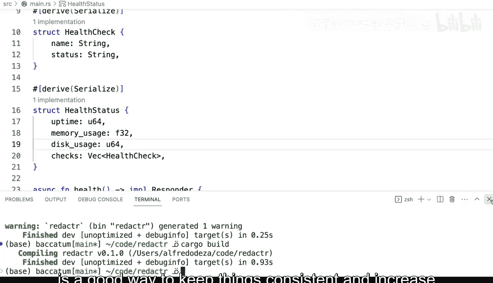

# 102：代码检查与格式化 📝


在本节课中，我们将要学习Rust开发中两个至关重要的工具：代码格式化与代码检查。它们能帮助团队保持代码风格一致，并提升代码质量与可维护性。

## 代码风格一致性的重要性

有时，工程师们对于代码格式和最佳实践会有不同的看法。为了确保代码以一种标准化的方式编写，让所有人都能遵循统一的约定，代码格式化和检查就显得尤为重要。

例如，以下是一个Rust应用程序的代码片段。在Rust中，你可以这样写代码，这完全没有问题：

```rust
fn main() {
    let health_check = HealthCheck { status: "OK".to_string() };
    println!("{}", health_check.status);
}
```

你可能会乐于以这种方式定义你的结构体。但对于其他人来说，他们可能会觉得代码布局很奇怪或很混乱，比如为什么 `HealthCheck` 结构体定义在这里，而健康状态又是那样定义的。实际上，你甚至可以把它们写在一行，并且风格不一致。**关键在于一致性**。

## 使用 `cargo fmt` 进行代码格式化

当出现风格不一致的情况时，我们可以使用Cargo内置的格式化工具。让我们打开终端并运行格式化命令：

```bash
cargo fmt
```

运行后，你会发现所有代码都被标准化了。虽然它可能在某些地方留下一些空隙（这不理想），但你已经能理解其核心思想：将代码格式化为一致的风格。

为什么这很重要？因为你希望代码在组织和团队中看起来是一致的。这种标准化能帮助你理解代码，因为所有内容都位于你期望的位置，并以你期望的格式呈现。

这非常棒，它不仅提升了代码可读性，还为实现自动化奠定了基础。

## 自动化与代码检查

接下来，我们将看到如何让 `cargo fmt` 命令自动运行，以确保代码格式一致。如果代码格式不正确，我们甚至可以拒绝变更。例如，如果我故意将代码改回混乱的格式并保存，自动化系统再次运行时就会将其纠正回来。如果检测到差异，系统可以拒绝这次更改，并提示开发者：“你最好让这些更改保持一致。”

除了格式化，我们还有代码检查工具。

## 使用 `cargo clippy` 进行代码检查

让我们看看另一个强大的工具。`cargo clippy` 是Rust中最流行的代码检查工具之一。运行以下命令：

```bash
cargo clippy
```

你会看到它列出了几个问题。然而，如果我们运行 `cargo build`，编译器会顺利通过，没有任何错误：

```bash
cargo build
    Finished dev [unoptimized + debuginfo] target(s) in 0.00s
```

既然能编译通过，那问题出在哪里呢？让我们仔细看看检查器的输出。它可能会提示：“你不需要对这个实现了 `Display` trait 的类型调用 `.to_string()`。” 这完全是多余的。

那么，这有什么问题呢？当你添加了不必要的代码时，会使代码变得冗余，更容易出错，增加混淆，并提升维护的复杂度。这不仅适用于Rust，也适用于任何其他编程语言。

事实上，我曾与一位拒绝使用代码检查工具的同事共事，他会说：“我写的代码很优美，不需要工具来告诉我该怎么做。” 但我认为这是一种误解。你完全可以借助这些免费的辅助工具，来使你的代码变得更好、更一致，并移除那些可能导致混淆或降低项目可维护性的部分。

## 核心工具总结

以下是两个非常有用的工具：

1.  **`cargo fmt`**：自动格式化代码，确保风格一致。
2.  **`cargo clippy`**：进行静态代码分析，发现潜在的错误、代码坏味道和不必要的复杂度。

理解并运用这两个工具，是保持代码一致性、提升软件项目可维护性的好方法。

---



本节课中，我们一起学习了Rust中代码格式化与检查的重要性及实践方法。我们了解了如何使用 `cargo fmt` 来统一代码风格，以及如何使用 `cargo clippy` 来发现并修复代码中的潜在问题。将这些工具集成到开发流程中，尤其是实现自动化，将极大地提升团队协作效率和代码质量。