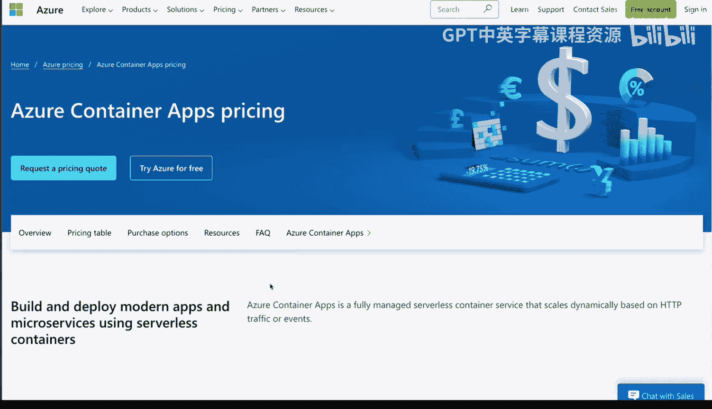
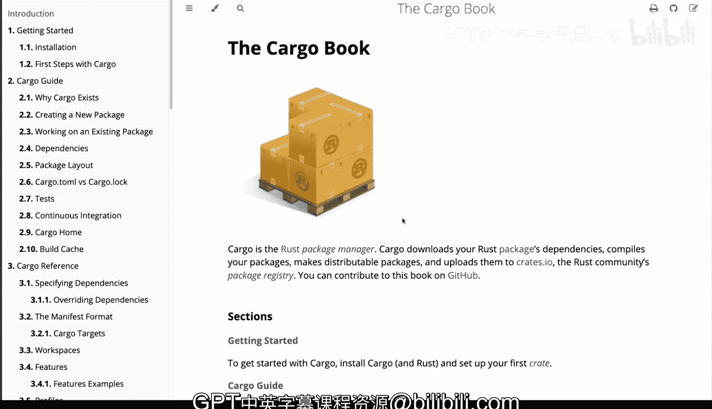

# Rust编程2-3（数据工程、DevOps）：14_01_06_Rust与Python的对比使用 🦀 vs 🐍

## 概述
在本节课中，我们将探讨为何在某些场景下应考虑使用Rust替代Python。我们将重点分析几个关键原因，包括云部署成本、性能差异以及项目打包与分发的便利性。

## 云部署成本对比 💰
上一节我们介绍了课程主题，本节中我们来看看选择编程语言时面临的主要挑战之一：云部署成本。当你计划将应用程序部署到云端时，需要计算其运行成本。

Rust应用在成本上通常比Python应用低一个数量级，这主要源于其对内存和CPU资源的消耗远低于Python。

以微软Azure容器应用为例，其消费计划的定价基于资源消耗。Python应用通常需要至少1GB内存的容器才能有效运行，具体需求取决于实际任务，但这无疑会导致更高的成本。

以下是Azure消费计划的免费授予额度：
*   **虚拟CPU**：每月180,000秒。
*   **内存**：每月360,000 GB-秒。

相比之下，一个Rust Web API应用可以仅使用**0.25个CPU核心**和**100 MB内存**成功部署。这意味着你可以将免费的CPU资源额度提升四倍，因为每秒消耗的不是一整个虚拟CPU。内存消耗也显著降低。通过简单的成本计算，可以看出使用Rust在经济上的巨大优势。

## 性能与资源效率 ⚡
除了成本优势，Rust还能带来纯粹的**性能提升**。无论是在云提供商处轻松运行和发布项目，还是在本地部署，Rust都能提供更强的处理能力、更低的RAM与内存消耗以及卓越的性能表现。

## 项目打包与分发 📦
现在，让我们将目光转向项目打包与分发。这是Python生态中一个普遍存在的问题。当你想要分发Python项目时，如果涉及依赖管理，事情会变得复杂。

尽管Python打包领域近年来出现了一些积极变化，但仍存在若干棘手且难以理解的挑战。首先，Python安装后，你首先需要确保拥有`pip`（Python包安装器）。它虽随Python安装，但常会提示你升级到新版本。

安装依赖有多种方式。在Python官方网站的打包指南中，他们提供了几种方法，但并没有一个统一的、强制的标准做法。

以下是Python中定义依赖的几种常见方式：
*   **`pyproject.toml`文件**：目前官方推荐的方式之一。
*   **`requirements.txt`文件**：传统方式。
*   **`setup.py`文件**：由`setuptools`支持。

即使使用`pyproject.toml`，你仍然需要像`pip`这样的包安装器，或者需要单独安装`build`这类工具（通过`pip`安装）。此外，你还需要使用**虚拟环境**来隔离地安装包。

配置好元数据（如README和许可证）后，你需要构建项目，这通常又需要安装`build`工具。准备发布项目时，可能还需要安装另一个工具`twine`。仅打包环节，就可能涉及四到五种不同的工具，非常复杂且缺乏统一标准。

## Rust的解决方案：Cargo 🛠️
Rust的一个主要优势在于其使用了`cargo`。`cargo`是Rust的包管理器，它集成了安装、构建、测试、代码格式化、代码检查（lint）、上传和发布等所有功能，是你需要的**单一工具**。

`cargo`使用`Cargo.toml`文件来管理项目配置和依赖，其结构与`pyproject.toml`类似。这种简单且高度统一的方式，使你无需面对Python中多种工具并存和碎片化带来的复杂性。

此外，当你使用`cargo`构建一个二进制文件时，它会确保将所有内容打包进一个**单一的可执行文件**中。这个文件可以在具有相同CPU架构的系统上直接运行。因此，一旦构建完成，向不同系统分发应用将变得非常容易。

这带来了巨大的好处：它让你能轻松分发工具，并通过一个包管理器以直接明了的方式处理构建、安装依赖和发布包等所有事宜。

## 总结
本节课中，我们一起学习了Rust相较于Python的几个关键优势。我们分析了Rust在**云部署成本**上的显著节约，得益于其更低的内存和CPU消耗。我们探讨了Rust带来的**性能与资源效率**提升。最后，我们深入比较了项目**打包与分发**的体验，揭示了Python生态的复杂性，并展示了Rust通过`cargo`工具链提供的统一、简单的解决方案。这些因素使得Rust在构建高效、低成本且易于分发的系统时成为一个强有力的选择。