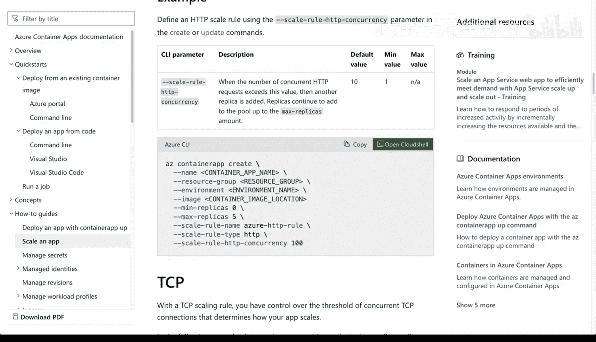

# Rust编程2-3（数据工程、DevOps）：20_01_06：容器的云扩展与弹性伸缩 🚀

在本节课中，我们将要学习云服务中的一个核心概念：扩展与弹性。我们将以在Azure平台上部署容器应用为例，重点探讨如何通过设置规则来实现服务的自动水平扩展，从而高效应对流量变化并优化成本。

## 概述

扩展与弹性是云服务的核心组成部分。云服务通过依赖特定的约束和规则来解决扩展问题，允许您的容器或服务水平地增长和扩展。“水平”意味着它将拥有更多的容器实例或资源来处理涌入的流量。本节将快速介绍在Azure上部署容器应用，并深入讲解容器化应用的扩展机制及其工作原理。设置规则至关重要，因为它能让您精确地控制扩展行为。

## 扩展规则详解

以下是配置扩展时涉及的核心参数和概念。通过它们，您可以精细调整扩展的具体含义。

*   **最小副本数**：您希望在任何给定时刻运行的最小容器实例数量。例如，对于一个API服务，您可能希望始终至少有2个实例在运行。
*   **最大副本数**：允许扩展到的最大容器实例数量上限，在Azure容器应用中最高可设置为300。
*   **默认扩展范围**：默认情况下，扩展范围是0到10，最小值为1。这意味着您可以从0扩展到1个实例，也可以设置默认值为1或2，然后一路扩展到300。
*   **扩展行为**：弹性机制允许您根据需求逐步增加容器镜像的数量，同样也可以在不再需要时减少数量。这对于实现高效的计费至关重要——您不希望在没有流量时运行300个容器，但在流量激增时，您肯定希望能在设定的约束范围内按需增长。
*   **基于指标的规则**：您可以设置基于HTTP请求、CPU和内存使用率等自定义规则。例如，可以设定规则：“如果我的CPU使用率超过某个阈值，就启动更多容器镜像。”这对于HTTP流量同样适用，平台会提供示例，您可以据此设置扩展规则、最小和最大副本数。

## 配置弹性伸缩

上一节我们介绍了扩展的核心概念，本节中我们来看看如何在Azure门户中实际配置这些规则。

首先，进入Azure门户并导航到“容器应用”服务。我已经预先创建了一个用于测试和扩展的容器应用。点击进入该应用。

创建应用的具体步骤对于今天描述扩展和副本的主题并非关键。我们需要关注的是左侧菜单中的“扩展和副本”选项。点击进入后，默认视图会显示扩展范围（例如0到10，正如之前提到的默认值）以及当前已配置的扩展规则（初始状态下通常没有规则）。

要添加新的扩展规则，您需要点击“编辑和部署”按钮。点击后，您将看到容器配置详情（例如一个简单的“Hello World”默认应用），它默认使用0.25个CPU核心和1GB内存。

在配置中，您可以启用扩展并“添加扩展规则”。规则类型可以选择“自定义”，之后您会看到所有可配置的选项。

以下是您可以配置的一些规则类型示例：

*   **Azure队列**：基于队列深度触发扩展。
*   **HTTP并发请求**：您可以设置规则，例如“如果并发HTTP请求数超过100，则进行扩展，最多扩展到10个实例”。这提供了极大的灵活性。

## 自动化与DevOps集成

为什么弹性伸缩如此重要？因为它让您掌握DevOps中的一个关键概念：保持灵活性。它允许您、您的团队或组织以一种近乎半自动化的方式，通过定义规则来应对流量增长时的扩展需求。

Azure的一个优点是，如果您滚动到配置页面的顶部，可以查看相关文档。在门户中点击菜单进行配置是一方面，但如果您想实现自动化——请记住，自动化是DevOps的基石之一——您将需要借助CI/CD系统。

通过CI/CD，您可以使用Azure CLI命令来设置这些规则，而不是手动点击菜单。这样，所有配置示例都会转变为可版本控制和自动执行的代码。这为实现真正的基础设施即代码和自动化部署流程铺平了道路。

## 总结

本节课中，我们一起学习了云环境下的扩展与弹性概念，特别是在Azure容器应用中的实现。我们探讨了如何通过设置最小/最大副本数以及基于CPU、内存或HTTP指标的规则，来定义自动水平扩展的行为。这种机制确保了应用既能高效应对流量高峰，又能在空闲时节约成本。最后，我们提到了通过CI/CD和Azure CLI实现规则配置自动化的重要性，这是将弹性伸缩融入现代DevOps实践的关键一步。