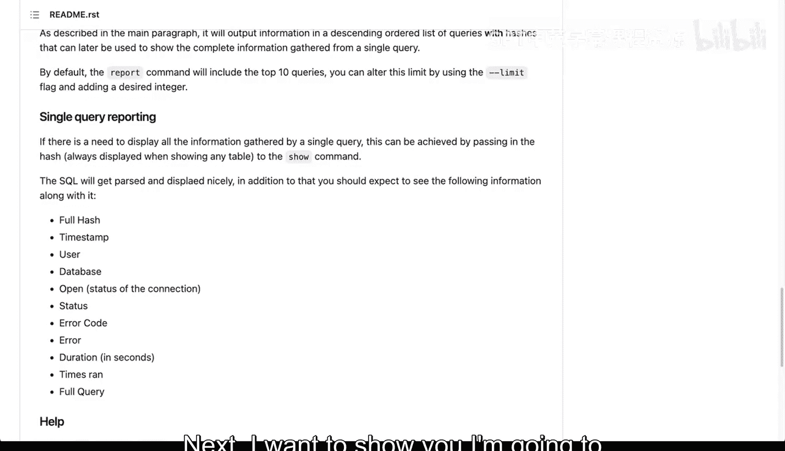
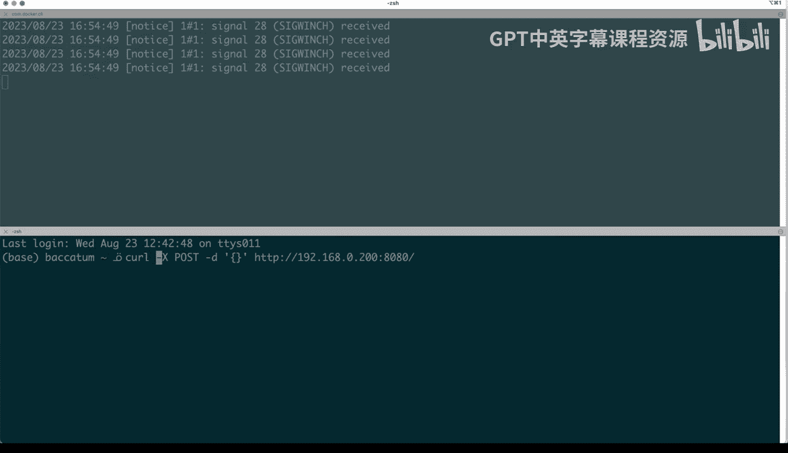
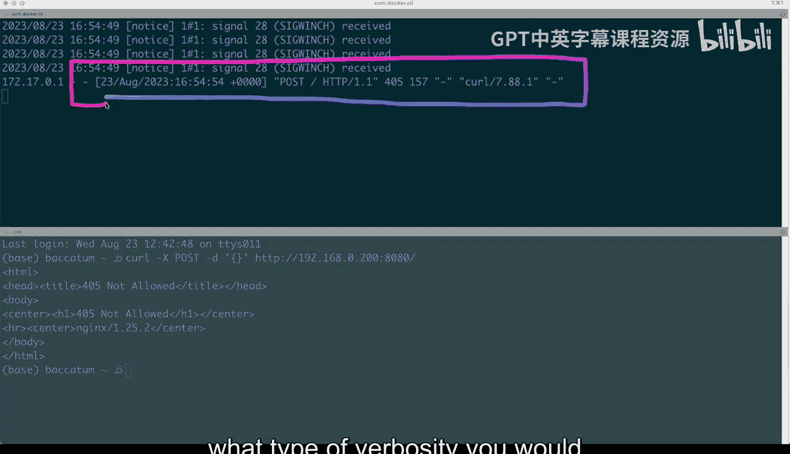

# 111：日志记录与监控的交叉点 📊

在本节课中，我们将要学习日志记录与监控在DevOps环境中的重要性，以及它们如何协同工作以帮助诊断问题、优化性能和触发自动化操作。我们将通过一个PostgreSQL查询分析器的具体项目和一个Nginx服务器的日志示例，来理解如何从日志中提取有价值的信息，并将其应用于监控场景。

---

## 日志记录的重要性 🔍

上一节我们介绍了DevOps的基本原则。本节中我们来看看日志记录为何是实现这些原则的关键一环。日志记录在DevOps环境中至关重要，它允许你应用一些DevOps原则。

我在这里有一个几年前编写的示例项目，它是一个用于PostgreSQL的查询分析器。让我简单介绍一下这个项目的背景。当时我们有一个PostgreSQL分布式集群。PostgreSQL是一个数据库和数据库服务器。我们遇到了一些查询相关的问题。

在启用日志后，因为实际上你可以在PostgreSQL中配置日志记录，这里有一个配置示例。你不仅可以设置日志名称，还可以设置日志类型。你可以看到这实际上非常强大。你可以将日志记录到标准错误输出。

你也可以记录到`syslog`，这是一个代表系统日志的系统。它是操作系统（如Linux和其他类Unix操作系统）的实际组成部分。还有事件日志。你绝对可以启用这些，并且也可以捕获标准错误输出。这一切都很好，但需要你设置日志记录。

现在，为什么这很重要？为什么这与我们试图用DevOps做的事情相关，并且实际上适用于任何其他应用程序？这是因为错误报告和日志记录使我们能够进行查询分析。这虽然是PostgreSQL特有的，但我们马上会看到它如何适用于其他类型的应用程序。

---

## 从日志到分析：一个查询分析器案例 📈

这个非常小的程序可以做到以下几点：

以下是该程序的核心功能列表：
*   **检测最慢的查询**：找出执行时间最长的查询。
*   **查找使用情况**：找出使用频率最高的查询。想象一下，有人发出一个查询，它是最慢的，但可能有一个查询不是特别慢，却被使用了非常多次。
*   **计算权重**：权重是**执行时间乘以使用次数**。这是一个非常有用的指标，因为它能让你找出哪些查询问题最大。

现在，这一切都来自于查看日志的能力。有了这些信息，你可以进行更深入的调查。

因此，我们清晰地划分了日志记录和监控的职责：日志记录更多用于调查，而监控用于触发某种操作。但在这两者之间也存在一些交叉。

---

## 基于日志的监控 🔄

你实际上可以基于日志进行监控。你可以在这里看到，我将跳过这个应用程序的所有具体细节。但归根结底，我们能够捕获所有这些信息，并能够进行一些准确的报告。这基本上都是因为日志记录才成为可能。

接下来，我想向你展示。我将切换到我的终端。在我的终端里，我想运行Nginx，一个运行Nginx的容器。我将执行`docker run`命令，并将Nginx的80端口映射到主机的8080端口。我将运行Nginx的最新版本。

我将执行这个命令，这需要一点时间来启动。好的，它正在启动。这里有几件事在发生：工作进程的数量，实际上工作进程正在启动，并且它给了我一些关于服务器如何启动的信息。这相当不错，也很有用。

这里有很多调试信息，特别是关于Docker的，就在顶部。但除此之外，除了它正在启动，没有其他信息。

在一个单独的窗口，我将开始向这个端点发送一些请求。当我开始发送请求时，你会开始看到所有这些信息出现在那里。到目前为止，所有这些都是好的请求。

但如果我开始输入一些会导致错误的内容，你会看到情况变得有点棘手。让我们尝试一点一点地分解这些信息。

首先，它识别了IP地址。这是发起请求的源IP地址。因为这是一个容器，这需要一些调整才能使其真正有用。

现在我们这里有日期和时间，你可以看到它是以这种格式分隔的。这都很好。然后我们看到了我执行的GET请求。我通过浏览器发出了一个GET请求，这是HTTP请求的类型，我得到了一个`304`，`304`意味着它是一种重定向。这些细节并不重要。我正在使用这种类型的浏览器。

这是一个有趣的信息，Web服务器可以捕获它，所以你可以判断出我正在使用苹果电脑，并且发出了那种类型的请求。这非常好。如果我继续向下滚动，找到实际的错误，你可以看到我试图访问`/FffF`，嗯，它不存在。我使用的主机是……这一点很重要。

这是实际处理该请求的主机，那是IP地址，而这里的是端口。你可以开始看到，这对于理解可能不太顺利的事情非常有用。如果我实际上去清除所有这些，然后用`curl`发送一个请求。

我将在这里拆分我的终端。我将执行一个`curl`命令。并且我将提交POST数据。

你会看到，这里顶部的内容……嗯，给了我另一种类型的错误，并说：嘿，这个人不仅不再使用Mozilla风格的浏览器，而且正在使用`curl`客户端，它来自这里的这个信息。我正在执行一个POST请求，并且得到了一个`405`。这是来自服务器的响应，现在被记录下来了。

---

## 日志与监控的交叉点 ⚙️

这在监控的背景下何时有用？因为我告诉过你这里存在一个交叉点。这里的交叉点在于，你可以建立监控，来查看这些类型的日志。然后你可以设置某种规则，并可以说：好吧，如果我们开始收到多个`405`或`404`或几个错误，特别是如果它们来自POST请求，那么我们需要采取一些措施。

所以，一旦你开始看到错误，当然最严重的是`500`错误。如果你仍然看到`500`错误，也就是内部服务器错误，那么你就知道需要采取一些行动。因此，你可以拥有基于日志记录的监控，即某个应用程序正在查看那里的日志。这就是日志记录。

当然，也有可能更多地查看监控工具。但对于日志记录来说，这是非常基础的，它能让你大致了解为什么你想要启用日志记录，以及在类似情况下你希望拥有何种详细程度的日志，以便你能够理解和弄清楚这些信息来自何处。

---

## 总结 📝

本节课中我们一起学习了日志记录与监控在DevOps中的核心作用。我们通过一个PostgreSQL查询分析器项目，看到了如何从数据库日志中提取“执行时间”和“使用次数”等关键指标（**权重 = 执行时间 × 使用次数**），并将其用于性能分析和问题定位。随后，我们通过一个运行在Docker容器中的Nginx实例，实地观察了Web服务器日志的格式与内容，并探讨了如何基于日志中的状态码（如`404`、`405`、`500`）来设置监控规则和触发告警。关键在于，日志为深入调查提供了原始数据，而监控则利用这些数据（或更直接的指标）来主动发现问题并触发行动，两者相辅相成，共同构成了可观测性体系的重要支柱。