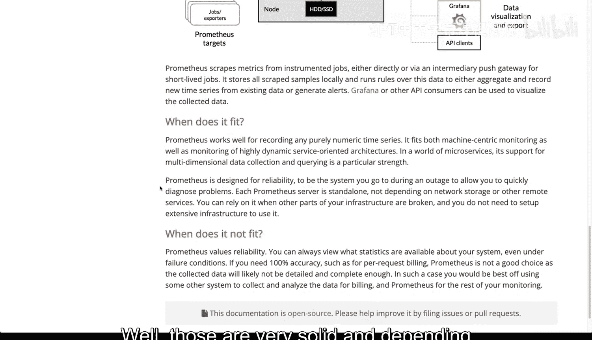

# Rust编程2-3（数据工程、DevOps）：23_02_03：监控工具概览 🛠️

在本节课中，我们将学习几种流行的应用程序监控工具。我们将了解它们的基本架构、核心组件以及各自的特点，帮助你为项目选择合适的监控方案。

## 概述

监控是确保应用程序健康运行的关键环节。存在多种不同的监控工具和仪表化方案。本节将介绍几种非常流行的工具，以及一个我个人非常喜欢、但目前不那么主流的工具。

## ELK/Elastic Stack 📊

首先，我们从ELK栈开始，它也被称为Elastic栈。

ELK代表 **Elasticsearch**、**Logstash** 和 **Kibana**。通常，**Beats** 不包含在这个缩写中，但这四个工具的组合为应用程序提供了非常出色的监控能力。

以下是其核心组件：

*   **Elasticsearch**：本质上是一个数据存储，类似于一个大型数据库（尽管不完全是）。所有的指标和信息都会发送到这里。
*   **Kibana**：这是仪表盘前端，用于可视化数据。Kibana会与Elasticsearch通信，生成展示系统状态的精美图表。
*   **Beats**：它会查看文件系统中的日志文件，并将这些日志条目发送给Logstash。
*   **Logstash**：负责解析日志。你可以设置规则，例如，只处理来自Nginx Web服务器的错误日志。

### 工作原理

其工作流程如下：
1.  Beats将日志发送给Logstash。
2.  Logstash解析日志，然后发送给Elasticsearch。
3.  Kibana从Elasticsearch读取数据，并生成精美的仪表盘。

这种架构的优势在于，你可以从任何地方摄取日志，只要存在日志文件，就能将其发送过来，没有问题。通过Kibana，你可以很好地整合数据，创建非常强大的仪表盘，从而构建出优秀的监控基础设施，清晰地了解系统运行状况。

## Graphite 📈

接下来，我们看看Graphite。它同样由多个协同工作的组件构成，能够生成引人注目的图表，进行良好的监控，并理解数据随时间的变化趋势。

Graphite的核心架构包括：
*   **Web前端**：接收请求的Web部分。
*   **Carbon**：一个监听传入指标的守护进程。
*   **Whisper**：数据存储部分，是一种用于存储时间序列数据的特殊类型数据库库。

其工作方式是：应用程序会发送它们的指标（例如，某个函数处理数据所花费的时间）。这通常与**StatsD**配对使用。StatsD是一个使用Node.js运行的守护进程，它会将这些指标值发送给Graphite的Carbon组件，以便后续展示。这种方式与代码集成起来非常方便。

## Prometheus 🔔

最后是Prometheus。在这里，你会看到监控和触发行动的交叉点。Prometheus是一种不同类型的监控工具，它不仅捕获指标，还能发送警报。

Prometheus的架构特点是：服务器有能力暴露（expose）指标，然后Prometheus服务器通过**拉取（pull）** 的方式获取这些指标。之后，你可以通过Prometheus Web UI或**Grafana**进行可视化展示和指标导出。我们稍后会详细讨论拉取和推送模式。

## 总结

本节课我们一起学习了三种主要的监控工具栈：**ELK栈**（Elasticsearch, Kibana, Logstash）、**Graphite**（与StatsD配合）以及**Prometheus**。这些都是非常可靠的方案。具体选择哪一种，取决于你的部署环境和使用方式。