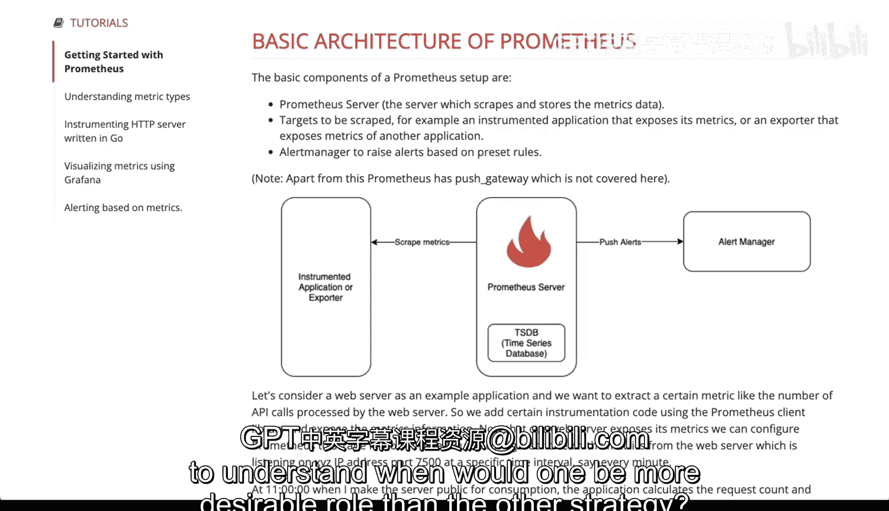

# 113：推送与拉取策略

在本节课中，我们将学习应用监控与日志管理的两种核心策略：推送与拉取。理解这两种策略的工作原理和适用场景，对于构建高效、可维护的监控体系至关重要。

## 概述

监控和日志管理主要有两种实现方式。我们将从 Elastic Stack（又称 ELK Stack）入手，其核心工作机制是**推送**策略。实际上，信息传输有两种主要方式：一种是推送，另一种是拉取。

## Elastic Stack 的推送策略

首先，我们来观察一下 Elastic Stack 的架构是如何工作的。整个过程从数据采集开始，一切始于 **Beats**。

以下是 Elastic Stack 推送策略的工作流程：

1.  **安装 Beats 代理**：你需要在你的系统上安装一个名为 Beats 的代理（类似守护进程）。它会持续观察特定文件（例如日志文件）。
2.  **推送至 Logstash**：当 Beats 发现新的或有趣的信息时，它会主动将这些数据**推送**到 **Logstash**。这就是推送策略，因为源服务器（即运行应用的服务器）负责发起传输，将信息发送到另一个地方（这里是 Logstash）。
3.  **数据处理与转发**：Logstash 会根据预定义的规则解析和处理接收到的数据。处理完成后，Logstash 会再次**推送**数据到 **Elasticsearch** 进行存储和索引。
4.  **可视化与反馈**：最后，**Kibana** 会从 Elasticsearch 中获取数据，并创建可视化的仪表板，形成一个可以提供出色指标的反馈循环。

这个由 Beats、Logstash、Elasticsearch 和 Kibana 组成的体系被称为**推送策略**，因为数据流是由数据源主动发起的。

## Prometheus 的拉取策略

上一节我们介绍了由数据源主动发起的推送策略。本节中，我们来看看另一种相反的策略：**拉取**。

拉取策略指的是由一个中心服务主动从其监控的组件中获取（拉取）数据。我们之前简要提到过的 **Prometheus** 就是这种策略的典型代表。

以下是 Prometheus 拉取策略的基本架构：

1.  **部署 Prometheus 服务器**：Prometheus 服务器自带时间序列数据库。
2.  **应用暴露指标端点**：被监控的应用程序（例如一个 API 服务）需要在其 API 中暴露一个特定的端点（endpoint），用于提供监控指标。
3.  **主动拉取指标**：Prometheus 服务器会按照设定的时间间隔，主动去“抓取”或访问该应用程序暴露的指标端点，从而**拉取**指标数据并存储到自己的时间序列数据库中。

这种策略被称为**拉取策略**。数据流是由监控中心（Prometheus）主动发起的。

## 策略对比与选择

我们已经了解了推送和拉取两种策略。那么，在什么情况下一种策略会比另一种更合适呢？

以下是两种策略的典型适用场景：

*   **拉取策略（如 Prometheus）的优势**：
    *   在处理**容器化**环境时非常有效。你只需要确保你的容器化应用暴露一个指标端点，Prometheus 就能自动发现并拉取数据，管理起来非常方便。

*   **推送策略（如 Elastic Stack / StatsD）的优势**：
    *   适用于你可以轻松配置并运行守护进程的**服务器或传统环境**。如果你能将 Beats 代理等配置直接集成到你的应用部署流程中，那么推送策略是一个很好的选择。
    *   推送策略对接收信息的服务器压力较小，因为它只需要被动接收数据即可。另一个使用推送策略的典型服务是 **StatsD**，它同样需要在客户端安装 StatsD 守护进程来推送指标。

简而言之，**Prometheus 从暴露的指标端点拉取数据，而 Elastic Stack 和 StatsD 则依赖客户端代理推送数据**。理解这两种策略的差异，能帮助你更轻松地判断在何种场景下使用哪种策略更为理想。

## 总结

本节课中，我们一起学习了应用监控的两种核心数据收集策略：**推送**与**拉取**。我们以 Elastic Stack 为例讲解了推送架构，以 Prometheus 为例讲解了拉取架构，并对比了它们各自的优缺点和适用场景。掌握这些概念，是设计高效监控系统的重要基础。