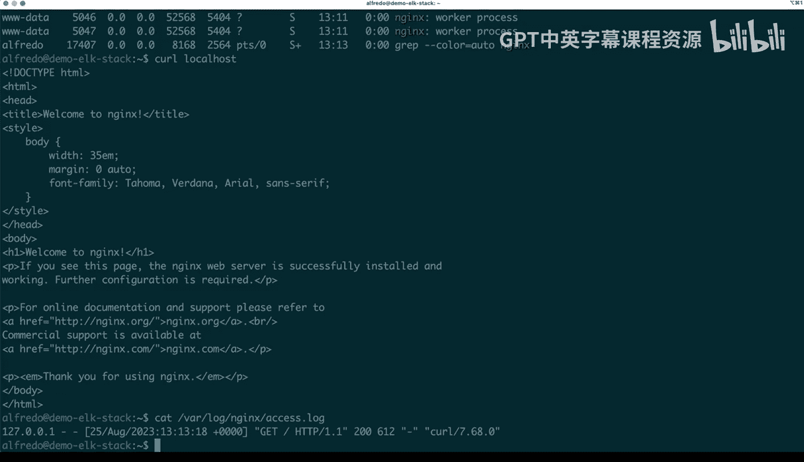

# 116：安装ELK技术栈 🛠️


在本节课中，我们将学习如何在基于Debian的Linux机器上安装ELK技术栈。ELK是Elasticsearch、Logstash和Kibana的简称，是一个用于日志收集、存储、分析和可视化的强大工具组合。我们将通过一系列步骤，从安装依赖项开始，到配置并启动各个服务，最终验证整个栈的运行情况。

---

## 概述

我们将在一台运行Ubuntu 20.04 LTS的Linux机器上，按照官方文档的指导，完成ELK技术栈的安装。整个过程包括设置软件源、安装核心组件、配置系统服务以及进行初步验证。

---

## 安装前的准备

首先，我们需要检查当前系统的环境。确认我们使用的是Ubuntu 20.04 LTS版本，这是我们将要使用的系统。

### 设置密钥和依赖项

接下来，我们开始设置安装所需的GPG密钥和依赖项。

以下是具体步骤：

1.  **获取Elasticsearch的GPG密钥**：这是为了验证从Elastic官方仓库下载的软件包的安全性。
2.  **安装`apt-transport-https`包**：这个包允许`apt`包管理器通过HTTPS协议访问软件仓库，是安装过程的一个必要依赖。

我们通过以下命令来安装`apt-transport-https`：
```bash
sudo apt-get install apt-transport-https
```
安装过程需要一些时间，请等待其完成。

---

## 添加Elastic软件源

上一节我们安装了必要的依赖，本节中我们来看看如何将Elastic的官方软件源添加到系统的软件源列表中。

我们需要运行一个较长的命令来创建源列表文件。这个命令指定了软件包的来源（即Elastic的官方仓库）。执行后，系统就能识别并从中获取ELK组件。

运行以下命令后，更新几乎是立即完成的。接下来，我们就可以开始安装各个组件了。

---

## 安装Elasticsearch

现在，我们开始安装ELK栈的核心——Elasticsearch。它是一个分布式搜索和分析引擎。

执行安装命令：
```bash
sudo apt-get install elasticsearch
```
在安装过程中，你可能会遇到“无法定位软件包”的错误。这通常意味着我们刚刚添加的软件源列表尚未被系统更新。解决方法是运行`sudo apt update`来更新所有软件源。

更新后，你会看到Elasticsearch的包开始被拉取。然后，我们可以继续执行安装命令。安装过程会拉取所有必要的文件并构建软件包。

安装完成后，有几个重要事项需要注意：
*   系统会为Elasticsearch的内置超级用户`elastic`生成一个随机密码。这是一个密钥，**不应**分享，务必保存在安全的地方（例如密码管理器）。
*   如果需要加入集群（本教程不涉及），可以按照屏幕提示重置密码。
*   后续安装Kibana时，可能需要进行注册（enrollment）。

---

## 安装Kibana和Logstash

我们已经成功安装了Elasticsearch，接下来安装栈的另外两个核心组件：用于数据可视化的Kibana和用于数据处理的Logstash。

首先安装Kibana，它是ELK栈的前端仪表板：
```bash
sudo apt-get install kibana
```
等待安装完成。

接着安装Logstash，它是一个服务器端的数据处理管道：
```bash
sudo apt-get install logstash
```
同样，等待其安装完成。

---

## 安装Filebeat

ELK栈的核心组件已安装完毕。为了收集和发送日志数据，我们还需要一个轻量级的日志数据采集器——Filebeat。

以下是安装Filebeat的命令：
```bash
sudo apt-get install filebeat
```
Filebeat的安装通常比前面几个组件更快。等待其完成即可。

---

## 配置并启动系统服务

所有软件包都已安装完成。现在，我们需要将它们配置为系统服务，并确保它们能随系统启动而自动运行。

我们将使用`systemd`来管理这些服务。首先，确保`systemctl`命令可用，然后重新加载`systemd`管理器配置：
```bash
sudo systemctl daemon-reload
```
这个命令确保系统能识别新添加的服务单元文件。

接下来，启用各项服务，使它们在系统启动时自动运行：
*   启用Elasticsearch服务：`sudo systemctl enable elasticsearch.service`
*   启用Filebeat服务：`sudo systemctl enable filebeat.service`
*   启用Logstash服务：`sudo systemctl enable logstash.service`
*   启用Kibana服务：`sudo systemctl enable kibana.service`

启用服务后，我们逐个启动它们，并检查运行状态：
1.  启动Elasticsearch：`sudo systemctl start elasticsearch.service`。使用`ps aux | grep elasticsearch`检查其是否在运行。
2.  启动Kibana：`sudo systemctl start kibana.service`。同样使用`ps`命令检查进程。
3.  启动Logstash：`sudo systemctl start logstash.service`。检查进程确认运行。
4.  启动Filebeat：`sudo systemctl start filebeat.service`。检查进程确认运行。

至此，所有ELK栈服务都已启动并运行。虽然我们还没有进行具体的配置，但基础环境已经就绪。

---

## 安装Nginx以生成测试日志

为了测试ELK栈是否能正常处理日志，我们需要一个能产生日志的应用程序。这里我们选择安装Nginx Web服务器。

执行以下命令安装Nginx：
```bash
sudo apt-get install nginx-full
```
安装Nginx后，系统会创建日志目录（如`/var/log/nginx/`），其中包含`access.log`和`error.log`等文件。初始时这些日志文件是空的。

我们可以检查Nginx是否运行：`sudo systemctl status nginx`。然后，通过向本地发送一个HTTP请求来生成一条访问日志：
```bash
curl localhost
```
执行后，再次查看`/var/log/nginx/access.log`文件，应该能看到新产生的日志条目。这证明Nginx正在运行并记录日志。

---

## 总结



本节课中，我们一起完成了在Ubuntu系统上安装ELK技术栈的全过程。我们从设置软件源和安装依赖开始，逐步安装了Elasticsearch、Kibana、Logstash和Filebeat这四个核心组件。接着，我们使用`systemd`将这些组件配置为系统服务并确保它们成功启动。最后，我们安装了Nginx作为日志源，并验证了其可以生成日志，为后续的日志收集、处理和可视化测试做好了准备。