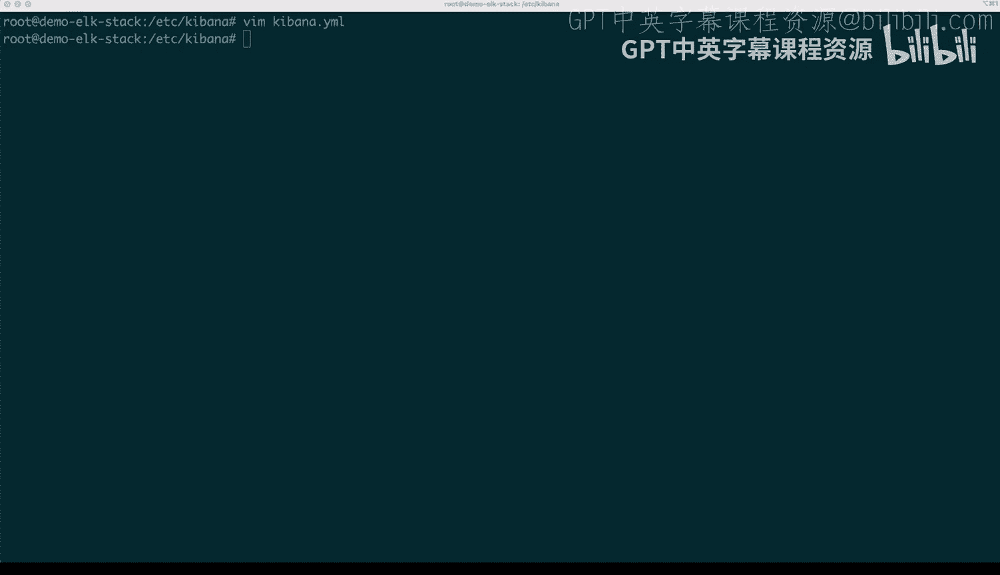
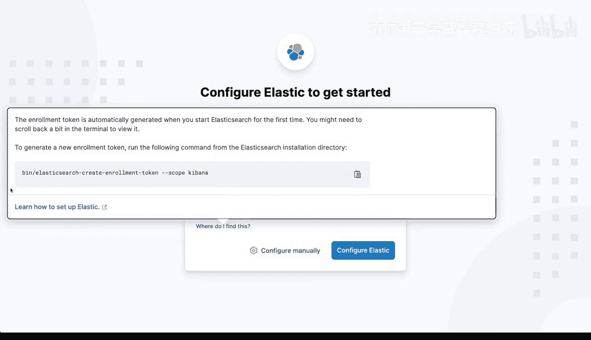
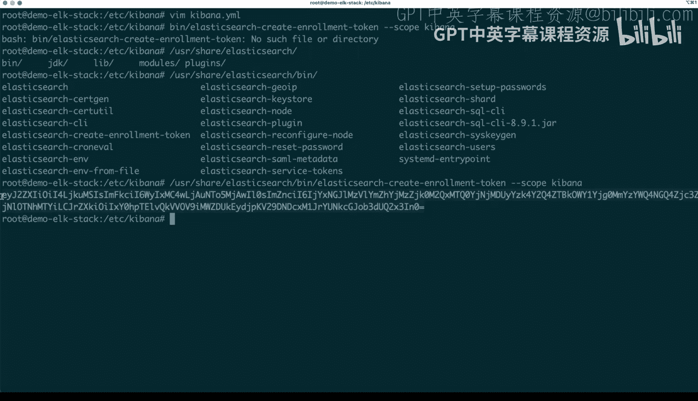
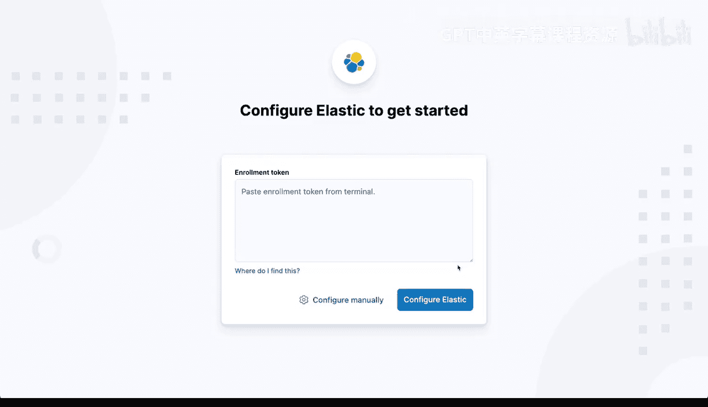
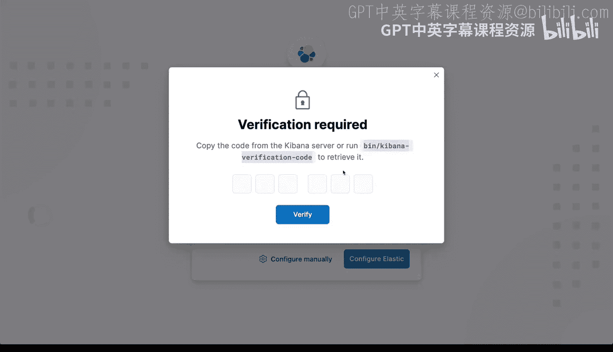
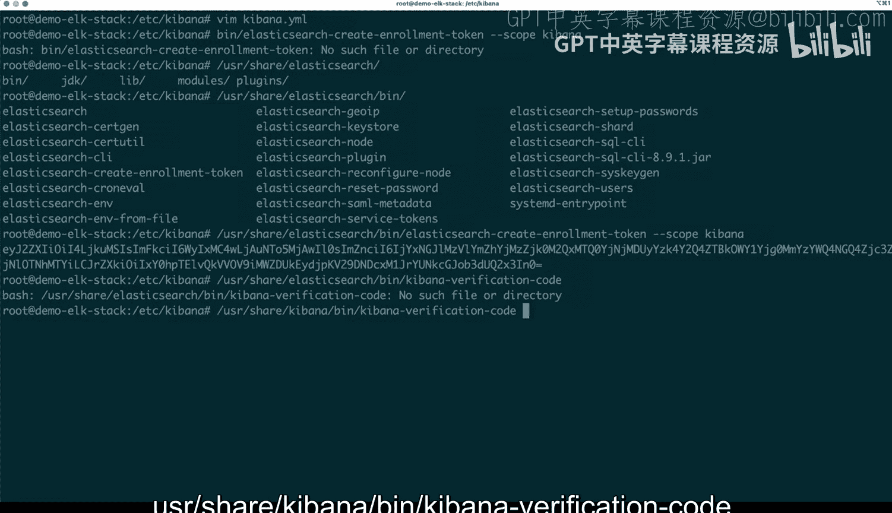
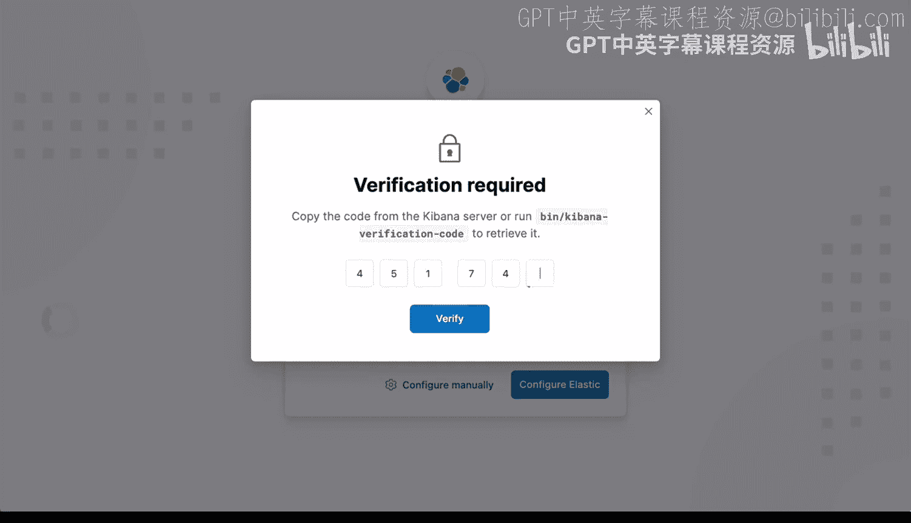
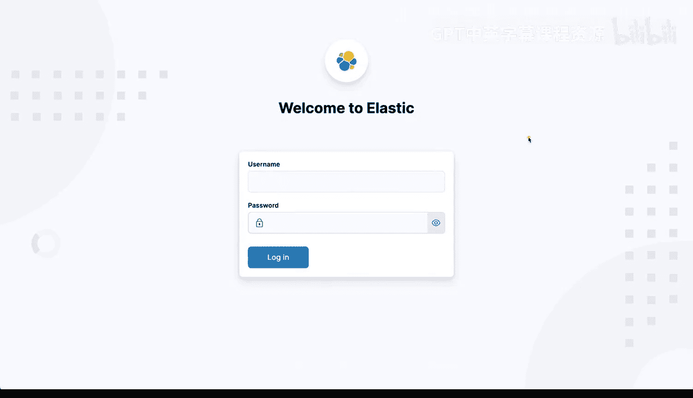
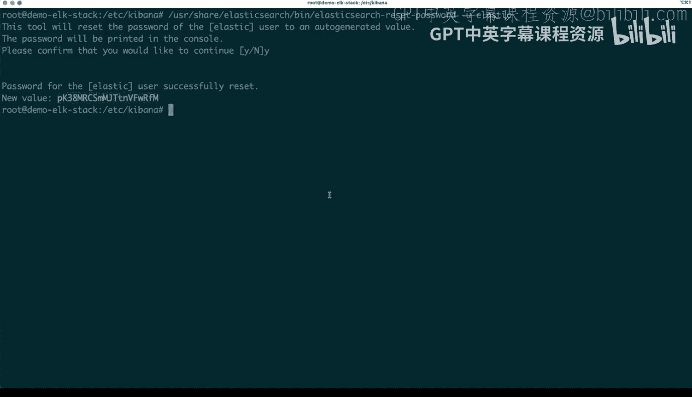
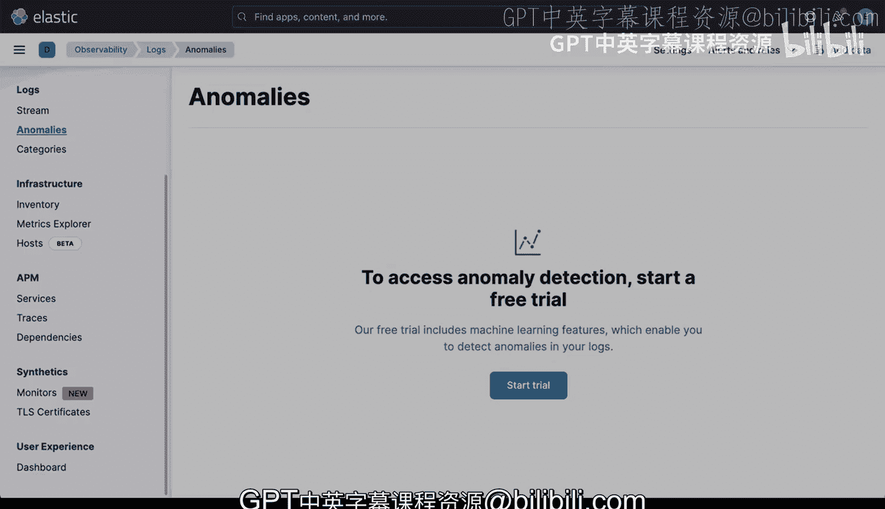

# Rust编程2-3（数据工程、DevOps）：28_02_05：配置ELK技术栈 🛠️

在本节课中，我们将学习如何配置ELK技术栈（Elasticsearch、Logstash、Kibana）以收集、处理和可视化Nginx的日志。我们将从配置Filebeat开始，逐步设置Logstash管道，并最终在Kibana中查看日志数据。


## 概述

ELK技术栈是一个强大的日志管理解决方案。本节教程将指导你完成配置Filebeat以收集Nginx日志，使用Logstash进行日志解析和过滤，并最终将数据发送到Elasticsearch，以便在Kibana中进行可视化分析。

## 配置Filebeat

上一节我们介绍了ELK技术栈的基本组件。本节中，我们来看看如何配置Filebeat来收集Nginx服务器的日志。

首先，我们需要编辑Filebeat的配置文件。该文件通常位于 `/etc/filebeat/filebeat.yml`。由于需要管理员权限，我们使用 `sudo` 命令进行编辑。

以下是需要修改的关键配置部分：

```yaml
filebeat.inputs:
- type: log
  enabled: true
  paths:
    - /var/log/nginx/*.log
```

*   **`type: log`**：指定输入类型为日志文件。
*   **`enabled: true`**：启用此输入配置。
*   **`paths`**：指定Nginx日志文件的路径。使用通配符 `*.log` 可以同时捕获 `access.log` 和 `error.log`。

配置完成后，需要重启Filebeat服务以使更改生效。执行以下命令：

```bash
sudo systemctl stop filebeat
sudo systemctl start filebeat
```

重启后，Filebeat将开始监控指定的Nginx日志文件，并将日志事件发送出去。

## 配置Logstash

现在Filebeat已经开始收集日志，我们需要配置Logstash来处理这些日志数据。Logstash的配置文件通常位于 `/etc/logstash/conf.d/` 目录下。

我们将创建一个名为 `filebeat-nginx.conf` 的新配置文件。这个配置文件需要定义三个主要部分：输入（input）、过滤器（filter）和输出（output）。

以下是配置文件的内容：

```ruby
input {
  beats {
    port => 5044
  }
}

filter {
  grok {
    match => { "message" => "%{COMBINEDAPACHELOG}" }
  }
}



output {
  elasticsearch {
    hosts => ["localhost:9200"]
  }
}
```

*   **输入（Input）**：配置Logstash通过5044端口接收来自Filebeat的数据。
*   **过滤器（Filter）**：使用 `grok` 插件和 `COMBINEDAPACHELOG` 模式来解析Nginx的访问日志格式，将非结构化的日志文本转换为结构化的字段。
*   **输出（Output）**：将处理后的数据发送到本地运行的Elasticsearch实例（端口9200）。

保存配置文件后，需要重启Elasticsearch和Kibana服务，以确保整个管道能够正常工作。



```bash
sudo systemctl restart elasticsearch
sudo systemctl restart kibana
```

## 访问与配置Kibana





Logstash配置完成后，数据将流入Elasticsearch。现在，我们通过Kibana来查看和探索这些日志数据。

首先，确保Kibana服务正在运行。默认情况下，Kibana可能只绑定在本地回环地址（`localhost`）。如果你希望通过网络访问，需要修改其配置文件 `/etc/kibana/kibana.yml`，将 `server.host` 的值从 `"localhost"` 改为 `"0.0.0.0"`。



```yaml
server.host: "0.0.0.0"
```





修改后，重启Kibana服务。

接下来，在浏览器中访问Kibana（通常是 `http://<你的服务器IP>:5601`）。首次访问时，需要进行初始设置。

Kibana会提示你输入一个注册令牌（enrollment token）以连接到Elasticsearch。这个令牌可以通过在Elasticsearch服务器上运行以下命令来生成：

```bash
sudo /usr/share/elasticsearch/bin/elasticsearch-create-enrollment-token --scope kibana
```

将生成的令牌粘贴到Kibana的网页界面中，点击“配置”。

随后，Kibana会要求你输入一个验证码（verification code）。这个验证码可以通过在Kibana服务器上运行以下命令获得：

```bash
sudo /usr/share/kibana/bin/kibana-verification-code
```





输入验证码后，Kibana将完成与Elasticsearch的连接设置。

设置完成后，你可能需要使用默认用户 `elastic` 登录。如果忘记密码，可以在Elasticsearch服务器上运行密码重置命令：

```bash
sudo /usr/share/elasticsearch/bin/elasticsearch-reset-password -u elastic
```

命令会生成一个新密码，使用 `elastic` 用户名和这个新密码即可登录Kibana。

成功登录后，你将进入Kibana的主界面。在这里，你可以：
*   进入“Discover”页面探索和搜索你的Nginx日志。
*   使用“Dashboard”创建自定义的数据可视化图表。
*   在“Stack Management”中管理索引、用户和权限。

## 总结

本节课中我们一起学习了如何配置完整的ELK技术栈来处理Nginx日志。我们完成了以下关键步骤：
1.  配置 **Filebeat** 来收集 `/var/log/nginx/` 目录下的日志文件。
2.  配置 **Logstash** 管道，使用 `grok` 过滤器解析日志，并将结果输出到Elasticsearch。
3.  启动服务并配置 **Kibana**，通过网页界面实现日志数据的可视化探索。



虽然初始配置需要一些步骤，但搭建好的ELK栈提供了一个功能强大、集成度高的日志监控、分析和告警平台。你可以在此基础上，进一步探索如何将其配置为适用于多服务器或集群环境的生产级部署。