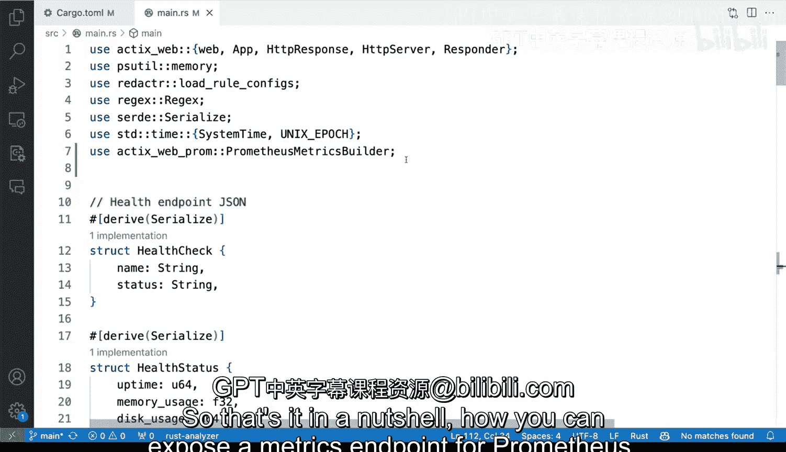
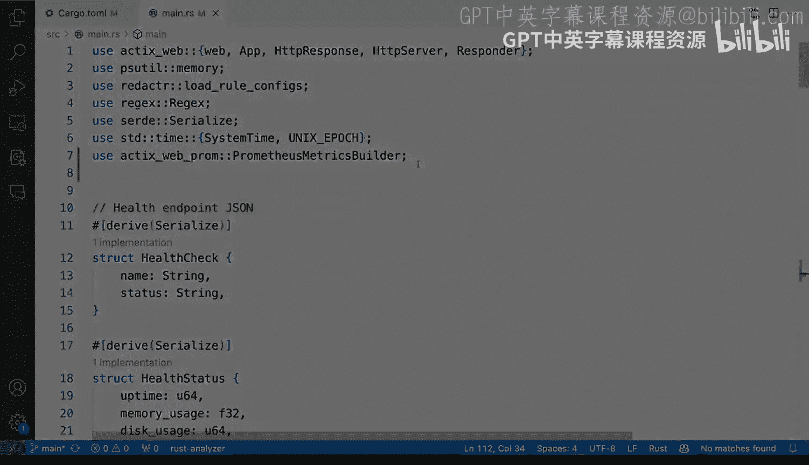

# Rust编程：2-3：在Rust应用中添加Prometheus监控端点


## 概述
在本节课中，我们将学习如何为一个使用Actix-web框架的Rust HTTP API应用添加Prometheus监控端点。Prometheus是一个流行的监控和告警工具，它通过从应用暴露的特定端点“拉取”指标数据来工作。我们将使用`actix-web-prom`中间件来简化这一过程。

## 添加依赖
首先，我们需要在项目的`Cargo.toml`文件中添加必要的依赖。我们将使用`actix-web-prom`这个crate，它专为Actix-web框架设计，能够自动处理Prometheus指标的格式化和端点暴露。

以下是需要添加的依赖项：
```toml
[dependencies]
actix-web = "4.0"
actix-web-prom = "0.10.0"
```

## 导入与初始化
上一节我们介绍了所需的依赖，本节中我们来看看如何在代码中导入并使用`actix-web-prom`。

在`main.rs`文件的顶部，我们需要导入`PrometheusMetricsBuilder`。这个构建器将帮助我们配置和创建Prometheus指标端点。
```rust
use actix_web_prom::PrometheusMetricsBuilder;
```

## 配置Prometheus中间件
接下来，我们需要在`main`函数中配置Prometheus中间件。这个中间件将自动为我们的应用添加一个`/metrics`端点。

首先，我们使用`PrometheusMetricsBuilder`来创建一个指标收集器。我们需要为它指定一个名称（通常使用项目名）和指标暴露的端点路径。
```rust
let prometheus = PrometheusMetricsBuilder::new("redactor")
    .endpoint("/metrics")
    .build()
    .unwrap();
```
在这段代码中：
*   `"redactor"`是项目的名称，它将作为所有指标的前缀。
*   `"/metrics"`是Prometheus来抓取数据的默认端点路径。
*   `build().unwrap()`方法构建出最终的中间件实例。

## 集成到HTTP服务器
现在我们已经创建了Prometheus中间件，需要将它集成到我们的Actix-web HTTP服务器中。由于它是一个中间件，我们需要将它“包裹”在现有的应用实例上。

找到创建HTTP服务器的代码部分（通常是调用`HttpServer::new`的地方），然后使用`.wrap()`方法添加中间件。为了避免所有权问题，我们使用`clone()`方法并配合`move`关键字。
```rust
HttpServer::new(move || {
    App::new()
        .wrap(prometheus.clone()) // 添加Prometheus中间件
        // ... 其他应用配置和路由
})
.bind("127.0.0.1:8080")?
.run()
.await
```
通过这行代码，我们的应用现在会处理所有发往`/metrics`端点的请求，并以Prometheus期望的格式返回监控指标。

## 运行与验证
配置完成后，让我们运行应用并验证指标端点是否正常工作。

在终端中运行以下命令来启动应用：
```bash
cargo run
```
应用启动后，在浏览器中访问 `http://localhost:8080/metrics`。

你应该能看到一个纯文本页面，其中包含了各种以`redactor_`为前缀的指标，例如：
*   `redactor_http_requests_duration_seconds_bucket`：HTTP请求耗时的直方图数据。
*   `redactor_http_requests_total`：HTTP请求的总数。

这些指标会自动包含请求的端点路径、HTTP方法和状态码等信息。当你访问应用的其他端点（包括不存在的路径产生404错误）时，相应的指标也会被记录并能在`/metrics`页面中看到更新。

## 总结
本节课中我们一起学习了如何为Rust Actix-web应用添加Prometheus监控支持。整个过程可以总结为以下三个步骤：
1.  **添加依赖**：在`Cargo.toml`中加入`actix-web-prom`。
2.  **配置中间件**：使用`PrometheusMetricsBuilder`创建并配置指标收集器，指定项目名和端点路径。
3.  **集成到服务器**：在创建`HttpServer`时，使用`.wrap()`方法将中间件添加到应用中。





通过使用`actix-web-prom`中间件，我们无需手动处理复杂的指标格式和端点逻辑，就能轻松地让应用具备被Prometheus监控的能力。这对于构建可观测的生产级服务至关重要。