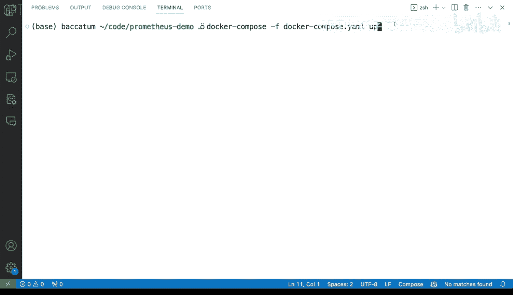
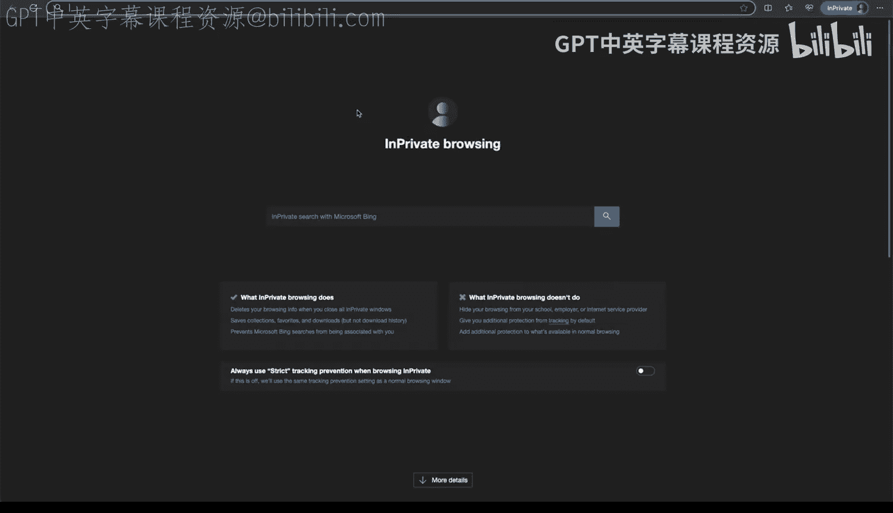
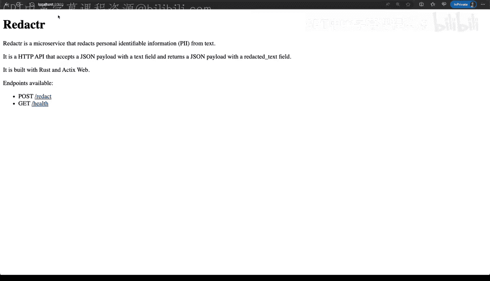
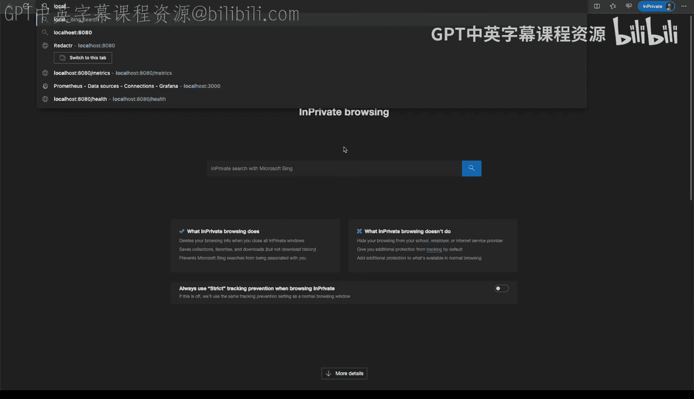
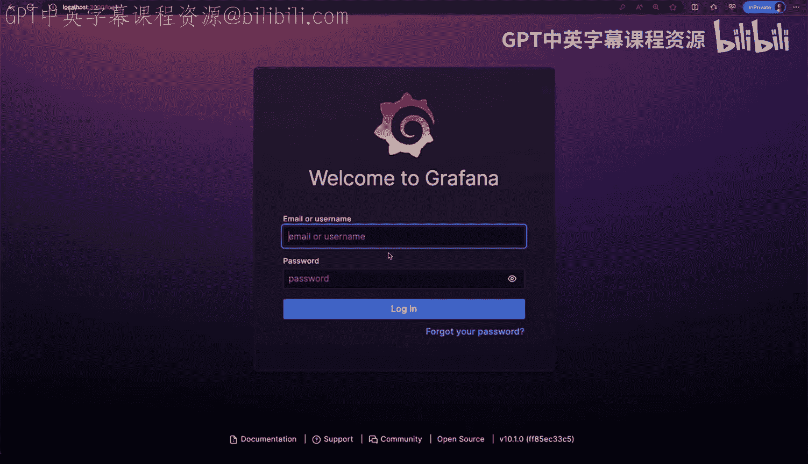
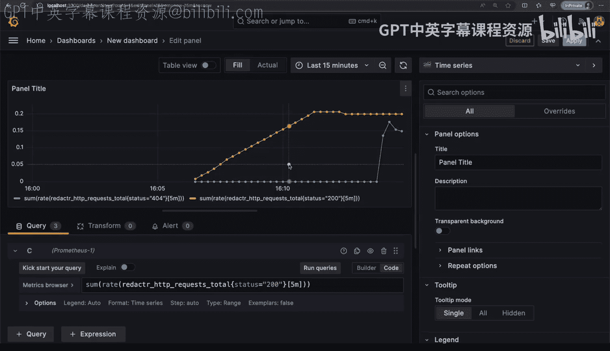

# Rust编程2-3（数据工程、DevOps）：30_02_07：连接Prometheus与Grafana 🚀


在本节课中，我们将学习如何将Prometheus和Grafana这两个强大的监控工具连接起来，并配置它们来可视化一个Rust HTTP应用暴露的指标数据。我们将使用Docker Compose来简化本地环境的搭建过程。

## 概述 📋

Prometheus是一个开源的系统监控和警报工具包，而Grafana则是一个用于可视化指标数据的开源平台。通过将它们与我们的Rust应用集成，我们可以实时监控应用的性能和行为。本节教程将演示一个直接且实用的方法，来启动并连接这两个服务，最终在Grafana仪表板上看到实际的数据。

## 配置Docker Compose 🐳

部署Prometheus和Grafana有多种方式，但我们将使用一种非常直接的方法来开始实验和连接这两个服务。我们将使用一个Docker Compose文件，它允许我们在本地开发环境中定义和运行多个容器服务。

以下是Docker Compose文件的核心配置：

```yaml
version: '3'
services:
  prometheus:
    image: prom/prometheus
    container_name: prometheus
    ports:
      - "9090:9090"
    volumes:
      - ./prometheus.yml:/etc/prometheus/prometheus.yml
  grafana:
    image: grafana/grafana
    container_name: grafana
    ports:
      - "3000:3000"
    environment:
      - GF_SECURITY_ADMIN_PASSWORD=admin
```

在这个配置中，我们定义了两个服务：`prometheus`和`grafana`。Prometheus服务将运行在容器的9090端口，并映射到宿主机的9090端口。Grafana服务运行在容器的3000端口，并映射到宿主机的3000端口。我们为Grafana设置了默认的管理员用户名和密码（admin/admin）。

## 配置Prometheus 📝

上一节我们介绍了如何通过Docker Compose启动服务，本节中我们来看看如何配置Prometheus来抓取我们Rust应用的指标。

Prometheus的配置通过一个YAML文件（`prometheus.yml`）完成。这个文件定义了抓取间隔、目标端点等关键信息。

以下是Prometheus配置文件的主要内容：



```yaml
global:
  scrape_interval: 5s

scrape_configs:
  - job_name: 'axum_monitoring'
    static_configs:
      - targets: ['host.docker.internal:8080']
```







在这个配置中，`scrape_interval`设置为5秒，意味着Prometheus每5秒会向配置的目标端点抓取一次指标数据。我们定义了一个名为`axum_monitoring`的抓取任务，其目标是`host.docker.internal:8080`。使用`host.docker.internal`而不是`localhost`至关重要，因为它能让容器内的Prometheus正确访问到宿主机上运行的服务。

## 启动服务并验证连接 ⚙️

配置完成后，我们需要启动所有服务并验证它们之间的连接是否正常。



以下是启动和验证服务的步骤：

1.  在终端中，导航到包含`docker-compose.yml`文件的目录。
2.  运行命令 `docker-compose -f docker-compose.yml up` 来启动服务。这个命令会在前台运行，并输出日志信息。
3.  服务启动后，打开浏览器，访问 `http://localhost:8080` 以确认Rust应用正在运行并暴露指标。
4.  在另一个浏览器标签页中，访问 `http://localhost:3000` 以打开Grafana界面。

首次登录Grafana时，会提示你更改默认密码（admin/admin）。登录成功后，你将进入Grafana的主界面。

## 在Grafana中添加数据源 📊

现在Grafana已经运行起来，但还没有数据可以展示。我们需要将Prometheus添加为Grafana的数据源。

以下是添加Prometheus数据源的步骤：

1.  在Grafana侧边栏，点击“Configuration”（齿轮图标），然后选择“Data Sources”。
2.  点击“Add data source”按钮。
3.  从列表中选择“Prometheus”。
4.  在配置页面，为数据源命名（例如“Prometheus 1”）。
5.  在“URL”字段中，输入Prometheus服务的地址：`http://prometheus:9090`。注意，这里使用服务名`prometheus`，因为Grafana容器通过Docker Compose网络可以解析这个名称。
6.  点击页面底部的“Save & Test”按钮。如果配置正确，Grafana会显示“Data source is working”的成功消息。

至此，Grafana和Prometheus已经成功连接。

## 创建和配置仪表板 📈

数据源添加成功后，我们可以开始创建仪表板来可视化我们的指标数据。

以下是创建仪表板并添加图表的步骤：

1.  在Grafana侧边栏，点击“Dashboards”（四个方块图标），然后选择“New dashboard”。
2.  在新仪表板中，点击“Add visualization”。
3.  选择我们之前创建的“Prometheus 1”数据源。
4.  在查询编辑器中，我们可以输入PromQL查询语句来获取特定指标。例如，要查询Rust应用中HTTP 404错误请求的总数，可以使用以下查询：
    ```
    sum(rate(axum_http_requests_total{status="404"}[5m]))
    ```
5.  点击“Run query”来查看图表。你可以调整时间范围（如过去15分钟、1小时）来观察数据变化。
6.  我们可以添加更多查询来丰富仪表板。例如，添加一个查询来监控成功的HTTP 200请求：
    ```
    sum(rate(axum_http_requests_total{status="200"}[5m]))
    ```
7.  通过不断访问你的Rust应用（特别是生成一些404错误），你可以在Grafana图表上实时看到指标数据的变化和趋势。

## 总结 🎯



本节课中我们一起学习了如何搭建一个完整的监控栈。我们使用Docker Compose快速部署了Prometheus和Grafana，配置Prometheus抓取Rust应用暴露的指标，并在Grafana中创建数据源和仪表板来可视化这些指标。这个过程展示了如何将应用监控从数据收集到可视化展示完整地串联起来，为理解应用运行状态提供了强大的工具。