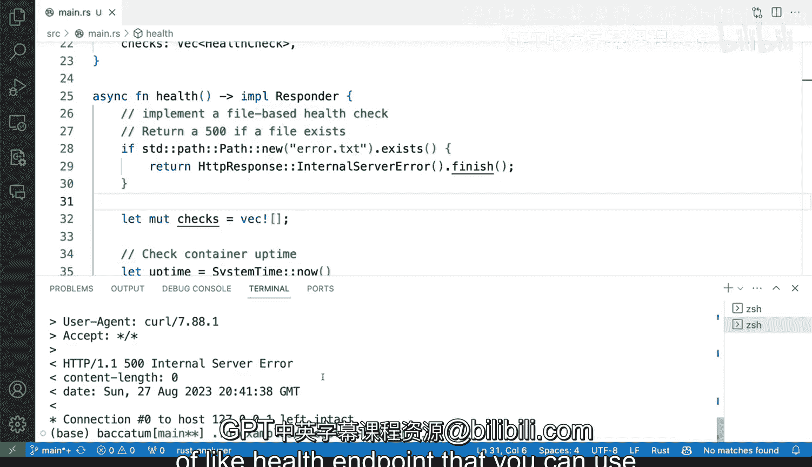

# Rust编程2-3（数据工程、DevOps）：120：暴露自定义监控端点 🛠️

在本节课中，我们将学习如何为一个Rust HTTP API服务添加一个自定义的健康检查端点。这个端点不仅能报告系统状态，还能通过检查特定文件的存在与否，来手动触发服务不可用的状态，这在负载均衡和运维场景中非常有用。

## 概述

这个Rust HTTP API服务暴露了多个路由端点，其中一个是根路径 `/`，另一个是 `/redact` API端点。此外，它还有一个自定义的 `/health` 端点，类似于Prometheus暴露指标的方式。我们将重点扩展这个 `/health` 端点，为其添加基于文件的手动健康检查功能。

## 现有健康检查端点


上一节我们介绍了API的基本结构，本节中我们来看看现有的 `/health` 端点是如何工作的。

该端点是一个名为 `health` 的函数，它实现了Actix Web框架中的 `Responder` trait，这允许我们返回一个HTTP响应。

以下是该函数的核心逻辑，它执行一些系统检查并生成响应：

```rust
// 示例：生成正常运行时间和内存使用情况
let uptime = SystemTime::now()
    .duration_since(UNIX_EPOCH)
    .unwrap()
    .as_secs();
let memory_usage = // ... 获取内存使用量的逻辑
```

启动服务后（例如通过 `cargo run`），我们可以使用 `curl` 命令来测试这个端点：

```bash
curl -X GET http://localhost:8080/health
```

响应会包含系统的正常运行时间和内存使用情况等信息，并返回 `200 OK` 状态码。

## 添加自定义文件检查逻辑

现在，我们希望在现有逻辑的基础上，增加一个手动控制机制。其核心思想是：如果服务器运行目录下存在一个特定的文件（例如 `error.txt`），则健康检查端点立即返回 `500 Internal Server Error`，表示服务不健康。

以下是实现此功能的关键步骤：

1.  **检查文件是否存在**：在健康检查函数开始时，检查 `error.txt` 文件是否存在于当前工作目录。
2.  **条件性返回错误**：如果文件存在，则立即构造并返回一个500错误响应，跳过后续的所有系统状态检查。
3.  **正常流程**：如果文件不存在，则继续执行原有的系统状态检查并返回 `200 OK`。

以下是实现该逻辑的代码片段：

```rust
use std::path::Path;

// 在 health 函数内部添加：
let error_file = Path::new("error.txt");
if error_file.exists() {
    // 立即返回 500 错误
    return HttpResponse::InternalServerError().body("500: File exists in the health directory");
}
// ... 原有的正常运行时间和内存检查逻辑
```

## 功能演示与测试

让我们来验证一下新添加的功能是否按预期工作。

首先，确保服务正在运行。然后，我们通过一系列 `curl` 命令和文件操作来测试：

以下是测试步骤和预期结果：

1.  **初始状态**：当 `error.txt` 文件不存在时，访问 `/health` 端点应返回 `200 OK` 及系统信息。
    ```bash
    curl -v http://localhost:8080/health
    ```
2.  **触发错误**：使用 `touch error.txt` 命令创建文件后，再次访问端点应返回 `500 Internal Server Error`。
    ```bash
    touch error.txt
    curl -v http://localhost:8080/health
    ```
3.  **恢复健康**：使用 `rm error.txt` 命令删除文件后，端点应恢复返回 `200 OK`。
    ```bash
    rm error.txt
    curl -v http://localhost:8080/health
    ```

这种模式非常实用。在负载均衡器（如Nginx）配置中，可以将其健康检查指向此 `/health` 端点。当某个服务实例需要手动下线进行维护时，运维人员只需在其服务器上创建一个 `error.txt` 文件，负载均衡器就会自动将流量路由到其他健康的实例，实现了优雅的手动故障转移。

## 总结



本节课中我们一起学习了如何为Rust Web服务构建一个增强型的健康检查端点。我们不仅回顾了如何暴露基本的系统监控信息，还重点实现了一种基于文件系统的、手动控制服务健康状态的机制。这种方法结合了自动检测（如磁盘空间不足）与手动干预的能力，为在生产环境中进行服务运维、滚动更新和负载均衡提供了更大的灵活性和控制力。