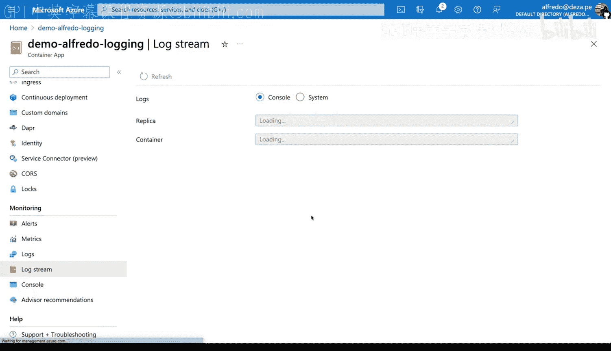
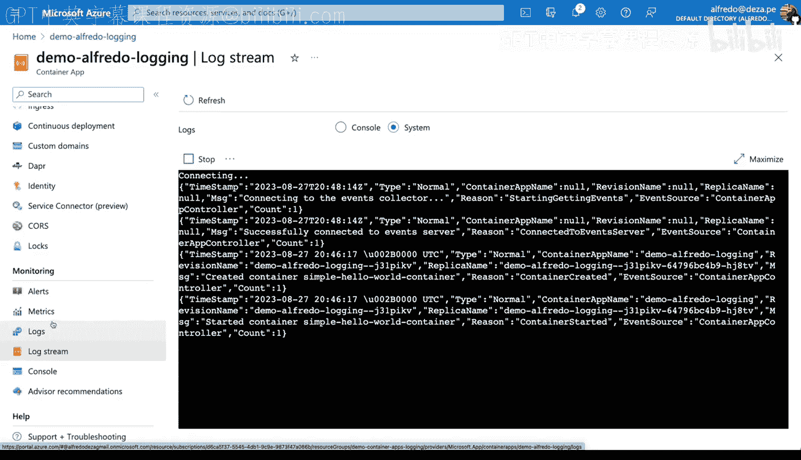
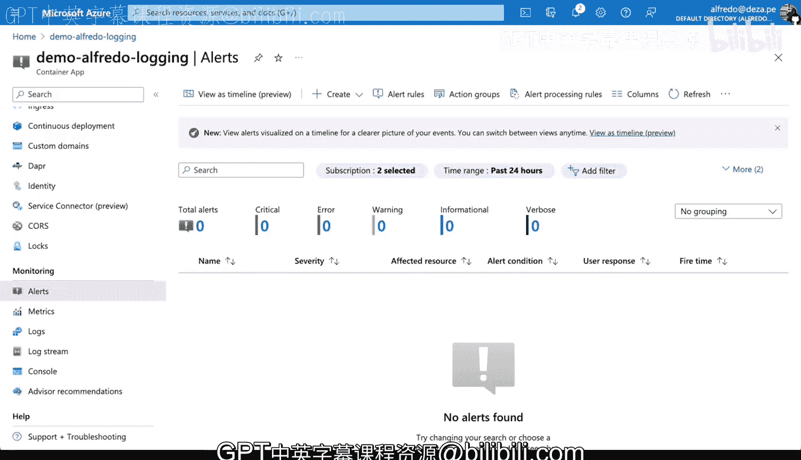

# 121：32_02_10_Azure中的监控与日志记录策略 📊

在本节课中，我们将学习如何在Azure平台上为容器应用配置监控与日志记录。我们将看到，无需深入理解Azure的底层工作原理，也能轻松地为容器应用添加监控和日志记录功能。

## 概述

我们将通过Azure的容器应用服务来演示。整个过程非常直观，您无需对容器本身进行任何修改，即可获得丰富的监控数据和日志流。

## 创建容器应用

首先，我们需要在Azure上创建一个容器应用。以下是具体步骤：

1.  创建一个新的资源组。这是在Azure上创建服务所必需的。
2.  为资源组命名，例如 `demo-container-apps-login`，以便于识别和后续清理。
3.  将容器应用命名为 `demo-alfredo-login`。
4.  选择区域，例如“美国西部2”。
5.  使用默认配置进行创建：CPU核心数设置为0.25（即四分之一个核心），内存为500MB，端口为80，并允许来自任何地方的流量。

创建过程需要一些时间。部署成功后，我们可以进入资源页面查看。

## 访问默认应用

容器应用启动并运行后，我们可以通过其应用URL（运行在80端口）进行访问。默认情况下，您会看到一个页面，显示“您的Azure容器应用正在运行”。这表明一个默认的容器已被成功部署。

## 探索监控与日志功能

现在，我们的应用已经运行，但尚未记录任何自定义活动。不过，Azure已经为我们提供了丰富的内置监控工具。在资源页面，您可以找到“活动日志”、“指标”、“日志”、“日志流”等选项。

### 查看活动日志

点击“活动日志”，目前可能没有内容，因为我们还没有触发任何需要记录的操作。

### 使用预置日志查询

在“日志”部分，Azure提供了许多预置的查询模板。例如，您可以快速分析错误。虽然我们现在不关注错误，但这个功能在排查问题时非常有用。

### 实时查看日志流

“日志流”功能非常强大。它会创建一个控制台并连接到您的运行容器。连接成功后，它会实时显示容器产生的所有日志。这对于即时调试和观察应用行为至关重要。您可以看到容器启动的详细信息，例如它正在监听哪个端口。

如果您部署了自己的应用，您将能在这里看到应用生成的所有日志。当前，我们查看的是系统日志，它反映了运行容器应用的基础系统状态，这同样是检查运行状况的绝佳方式。

## 监控应用指标

除了日志，监控容器运行时的指标也很重要。Azure默认提供了多项关键指标，您无需在容器中添加任何额外配置即可使用。

### 查看CPU使用率

我们可以检查CPU使用率指标，图表会直观地显示其变化情况。

### 查看网络请求

我们还可以检查请求指标。虽然当前可能没有记录到我们的访问请求，但我们可以查看最大值、平均值等统计数据。

### 查看网络流量

“网络流入”指标可能记录了我们在几分钟前访问应用时产生的流量。

这些指标默认包含在服务中，部署后即可使用，非常方便。

### 配置警报规则

在“警报”部分，您可以基于这些指标创建警报规则。您可以定义触发条件（例如，当CPU使用率超过80%时），并设置通知方式。这样，当应用出现异常时，系统能及时提醒您。

## 总结

本节课中，我们一起学习了如何在Azure上为容器应用快速启用监控与日志记录。

1.  **创建与部署**：我们创建了一个容器应用，并使用了默认配置进行部署。
2.  **访问日志**：我们探索了如何通过“日志流”功能实时查看容器输出的系统与应用日志。
3.  **监控指标**：我们查看了CPU使用率、网络请求和流量等默认提供的运行指标。
4.  **设置警报**：我们了解到可以基于这些指标配置警报规则，实现主动监控。

关键在于，所有这些功能都可以在不修改容器应用代码的情况下直接获得。当您在Azure这类云服务提供商上使用容器服务时，充分利用这些内置的监控和日志记录策略，能极大地简化运维工作，帮助您更好地洞察应用状态。