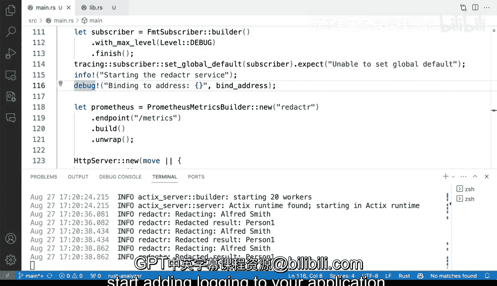

# 124：在Rust中使用日志记录


在本节课中，我们将学习如何在Rust应用程序中替换简单的`println!`语句，转而使用结构化的日志记录系统。我们将看到如何初始化日志记录器，如何设置日志级别，以及如何在不同位置输出不同级别的日志信息。

## 概述

上一节我们介绍了如何为应用程序添加必要的日志记录功能以开始产生输出。本节中，我们将在此基础上进行扩展，学习如何用结构化的日志记录替换代码中分散的`println!`语句，并添加更有用的上下文信息。

## 替换硬编码信息

首先，我们注意到在`lib.rs`中有一些`println!`语句，它们会将“Reacting”等信息打印到标准输出。这种做法不够灵活，因为我们无法控制其输出级别。我们的目标是避免使用这些`println!`语句。

以下是替换过程的具体步骤：

1.  **初始化变量**：在`main.rs`文件的顶部，我们定义服务器地址和端口变量，而不是在代码中硬编码。
    ```rust
    let address = "127.0.0.1";
    let port = 8080;
    let bind_address = format!("{}:{}", address, port);
    ```

2.  **替换警告信息**：找到原来打印警告信息的位置，将其替换为`debug!`级别的日志记录。这需要确保在文件顶部已经引入了`tracing::debug`。
    ```rust
    // 替换前：println!("Binding to {}", bind_address);
    // 替换后：
    debug!("Binding to {}", bind_address);
    ```

3.  **更新绑定调用**：将硬编码的地址字符串替换为我们定义的`bind_address`变量。
    ```rust
    // 替换前：.bind("127.0.0.1:8080")
    // 替换后：
    .bind(&bind_address)
    ```

通过这种模式，你可以在应用程序的各个部分，根据信息的重要性，使用不同级别的日志（如`debug!`、`info!`、`warn!`、`error!`）来记录状态。

## 添加追踪信息

接下来，我们为应用程序的核心逻辑添加`info!`级别的日志。

以下是具体操作：

1.  **引入宏**：在`lib.rs`文件的顶部，确保引入了`tracing::info`宏。
    ```rust
    use tracing::info;
    ```

2.  **替换`println!`**：找到原有的`println!`语句，将它们替换为`info!`宏。
    ```rust
    // 替换前：println!("Reacting");
    // 替换后：
    info!("Reacting");
    ```

完成这些更改后，原来的控制台输出将被结构化的日志信息所取代。

## 控制日志级别

更改完成后，运行`cargo run`启动应用程序，你可能会发现新的`info!`日志没有显示。这是因为当前设置的全局日志级别可能高于`INFO`（例如是`WARN`或`ERROR`）。

为了解决这个问题，你有两个选择：

*   将`lib.rs`中的`info!`改为`debug!`。
*   或者在启动应用程序时，将环境变量`RUST_LOG`的级别设置为`info`或更低（如`debug`、`trace`）。

例如，在终端中运行：
```bash
RUST_LOG=info cargo run
```
这样，`info!`及以上级别的日志就会输出到控制台。现在，当你访问API时，就能看到由日志系统输出的“Reacting”等信息，而不是简单的`println!`输出。

## 总结



本节课中，我们一起学习了在Rust中实施结构化日志记录的关键步骤。我们首先用变量替换了硬编码的配置信息，然后使用`debug!`和`info!`等宏替换了原有的`println!`语句。最后，我们了解了如何通过环境变量控制日志的输出级别。这正是为应用程序添加可管理、可配置的日志记录功能的标准技术。