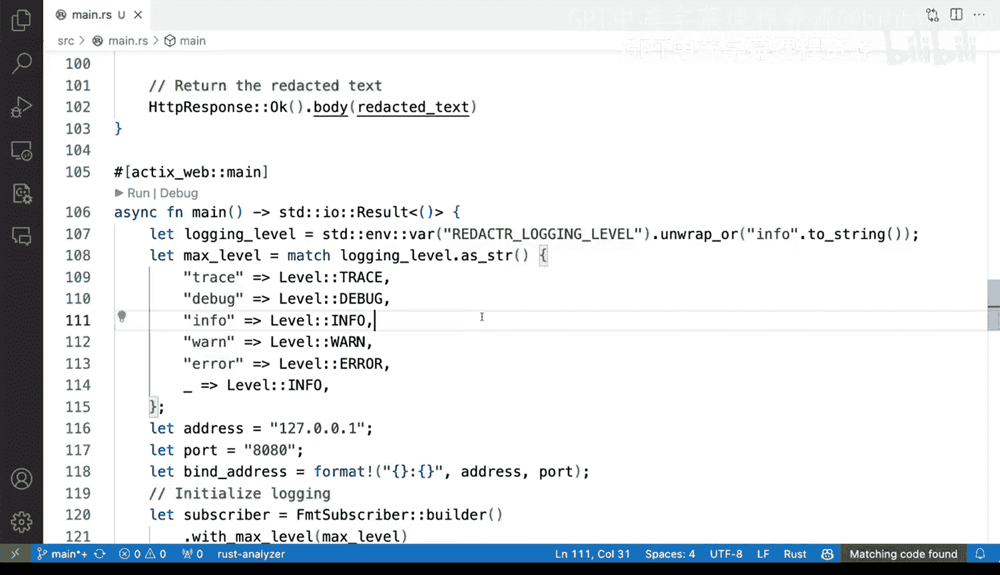

# 125：控制日志详细级别 📝


在本节课中，我们将学习如何为我们的HTTP API应用程序实现灵活的日志级别控制。我们将把硬编码的日志级别替换为通过环境变量动态配置的方式，从而使我们的应用在生产环境中更具适应性和可配置性。

---

## 概述

之前，我们为应用程序添加了日志功能。然而，日志级别是硬编码在源代码中的。每次需要调整日志详细程度时，都必须修改代码并重新编译。这在生产环境中非常不理想，因为我们通常需要能够灵活地调整日志级别，而无需重新部署应用。

上一节我们介绍了如何添加日志功能，本节中我们来看看如何使其配置变得灵活。

## 从硬编码到环境变量

目前，我们的日志级别是固定的，缺乏灵活性。为了改进这一点，我们将采用环境变量来动态设置日志级别。

首先，我们需要从环境中读取一个变量。为了避免与其他可能使用通用变量名的应用冲突，我们将为这个变量加上服务名前缀。

以下是实现步骤：

1.  从环境变量中读取日志级别。
2.  将读取到的字符串匹配到对应的日志级别枚举值。
3.  设置一个默认级别（例如 `info`），以防环境变量未设置或值无效。

## 实现步骤详解

### 1. 读取环境变量

我们使用标准库的 `std::env` 模块来读取环境变量。我们将变量命名为 `REDACTOR_LOGGING_LEVEL`，以使其具有特定性。

```rust
let logging_level = std::env::var("REDACTOR_LOGGING_LEVEL").unwrap_or("info".to_string());
```

这段代码尝试读取名为 `REDACTOR_LOGGING_LEVEL` 的环境变量。如果变量不存在，则使用默认值 `"info"`。

### 2. 匹配日志级别

接下来，我们需要将读取到的字符串（如 `"trace"`, `"debug"`, `"info"`, `"warn"`, `"error"`）转换为 `tracing` crate 中对应的 `Level` 枚举值。我们使用 `match` 语句来实现这个映射。

```rust
let max_level = match logging_level.to_lowercase().as_str() {
    "trace" => Level::TRACE,
    "debug" => Level::DEBUG,
    "info" => Level::INFO,
    "warn" => Level::WARN,
    "error" => Level::ERROR,
    _ => Level::INFO, // 默认级别
};
```

如果提供的字符串不匹配任何已知级别，代码将默认使用 `Level::INFO`。

### 3. 应用日志级别

最后，我们将匹配得到的 `max_level` 用于初始化日志订阅器，替换之前硬编码的 `Level::INFO`。

```rust
let subscriber = FmtSubscriber::builder()
    .with_max_level(max_level) // 使用动态设置的级别
    .finish();
```

## 测试与验证

完成代码修改后，我们可以通过设置不同的环境变量来测试日志级别的变化。

*   运行 `REDACTOR_LOGGING_LEVEL=debug cargo run` 将启用调试级别及更高级别的日志。
*   运行 `REDACTOR_LOGGING_LEVEL=trace cargo run` 将启用最详细的跟踪级别日志。
*   如果不设置该变量或设置为无效值，应用将默认使用 `info` 级别。

通过这种方式，我们可以在启动应用时轻松控制其日志输出量，无需改动任何源代码。

## 总结

本节课中我们一起学习了如何使Rust应用程序的日志系统更具生产环境适用性。我们成功地将硬编码的日志级别替换为通过环境变量配置的方式。具体步骤包括：

1.  使用 `std::env::var` 读取环境变量。
2.  使用 `match` 语句将字符串映射到具体的日志级别枚举。
3.  设置合理的默认值以保证应用的健壮性。



现在，我们的应用拥有了灵活的日志控制能力，可以通过简单的环境变量调整来适应开发、测试和生产等不同场景的需求，这比我们之前硬编码的方式要强大和实用得多。