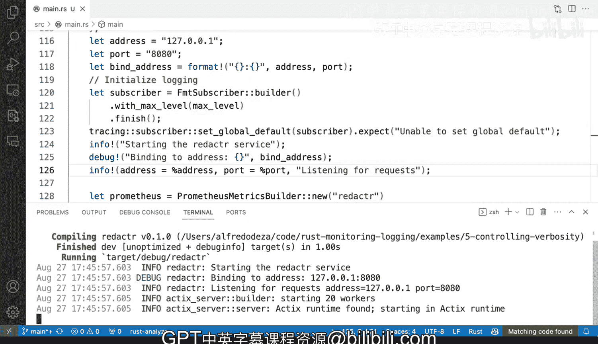

# 126：结构化日志记录 📝


在本节课中，我们将学习如何在Rust应用程序中实现结构化日志记录。结构化日志记录是一种将日志输出格式化为易于机器解析的结构化数据（如键值对）的技术，这对于监控、告警和日志分析系统至关重要。

## 概述

之前我们已经为应用程序配置了灵活的日志级别和详细程度。现在，我们将探讨如何进一步提升日志的实用性，使其不仅对人类可读，也便于外部程序自动化处理。

## 从非结构化日志到结构化日志

上一节我们介绍了基础的日志记录功能。本节中，我们来看看非结构化日志在自动化处理时面临的挑战。

当前的非结构化日志输出类似于散文，虽然人类容易阅读，但程序解析起来却很困难。例如，日志信息 `binding to address 127.0.0.1:8080` 需要编写复杂的正则表达式来提取IP地址和端口号。这种方法是脆弱的，因为日志格式的微小变动就会导致解析失败。

为了解决这个问题，我们引入结构化日志记录。它通过将信息组织成清晰的键值对形式，使得外部系统能够可靠、高效地解析日志数据。

## 实现结构化日志记录

实现结构化日志记录非常简单直接。我们只需在日志宏中明确地输出变量名和值。

以下是实现步骤：

1.  定位到记录服务器地址绑定的日志语句。
2.  修改 `info!` 宏的调用，使用 `%` 占位符来格式化变量，并明确指定键名。

例如，将原来的日志语句修改为：
```rust
info!("listening for requests address=% port=%", address, port);
```

在这行代码中，我们向 `info!` 宏传递了格式化字符串和变量。`%` 是占位符，它会被后面提供的变量值依次替换，同时我们在字符串中直接定义了键名（`address=` 和 `port=`）。

## 查看结构化日志效果

让我们运行修改后的服务，观察输出变化。

启动服务后，你将看到类似以下的输出：
```
listening for requests address=127.0.0.1 port=8080
```

现在的日志输出是结构化的。我们得到了清晰的键值对：`address=127.0.0.1` 和 `port=8080`。这种方式极大地便利了外部系统（如日志聚合器或监控工具）对日志内容的解析。

你可以根据需要轻松添加更多字段到日志中，例如请求方法、用户ID或响应状态码，所有信息都将以同样易于解析的格式呈现。

## 总结



本节课中我们一起学习了结构化日志记录。我们了解到非结构化日志在自动化处理上的局限性，并学会了如何使用 `log` 库的宏来输出结构化的键值对日志。这种方法为日志的后续处理、监控和告警提供了坚实的基础，是构建可维护数据工程与DevOps应用的重要实践。