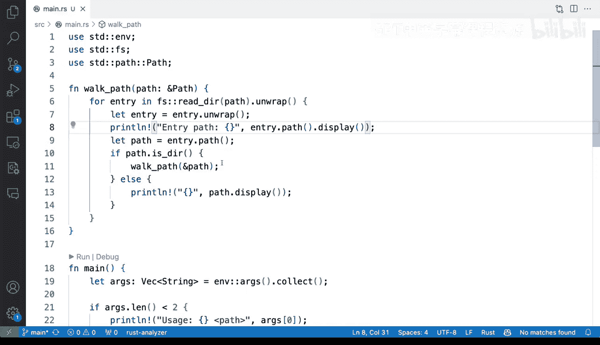

# Rust编程：2-3：文件系统爬取教程 🗂️


在本节课中，我们将学习如何使用Rust编写一个应用程序来遍历文件系统。这是一个非常实用的技能，它不仅能让你遍历文件系统，还能在此基础上执行许多任务。这是你需要掌握的基础知识，而在Rust中，实现起来并不复杂。

## 概述

我们将从一个简单的Rust程序开始，它接受一个命令行参数作为要遍历的目录路径。程序的核心是一个递归函数，它会读取目录内容，判断每个条目是文件还是子目录。如果是子目录，函数会递归调用自身以继续深入遍历；如果是文件，则直接打印其路径。通过这种方式，我们可以系统地探索整个目录结构。

## 代码实现

首先，我们有一个主文件 `main.rs`。主函数 `main` 负责处理命令行参数。

```rust
use std::env;
use std::path::Path;

fn main() {
    let args: Vec<String> = env::args().collect();
    if args.len() < 2 {
        eprintln!("请提供一个路径参数");
        return;
    }
    let path = Path::new(&args[1]);
    walk_path(&path);
}
```

主函数收集命令行参数。我们未使用复杂的CLI框架，而是直接获取第二个参数（索引为1）作为目标路径。如果未提供参数，程序会打印错误信息并退出。获取路径后，我们调用 `walk_path` 函数开始遍历。

上一节我们介绍了程序的入口点，本节中我们来看看核心的遍历函数 `walk_path` 是如何工作的。

以下是 `walk_path` 函数的实现步骤：

1.  **读取目录**：使用 `std::fs::read_dir` 函数尝试读取给定路径的目录内容。
2.  **遍历条目**：使用 `for` 循环遍历目录中的每一个条目（`DirEntry`）。
3.  **获取路径**：从每个条目中提取出完整的文件系统路径。
4.  **判断类型**：检查该路径指向的是文件还是目录。
5.  **递归或打印**：如果是目录，则递归调用 `walk_path` 函数；如果是文件，则打印其路径。

```rust
use std::fs;

fn walk_path(path: &Path) {
    if let Ok(entries) = fs::read_dir(path) {
        for entry in entries {
            if let Ok(entry) = entry {
                let entry_path = entry.path();
                if entry_path.is_dir() {
                    // 递归遍历子目录
                    walk_path(&entry_path);
                } else {
                    // 打印文件路径
                    println!("{}", entry_path.display());
                }
            }
        }
    }
}
```

## 核心概念解析

现在，让我们深入分析一下代码中的关键部分，特别是**递归**是如何应用的。

`walk_path` 函数接收一个 `Path` 类型的参数。它的工作原理是：首先假设这个路径是一个目录，然后尝试读取其中的所有条目。对于每个条目，我们获取其完整路径并判断它是否为目录。

**递归**就发生在这里：如果 `entry_path` 是一个目录，我们不是立即处理它，而是直接再次调用 `walk_path` 函数，并将这个子目录的路径作为新参数传入。这样，函数就会“进入”这个子目录，重复同样的过程（读取、判断、递归），从而一层一层地遍历整个文件系统树。如果不是目录，我们就简单地打印出文件路径。

这是一种遍历文件系统、查找目标文件的清晰有效的方法。

## 运行与测试

如果我们在终端中运行程序并传入一个存在的目录（例如 `bar_log`），程序会快速运行并打印出该目录及其所有子目录下的文件列表。

```bash
cargo run bar_log
```

输出将会是类似这样的文件路径列表：
```
/Users/example/bar_log/file1.txt
/Users/example/bar_log/subdir/another_file.rs
...
```

如果传入一个不存在的路径，程序会因为 `read_dir` 失败而跳过该目录，不会输出错误（除非我们主动添加错误处理）。在我们的简单示例中，主函数会先检查路径是否存在。

## 扩展可能性

这个基础实现为你提供了一个坚实的起点。在此基础上，你可以进行许多扩展：

*   **过滤文件**：在打印路径前，可以根据文件扩展名（如 `.rs`， `.log`）或其他属性进行过滤。
*   **控制递归深度**：添加一个深度计数器参数，限制程序遍历的子目录层数，避免进入过深的文件结构。
*   **执行操作**：不仅仅是打印，你可以对找到的文件进行读取、复制、移动或计算哈希值等操作。
*   **错误处理**：更健壮地处理 `read_dir` 或文件访问可能出现的错误，例如权限不足。

## 总结



本节课中我们一起学习了如何使用Rust进行文件系统爬取。我们构建了一个程序，它通过递归函数遍历指定目录，区分文件和子目录，并打印出所有文件的路径。我们理解了**递归**在此场景下的应用逻辑，即将一个大问题（遍历整个目录树）分解为重复的小问题（遍历单个目录）。这个简单的例子是许多文件系统工具（如查找、备份、清理工具）的核心逻辑，掌握了它，你就为用Rust处理更复杂的文件操作打下了坚实的基础。