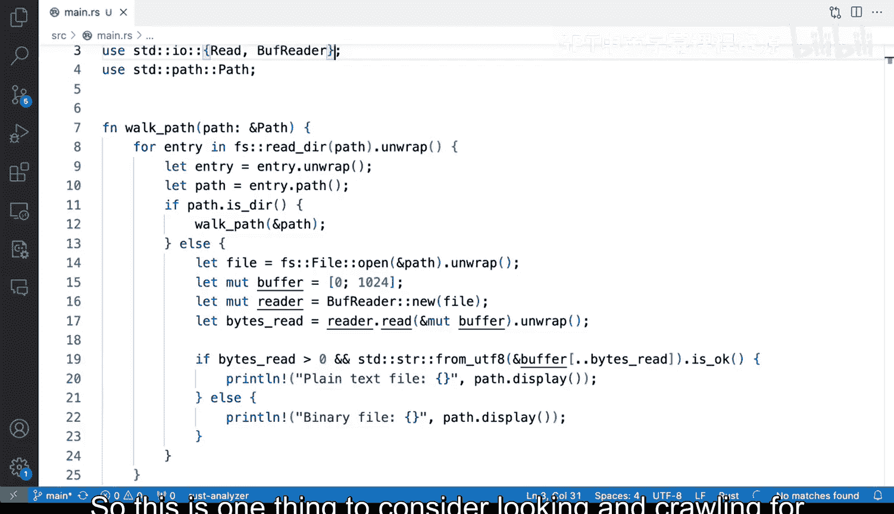

# 130：构建用于解析文件的Rust命令行工具


在本节课中，我们将学习如何构建一个Rust命令行工具，用于遍历文件系统并检测文件类型。我们将重点介绍如何区分纯文本文件和二进制文件，并理解Rust中trait导入的重要性。

## 概述

我们将从一个已有的文件系统遍历程序开始，为其添加文件类型检测功能。核心任务是判断一个文件是纯文本文件还是二进制文件。我们将使用Rust的标准库来完成这个任务，并在这个过程中学习一些重要的编程概念。

## 准备工作

首先，我们需要在代码文件的顶部引入必要的库。这些库将帮助我们进行文件操作和字节读取。

```rust
use std::fs;
use std::io::{self, BufReader, Read};
```

## 修改遍历函数

上一节我们介绍了基本的文件系统遍历逻辑。本节中，我们来看看如何修改`walk_path`函数，使其在遍历时对每个文件进行类型检测。

我们将移除简单的文件路径打印，转而实现一个检测逻辑。以下是修改后的核心步骤：

1.  打开文件。
2.  读取文件的前1024个字节。
3.  尝试将这些字节解码为UTF-8字符串。
4.  根据解码结果判断文件类型。

```rust
let file = fs::File::open(&path).unwrap();
let mut buffer = [0; 1024];
let mut reader = BufReader::new(file);
let bytes_read = reader.read(&mut buffer).unwrap();
```

## 实现文件类型检测

在成功读取文件字节后，我们需要进行判断。如果读取的字节数大于0，并且这些字节能够被成功解码为UTF-8字符串，那么我们认为该文件是纯文本文件；否则，我们将其标记为二进制文件。

以下是判断逻辑的代码实现：

```rust
if bytes_read > 0 && std::str::from_utf8(&buffer[..bytes_read]).is_ok() {
    println!("{}: plain text", path.display());
} else {
    println!("{}: binary file", path.display());
}
```

## 理解Trait的作用

在编写上述代码时，你可能会遇到一个常见的编译错误：`no method named \`read\` found`。这是因为`read`方法属于`std::io::Read`这个trait。

在Rust中，trait定义了一组方法。要使用某个类型（如`BufReader`）的trait方法，必须将该trait导入当前作用域。这就是为什么我们需要在文件开头写上`use std::io::Read;`。Rust的编译器错误信息非常清晰，会直接提示你缺失哪个trait，这是Rust语言的一大优势。

## 实际应用与总结

本节课中我们一起学习了如何为文件系统遍历工具添加文件类型检测功能。我们实现了通过读取文件头部字节并尝试进行UTF-8解码来区分纯文本文件和二进制文件的逻辑。同时，我们也理解了在Rust中正确导入trait对于调用相关方法的重要性。



这种检测机制在实际开发中非常有用。例如，在处理未知来源的文件、自动化系统配置或日志分析时，确保程序只处理预期的纯文本文件可以避免许多错误。使用Rust实现此功能，既能保证高性能，又能借助其强大的类型系统和编译器避免许多运行时错误。这是一个值得掌握的实用编程模式。