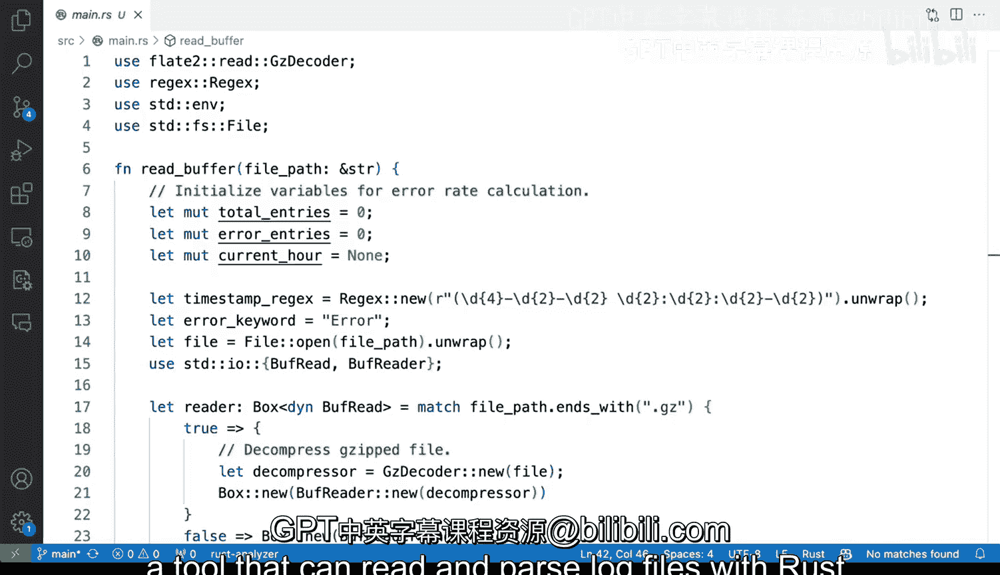

# Rust编程2-3（数据工程、DevOps）：42_03_05：使用Rust解析日志文件 📄


在本节课中，我们将学习如何使用Rust编写一个高效的工具来解析和分析日志文件。我们将重点关注如何从日志中提取特定信息，例如按小时统计错误数量，并处理可能存在的压缩文件格式。

## 概述

日志文件是系统监控和故障排查的重要数据源。手动分析大型日志文件效率低下。我们将构建一个Rust程序，它能自动解析日志文件，提取时间戳和错误信息，并按小时汇总错误数量。此工具的特点是**高性能**和**可定制性**，能够处理纯文本和压缩格式的日志文件。

## 项目结构

上一节我们概述了项目目标，本节中我们来看看具体的代码结构。程序的核心是一个`main`函数，它接收一个文件路径作为参数。程序没有使用独立的库模块，所有逻辑都包含在主文件中。

```rust
fn main() {
    // 主函数逻辑
}
```

## 日志格式与业务逻辑

在深入代码之前，我们需要理解要解析的日志格式和我们的业务目标。

程序旨在解析类似以下格式的日志行：
```
Aug 29 17:30:00 MyComputer some_daemon[123]: This is a log message, possibly containing an error.
```
我们特别关注包含“error”关键词的行。业务逻辑是计算**每小时出现的错误数量**。

## 核心实现解析

理解了目标后，我们来看看实现的核心部分。程序主要分为几个步骤：读取文件、逐行解析、应用正则表达式提取时间、按小时聚合错误计数。

### 1. 文件读取与解压

程序首先需要读取日志文件。考虑到日志文件可能被压缩（例如`.gz`格式），我们需要一个能同时处理压缩和未压缩文件的机制。

以下是处理逻辑：
```rust
// 使用 match 语句根据文件扩展名决定读取方式
match path.extension().and_then(|s| s.to_str()) {
    Some("gz") => {
        // 如果是 .gz 文件，使用 GzDecoder 解压
        let file = File::open(path)?;
        let decoder = GzDecoder::new(file);
        let reader = BufReader::new(decoder);
    }
    _ => {
        // 否则，直接以普通文件打开
        let file = File::open(path)?;
        let reader = BufReader::new(file);
    }
}
```
这段代码使用`match`进行模式匹配，根据文件后缀名选择不同的读取器，确保无论是否压缩都能正确读取。

### 2. 逐行处理与错误匹配

获得文件读取器后，程序开始逐行读取。对于每一行，它检查是否包含“error”字样。

以下是处理循环：
```rust
for line_result in reader.lines() {
    let line = line_result?; // 处理可能的IO错误
    if line.to_lowercase().contains("error") {
        // 如果该行包含错误，则进行后续的时间戳解析和计数
    }
}
```

### 3. 使用正则表达式解析时间戳

对于包含错误的行，我们需要从中提取小时信息。这通过一个预定义的正则表达式来完成。

定义的正则表达式模式类似于：
```rust
let re = Regex::new(r"(\w{3}\s+\d{1,2})\s+(\d{2}):\d{2}:\d{2}").unwrap();
```
这个模式捕获**日期**（如“Aug 29”）和**小时**（如“17”）。

当一行匹配时，我们可以提取出这些捕获组：
```rust
if let Some(caps) = re.captures(&line) {
    let current_hour = caps.get(2).map_or("", |m| m.as_str()); // 提取小时部分
    // ... 使用 current_hour 进行计数
}
```

### 4. 按小时聚合计数

这是业务逻辑的核心。我们需要跟踪当前正在统计的是哪个小时，以及该小时内的错误数量。

逻辑流程如下：
1.  初始化一个`current_hour`变量来跟踪当前统计的小时，以及一个`error_count`计数器。
2.  遍历每一行。
3.  如果从某行提取的`hour`与`current_hour`不同，说明进入了新的一个小时。此时，打印上一个小时的总错误数，并将`current_hour`更新为新的小时，同时将`error_count`重置为0。
4.  如果`hour`与`current_hour`相同，则将`error_count`加1。
5.  文件遍历结束后，打印最后一个小时的数据以及整个文件的总错误数。

## 运行示例与输出

现在，让我们看看这个程序在真实日志文件上的运行效果。使用`cargo run`命令并传入日志文件路径即可执行。

程序输出按小时显示错误数量，格式如下：
```
[Aug 29 17:00] Errors: 85
[Aug 29 18:00] Errors: 41
...
Total errors in file: 9021
```
这清晰地展示了错误在一天中的分布情况。

## 优势与考量

上一节我们看到了程序的运行结果，本节我们来总结其优势和应用时的注意事项。

**优势：**
*   **高性能**：Rust的零成本抽象和高效的内存管理使得处理大型日志文件速度极快。
*   **部署简单**：编译后的二进制文件可以轻松部署到任何兼容的系统，避免了脚本语言对运行环境的依赖。
*   **强类型与安全性**：减少了运行时错误，代码更健壮。
*   **可扩展性**：可以轻松修改以输出JSON格式、连接数据库或添加更复杂的分析规则。

**注意事项：**
*   **日志格式耦合**：当前的正则表达式针对特定日志格式。如果日志格式变化，程序需要调整。
*   **功能针对性**：这是一个专用工具。对于简单的临时分析，使用`grep`、`awk`等Unix命令行工具可能更快捷。但当需要复杂的、重复执行的业务逻辑时，Rust工具的优势就体现出来了。

## 总结



本节课中我们一起学习了如何使用Rust构建一个实用的日志解析工具。我们涵盖了从文件读取（支持压缩格式）、逐行处理、利用正则表达式提取关键信息，到实现按小时聚合错误计数的完整业务流程。这个例子展示了Rust在数据处理领域的强大能力：它既能提供媲美系统级工具的性能，又能保证代码的可靠性和可维护性。你可以以此为基础，定制属于自己的日志分析工具。