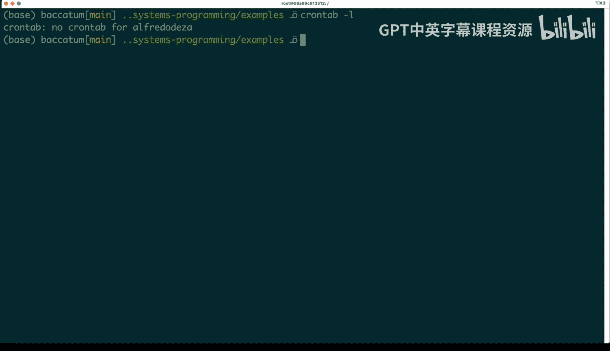
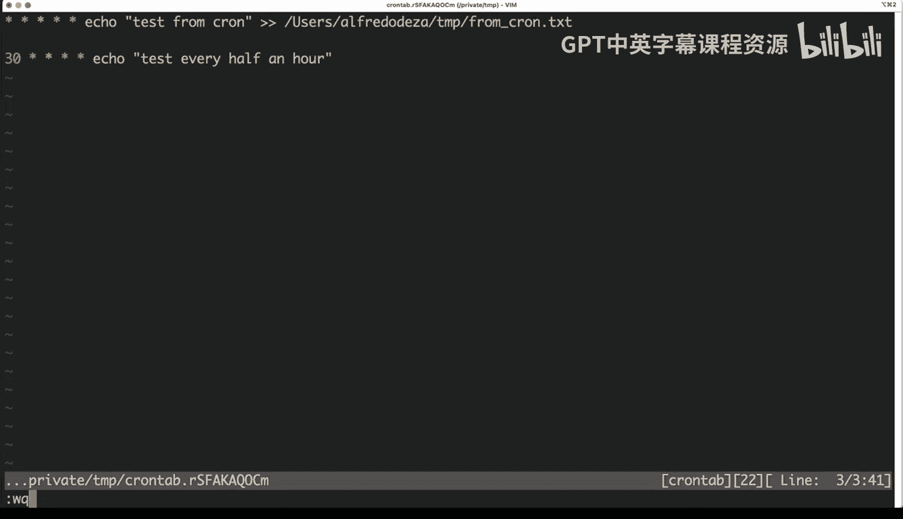
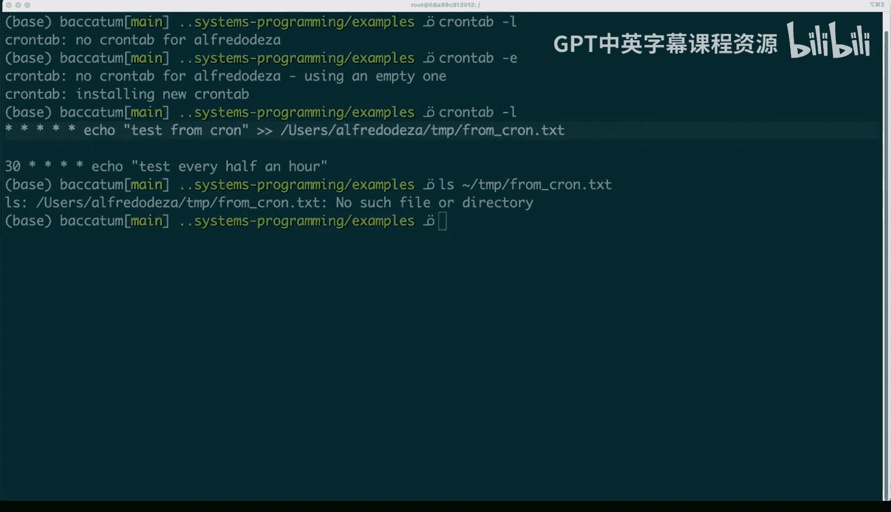
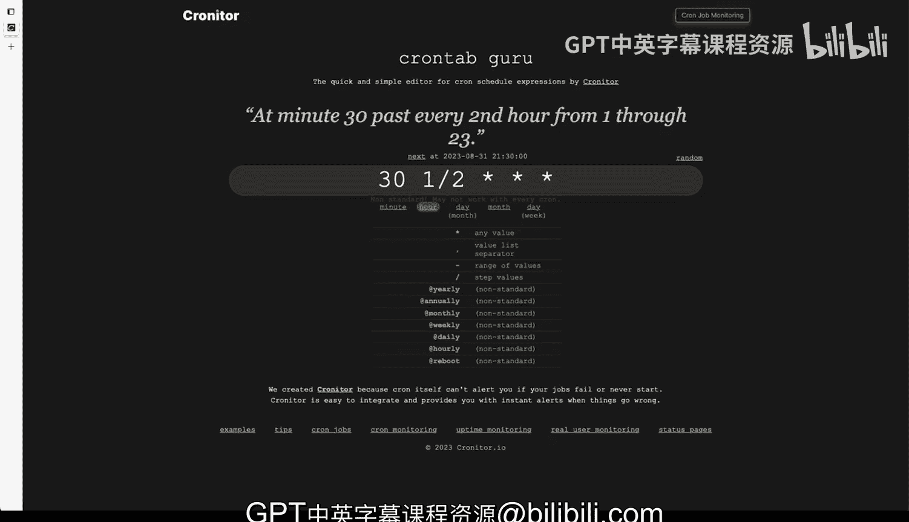

# 132：使用Cron自动化重复任务 🕐


在本节课中，我们将要学习如何使用Cron工具来自动化重复性的任务。Cron是一个在Unix-like系统中广泛使用的任务调度程序，它允许你安排脚本或命令在特定的时间间隔自动运行。这对于数据工程和DevOps中的自动化工作流至关重要。

## 什么是Cron？ 🤔

上一节我们介绍了自动化任务的概念，本节中我们来看看Cron的具体工作机制。Cron是一个系统守护进程，它会根据预定的时间表自动执行命令。你无需手动启动它，当系统检测到Cron配置文件（crontab）存在时，它便会自动运行。

要查看Cron的手册说明，可以使用命令 `man cron`。



## 如何配置Cron任务？ ⚙️

Cron任务的配置是通过编辑一个名为“crontab”的特殊文件来完成的。每个用户都可以拥有自己的crontab文件。

要查看当前用户的Cron任务列表，可以使用命令 `crontab -l`。如果当前没有配置任何任务，该命令将不会显示任何内容。

要编辑当前用户的crontab文件，可以使用命令 `crontab -e`。这个文件有特定的格式要求。

## 理解Crontab格式 📝

Crontab的每一行代表一个任务，并且遵循一个由五个时间字段和一个命令字段组成的固定格式。

以下是crontab条目的基本结构：
```
* * * * * command_to_execute
```
这五个星号分别代表不同的时间单位，从左到右依次是：
1.  分钟 (0 - 59)
2.  小时 (0 - 23)
3.  月份中的日期 (1 - 31)
4.  月份 (1 - 12)
5.  星期几 (0 - 7，其中0和7都代表星期日)

例如，配置 `* * * * *` 意味着该命令将在**每一分钟**执行。

## 配置示例与实践 🧪

让我们通过一些例子来具体了解如何配置。



一个简单的例子是，让Cron每分钟向一个文件写入一条测试信息。对应的crontab条目如下：
```
* * * * * echo "test from Cron" >> /home/alfredo/Desktop/fromCron.txt
```
这个配置表示：在每一分钟、每一小时、每一天、每一月、每一周的任何一天，执行后面的`echo`命令。

如果你想调整执行频率，比如改为每30分钟执行一次，可以这样配置：
```
30 * * * * echo "test every half an hour" >> /home/alfredo/Desktop/fromCron.txt
```
这个配置表示：在每个小时的第30分钟（例如1:30， 2:30）执行命令。

编辑并保存crontab文件后，新的任务就会被安装。你可以再次使用 `crontab -l` 命令来确认任务已成功添加。

## 使用在线工具验证Cron表达式 🌐



对于初学者来说，Cron表达式可能有些难以理解。幸运的是，有一些在线工具可以帮助我们。

一个非常有用的网站是 **crontab.guru**。你可以将你的Cron表达式（例如 `30 * * * *`）粘贴到该网站，它会给出清晰易懂的解释，告诉你这个配置具体代表什么时间执行（例如：“在每小时的第30分钟”）。

这对于编写和调试复杂的Cron计划非常有帮助。

## 将Cron与Rust结合使用 🔗

Cron的强大之处在于它可以触发任何系统命令或脚本。这意味着你可以轻松地将它与Rust程序结合使用。

例如，你可以编写一个Rust程序来执行数据清洗、日志分析或系统监控等任务。然后，在crontab中配置类似下面的条目，让这个Rust程序每小时运行一次：
```
0 * * * * /path/to/your/rust_program
```
这样，你就实现了一个完全自动化的、由Rust驱动的任务流水线。

## 总结 📚



本节课中我们一起学习了Cron自动化工具的核心用法。我们了解了Cron是一个系统调度守护进程，学会了通过 `crontab -e` 命令编辑任务计划，并掌握了由五个时间字段组成的crontab基本格式。通过具体示例，我们实践了如何配置每分钟或每半小时执行的任务。我们还介绍了 **crontab.guru** 这个实用的在线工具，它可以帮助我们理解和验证复杂的Cron表达式。最后，我们探讨了如何将Cron与Rust程序结合，从而构建强大的自动化工作流，这对于数据工程和DevOps实践至关重要。