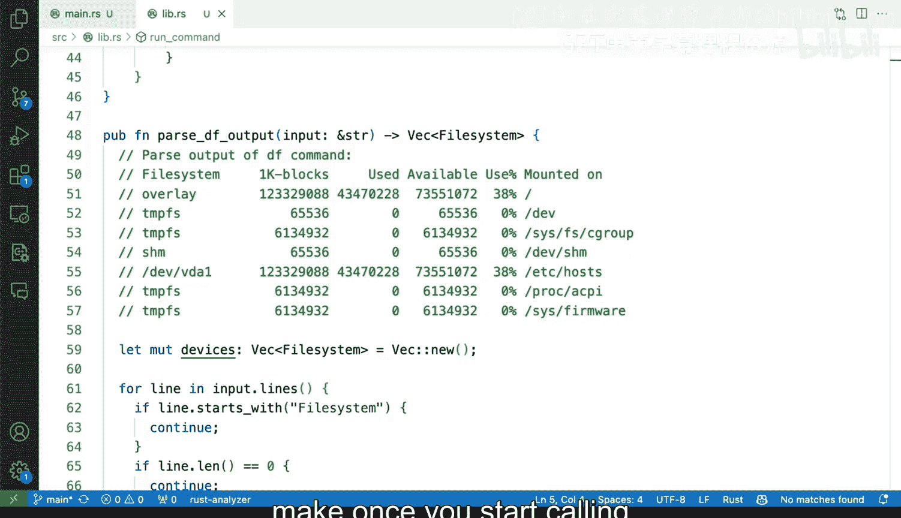
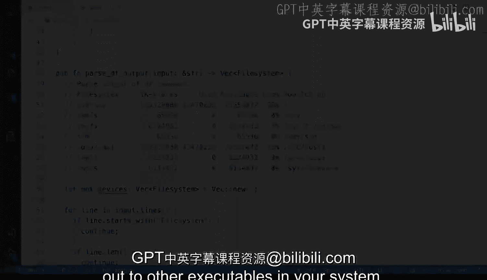

# Rust编程2-3（数据工程、DevOps）：134：运行外部程序的复杂性概述 🧩

在本节课中，我们将要学习在Rust（以及其他编程语言）中运行外部程序时可能遇到的一系列复杂性问题。我们将以`df`命令为例，探讨不同系统间的输出差异、错误处理策略以及解析外部命令输出时面临的挑战。

---

运行外部程序通常涉及许多复杂性。当你使用像Rust这样的编程语言（其他语言也同样适用）去封装或调用外部工具时，会产生一系列预期之外的情况。

现在，我将运行`df`命令。我使用的是苹果电脑，如果你使用的是Linux机器或其他系统，输出会有所不同。这里展示的是命令的输出结果。我想说明的是，我们的系统可能会依赖像`df`这样的外部命令行工具来报告系统信息。

当然，存在一些实现了此功能的Rust库（crate）。但有时这些库的功能不足以满足需求，你可能因为某些特殊原因（例如需要提供与旧系统的兼容性）而不得不选择直接调用外部命令。这正是我今天要讨论的内容。几年前，我曾遇到一个情况：需要依赖一个系统命令行工具，而该工具在不同年代系统上的输出格式略有不同，我必须编写一个“粘合”层来规范化输出，无论系统是五年前的还是全新的。

因此，今天我将重点分析与`df`类似的输出，并探讨在使用此类策略（即封装外部命令）时需要考虑的问题。与直接使用现成库不同，你需要根据具体用例做出一些决策。

---

接下来，我将关闭终端，首先向你展示`main.rs`文件。它将接受一个路径参数（该参数是可选的，因为可以传递空字符串）。这个程序的功能是调用一个库，并生成JSON输出。

现在，我将转到库文件`lib.rs`的顶部。这里展示了我们将要进行的解析工作。我暂时不会深入细节，但我想指出复杂性和你需要做出的决策之一：当命令执行出错或输出不兼容时会发生什么？因为你需要进行解析。

在这个例子中，库的目标是提供一个JSON接口。它会解析`df`输出的每一行并生成JSON。那么，当输出不正常时，你必须考虑到这一点。在我过去的经验中，我的观点是：解析输出时，有一个运行命令的Rust函数。这个函数有两种可能的结果：要么成功获得命令运行的正确结果，要么遇到错误。

此时，你几乎需要做出一个业务逻辑上的决策：是让错误中断整个程序，还是允许程序继续执行？在我当时工作的系统中，完全中断是不可接受的，因此我必须让程序继续运行。实现这一点的方法是，修改那个运行外部命令的函数，使其能够处理输出可能为空的情况。如果输出为空，就什么都不做。然而，如果输出损坏或命令执行被中断，情况就会变得棘手。

这对我当时的情况是正确的处理方式。但你的策略可能不同，你可能认为一旦此处出错，就必须终止执行。这些都是你需要考虑的因素。

---

最后，我想谈谈解析本身。解析绝对会让事情变得复杂。我最初展示的是类Linux系统的输出，而我MacOS系统上`df`命令的输出看起来非常不同，列数更多。因此，解析技术必须考虑到系统间的差异。如果你打算让工具在不同系统上运行，就必须防范因解析完全失败而导致值被放入错误字段的灾难性情况。就像这里展示的，代码正在消费输出的每一部分并将其强制转换为字符串以捕获信息。

本例中，我只关注Linux输出。但在为不同系统进行解析时，你肯定可以采用其他策略。

---

综上所述，当你开始在系统中调用其他可执行文件时，可能会面临上述困难，并且必须做出相应的设计决策。本节课我们一起学习了运行外部程序时的核心挑战，包括系统差异、错误处理逻辑以及输出解析的复杂性。理解这些是构建健壮命令行工具集成功能的基础。