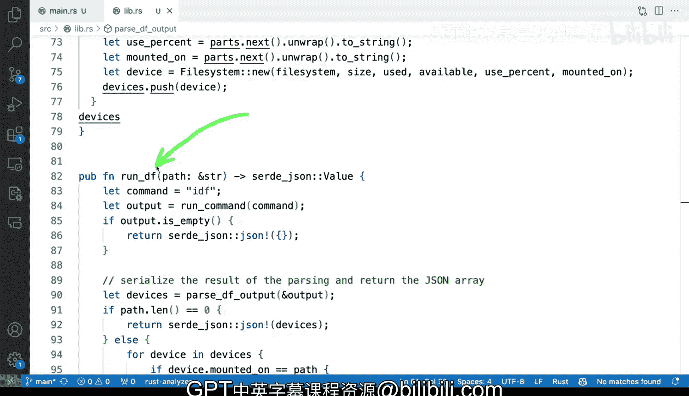

# Rust编程2-3（数据工程、DevOps）：46_03_03：解析系统命令输出的策略 🛠️


在本节课中，我们将要学习在Rust应用程序中包装和解析外部命令输出时，需要考虑的复杂性和可以采取的策略。我们将通过一个包装`df`命令的示例来探讨如何设计更健壮、更灵活的代码。

## 概述

解析外部命令的输出是一项复杂的任务。我们之前已经讨论过一些复杂性，本节将重点介绍处理这类问题时可用的具体策略。这些策略的选择取决于你的项目是命令行工具还是库，以及你对输入输出的控制程度。

## 策略一：区分应用与库的设计

上一节我们介绍了解析外部命令的复杂性，本节中我们来看看第一个核心策略：根据项目类型（独立应用 vs 库）做出不同的设计决策。

在示例中，我们有一个包装`df`命令的Rust命令行工具。它解析选项和参数，例如`path`是一个默认为空字符串的标志。这种设计方式与创建一个供其他工具使用的库有所不同。

如果你在构建一个库，你需要为调用者提供更多灵活性来处理错误和输出。而在构建一个独立的一体化应用程序时，你可以根据自身需求做出更直接的选择。

以下是示例中运行命令的函数，它直接返回一个字符串并内部处理错误：

```rust
fn run_command() -> String {
    // ... 执行命令的逻辑
    // 内部处理错误，总是返回一个字符串
}
```

这种设计对于独立应用可行，但对于库则不理想，因为它剥夺了调用者按自己意愿处理错误的能力。

## 策略二：将解析逻辑与命令执行分离

将解析逻辑从实际运行命令的函数中分离出来是一个好主意。这样做可以让你专注于处理输入（可能是一个缓冲区），而不必关心系统命令的调用细节。

这种方法也使测试变得更容易，因为你可以直接使用字符串作为输入进行测试，而无需调用真实的系统命令。

在示例中，`parse_df`函数专门负责解析`df`命令的输出字符串：

```rust
fn parse_df(output: &str) -> JsonValue {
    // 专注于解析字符串逻辑
}
```

## 策略三：考虑跨平台兼容性

如果你需要解析来自不同系统的、略有差异的命令输出，你可能需要为不同操作系统（例如macOS和Linux）准备单独的解析实现。

这允许你在后端根据不同的系统进行相应的处理，是构建健壮工具时需要考虑的一个重要方面。

## 策略四：评估解析的“脆弱性”与健壮性

解析外部来源的输出可能非常脆弱。在示例中，解析器天真地基于空白字符进行分割：

```rust
let parts: Vec<&str> = line.split_whitespace().collect();
```

这种方法在简单情况下有效，但如果任何字段（例如文件路径）包含空格，解析就会失败。

因此，你需要分析你处理的输出类型，并确保你的假设是正确的。如果可能包含空格，你就需要更健壮的解析策略，例如使用正则表达式或专门针对该命令输出格式的解析器。

## 需要考虑的关键点

以下是设计命令包装器时需要权衡的一些关键因素：

*   **错误处理**：决定是在内部处理错误，还是将错误返回给调用者处理。
*   **输入验证**：确保传递给系统命令的参数是安全且格式正确的。
*   **输出假设**：明确你对命令输出格式所做的所有假设，并评估其稳定性。
*   **测试便利性**：设计易于测试的代码结构，例如将纯解析逻辑分离出来。

## 总结



本节课中我们一起学习了在Rust中包装和解析系统命令输出的几种核心策略。我们了解到，设计决策应根据项目是应用还是库而有所不同；将解析逻辑与命令执行分离能提高代码的可测试性和清晰度；需要考虑跨平台兼容性；并且必须谨慎评估解析逻辑的健壮性，避免因对输出格式的天真假设而导致程序崩溃。通过应用这些策略，你可以构建出更可靠、更易维护的命令行工具或库。