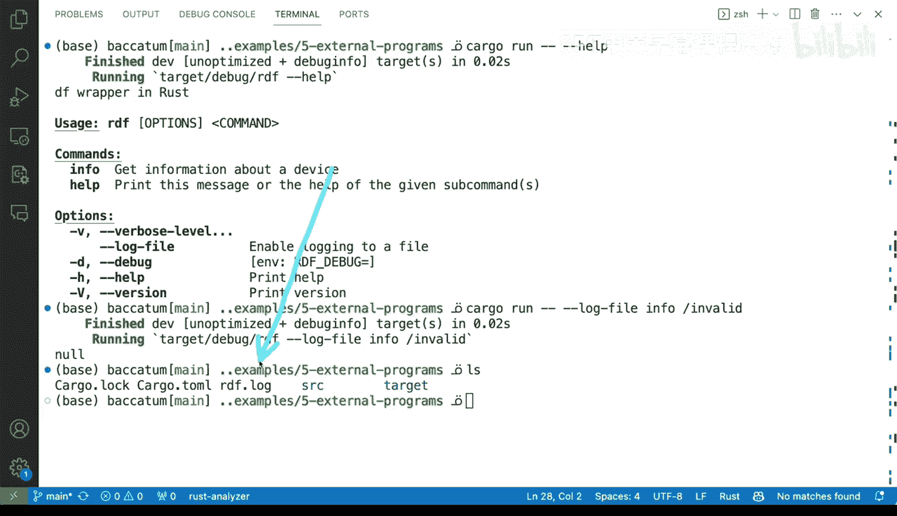

# 137：错误报告与处理技术


在本节课中，我们将学习在包装外部命令或系统命令时，如何建立一套坚实、健壮的错误处理策略。核心目标是确保在发生故障时，我们能够清晰地理解发生了什么。

## 捕获执行的命令

上一节我们介绍了错误处理的重要性，本节中我们来看看具体的技术。首先，一个始终推荐的做法是捕获实际运行的命令。这在命令包含多个参数或标志时尤其有用，因为错误可能源于特定的输入组合。

以下是实现此功能的关键步骤：

*   **记录完整命令**：当调用外部命令（如 `df`）时，不仅记录错误信息，还要记录完整的命令行字符串，包括所有参数和标志。
*   **辅助调试**：当错误发生时，这为开发者提供了明确的上下文，便于复现和定位问题。

例如，在代码中，当命令执行失败时，我们可以这样输出：
```rust
eprintln!("Command failed: {}", actual_command_string);
```

## 捕获并解析错误输出

仅仅知道命令是什么还不够，我们还需要知道系统或外部命令返回的具体错误信息。这有助于区分是路径错误、权限问题还是其他类型的故障。

以下是处理错误输出的方法：

*   **检查退出状态**：使用 `std::process::Command` 的 `.status()` 或 `.output()` 方法获取命令的退出状态码。
*   **捕获标准错误**：通过 `.stderr` 捕获命令输出的错误信息流。
*   **提供清晰反馈**：将原始错误信息与上下文（如失败的命令）一起呈现给用户或日志。

例如，尝试访问一个无效路径 `/invalid` 时，程序不仅会报告“命令失败”，还会显示类似 `df: ‘/invalid’: No such file or directory` 的系统错误信息。

## 实现健壮的输出处理

程序在成功时会产生格式化的输出（如JSON），但在失败时，我们需要确保错误信息、日志和正常输出不会混杂在一起，造成混乱。本节我们来优化失败时的输出呈现。

一个有效的策略是将详细的调试信息记录到文件中，而不是直接打印到用户终端。

以下是实现日志文件策略的步骤：

*   **添加日志开关**：为命令行工具添加一个标志（例如 `--log-file`），用于启用文件日志功能。
*   **分离输出流**：用户看到的终端输出保持简洁（如“命令执行失败”），而详细的命令、错误堆栈等信息则写入指定的日志文件。
*   **始终可选**：你可以选择始终启用文件日志，也可以将其作为调试选项。

例如，运行工具时使用 `cargo run -- --log-file`，详细的错误信息将被写入一个独立的文件（如 `rdf.log`），而用户界面保持整洁。

## 总结



本节课中我们一起学习了构建健壮命令行工具的几种关键错误处理技术。我们首先强调了**捕获完整执行命令**的重要性，以便在出错时提供清晰的上下文。接着，我们探讨了如何**捕获并解析外部命令的错误输出**，以准确诊断问题根源。最后，我们介绍了通过**实现可选的日志文件功能**来分离用户输出和调试信息，从而提升工具的可用性和可维护性。将这些技术结合起来，可以显著改善工具在故障情况下的行为，使其更易于调试和使用。