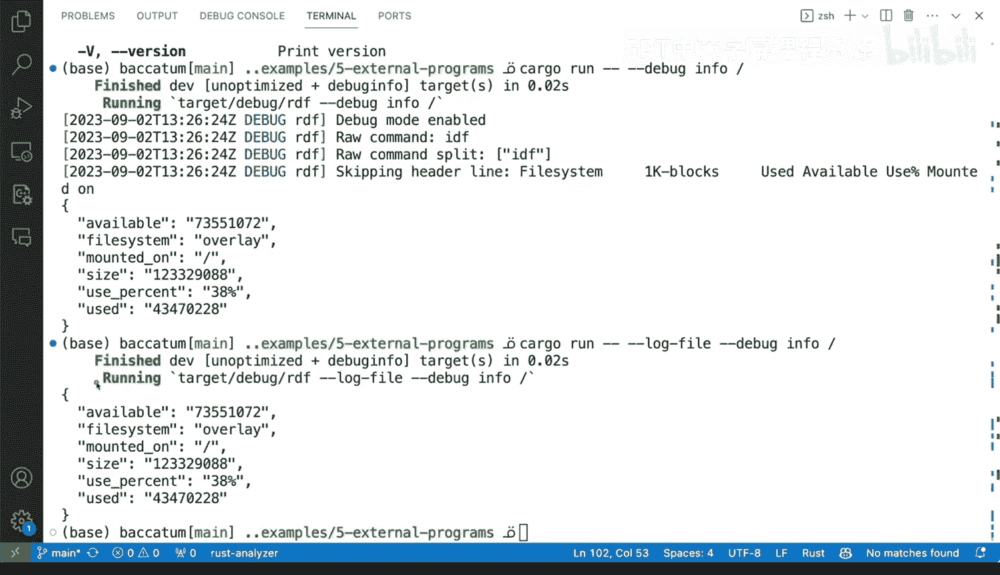

# Rust编程2-3（数据工程、DevOps）：138：用于错误报告的文件日志记录 📝


在本节课中，我们将学习如何在Rust程序中实现文件日志记录，以增强错误报告和调试能力。我们将看到如何将调试信息输出到日志文件，而不是直接打印到终端，这对于生产环境或需要结构化输出的工具至关重要。

上一节我们介绍了处理外部命令执行的基本错误，本节中我们来看看如何通过日志记录来捕获更详细的调试信息。

## 添加调试日志

首先，我们可以在代码中导入 `log` 库的 `debug` 宏，用于记录调试信息。这允许我们捕获程序执行过程中的详细信息，而不会干扰主输出。

以下是添加调试日志的步骤：

1.  导入 `log` 库的 `debug` 宏。
2.  在关键执行点（如命令拆分、数据处理）添加 `debug!` 语句。
3.  将日志输出重定向到文件，而不是标准输出。

例如，我们可以记录原始命令及其拆分后的参数向量，以确保命令解析正确：

```rust
use log::debug;

// 记录原始命令字符串
debug!("Raw command: {}", raw_command);
// 记录拆分后的命令参数
debug!("Raw command split: {:?}", args);
```

## 记录特定操作

除了命令本身，记录程序流程中的特定决策也很有帮助。例如，在处理数据行时，我们可以记录跳过空行或标题行的操作。

以下是记录特定操作的示例：

*   当遇到空行时，记录 `"Skipping empty line"`。
*   当跳过标题行时，记录 `"Skipping header line"`。
*   当命令输出为空时，记录 `"Output from command is empty"`。

这些日志条目有助于在事后审查时理解程序的行为和决策路径。

## 配置日志输出

默认情况下，`debug!` 宏的日志可能不会显示。我们需要配置日志系统的详细程度（verbosity）。可以通过环境变量或命令行参数（如 `--debug` 和 `--info`）来控制日志级别。

更重要的是，我们可以将日志输出定向到一个文件。这样做的好处是：
*   避免调试信息污染工具的标准输出（例如JSON输出）。
*   为生产环境故障排查保留完整的执行上下文。
*   实现日志信息的持久化。

## 运行与验证

完成代码修改后，运行程序并检查日志文件。你应该能看到添加的所有 `debug!` 信息被捕获到指定的日志文件中。同时，工具的主输出（如处理后的数据）将保持干净，不受调试文本的影响。

这种模式——将详细的调试信息写入日志文件，同时保持标准输出的整洁——对于构建需要被其他系统消费的健壮工具至关重要。



本节课中我们一起学习了如何利用 `log` 库在Rust程序中实现文件日志记录。关键点包括：使用 `debug!` 宏添加调试信息、将日志输出重定向到文件、以及通过配置日志级别来控制信息详细程度。这种方法能有效提升错误报告的质量和程序的可调试性，尤其是在处理外部命令或构建数据管道时。