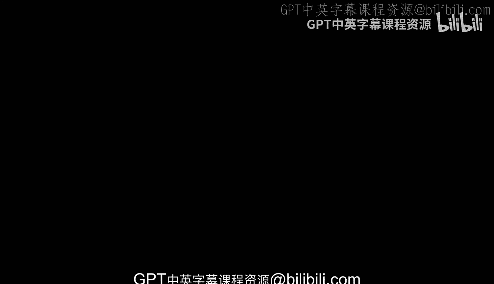
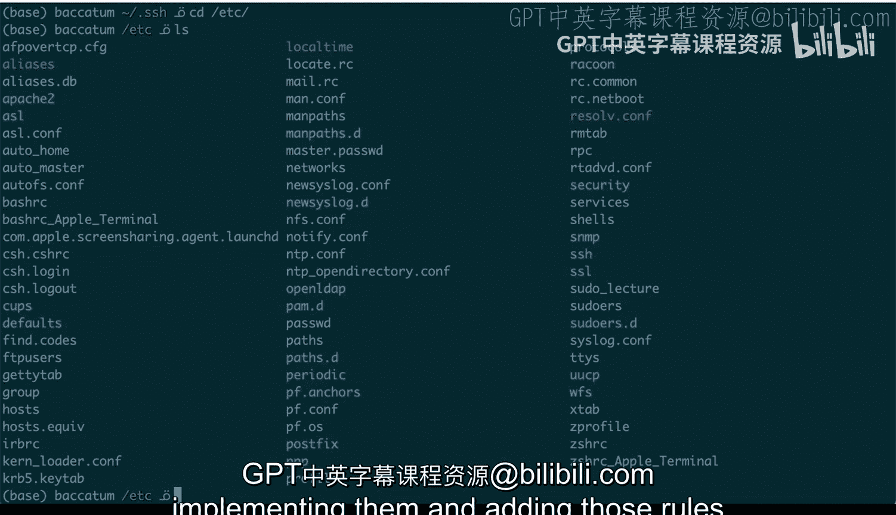

# 140：合规性应用场景

## 概述

在本节课中，我们将探讨合规性在DevOps操作中的实际应用场景。我们将通过一个具体的SSH密钥权限管理的例子，来理解合规性检查的必要性和实现方式。您将看到，确保系统配置符合特定规则，对于维护系统安全和稳定至关重要。

## SSH密钥权限管理

上一节我们介绍了合规性的基本概念，本节中我们来看看一个具体的应用实例：SSH密钥的权限管理。

SSH是一种允许您远程登录到其他系统的工具。例如，我有一台名为“Mac mini server”的服务器，我可以使用`ssh`命令登录到那台服务器。登录后，我的命令行提示符会改变，表明我已不在本地计算机上。

那么，合规性在何处发挥作用呢？关键在于与SSH相关的配置文件权限。在我的家目录下，有一个隐藏的子目录`.ssh`，它存放着所有SSH配置，包括我的私钥、公钥以及我使用SSH时连接过的主机信息。

如果我现在查看这些文件的权限，会发现我的私钥文件（例如`id_rsa`）的权限设置非常特殊。它只允许文件所有者（也就是我本人）进行读写操作，而我所在的用户组或其他用户则没有任何权限（读、写或执行）。

## 权限修改与合规性警告

现在，如果我修改这个私钥文件的权限，让其他用户也能读取它，问题就会出现。

以下是操作步骤和结果：
1.  使用命令 `chmod o+r id_rsa` 为“其他用户”添加读取权限。
2.  使用 `ls -alh` 命令查看，会发现私钥文件的权限现在对所有用户都是可读的。
3.  当我尝试再次SSH连接到我的Mac mini服务器时，系统会立即发出警告。

警告信息明确指出：私钥文件未受保护，其权限（0644）过于开放，这意味着其他用户可以读取它。SSH要求私钥文件不能被其他人访问，因此这个私钥将被忽略，登录尝试会失败。

这种情况在我创建、移动、修改密钥或进行某些更改时多次发生。因此，此处的合规性就是指确保某些文件（如SSH私钥）具有特定的、安全的权限。

要修复这个问题，我们需要撤销错误的权限设置：
1.  使用命令 `chmod o-r id_rsa` 移除其他用户的读取权限。
2.  确保所有者拥有读取权限：`chmod u+r id_rsa`。
3.  再次使用 `ls -alh` 检查，确认权限已恢复正确。
4.  此时，SSH连接就能正常工作了。

这就是合规性的一个方面：我可以编写检查程序，来强制确保某些文件具有特定的权限。通常对于脚本或配置文件，您可能希望创建某种机制来保证它们具有正确的权限，否则程序可以发出警告，指出这些配置不符合规定，存在需要修复的问题。自动修复这些问题需要更高级的自动化工具，但仅实现检查功能已足以帮助我们理解系统状态。

## 文件存在性与软件安装检查

除了检查文件权限，合规性检查的另一个常见方面是验证特定文件是否存在。

例如，进入`/etc`目录，可以看到大量不同的配置文件。您可以设定一个规则：系统中必须始终存在一个`nfs.conf`文件。如果该文件不存在，系统可能会遇到问题。

您可以有效地编写一个工具来执行此检查，确保某些关键文件存在。在过去，为了避免依赖包管理器并执行一些系统检查，我常常会进入`/etc`目录，查找某个必须安装的软件对应的配置文件。如果该文件不存在，就意味着该软件无法正常工作。

因此，检查必需文件是否存在，是合规性检查能为您完成的另一项有趣且有用的任务。这也正是人们对构建、实现这些检查规则，并将其添加到所管理的系统中感兴趣的原因。

## 总结

本节课中，我们一起学习了合规性在DevOps中的两个核心应用场景。
1.  **权限合规**：通过SSH私钥的例子，我们看到了确保敏感文件（如`id_rsa`）具有严格权限（如`600`）的重要性。不符合规的宽松权限会导致安全警告和功能失效。
2.  **存在性合规**：通过检查`/etc`目录下特定配置文件（如`nfs.conf`）是否存在，我们可以间接验证关键软件是否已正确安装，从而预防因缺失组件导致的系统问题。

这些检查是构建自动化、可靠且安全系统的基础步骤。