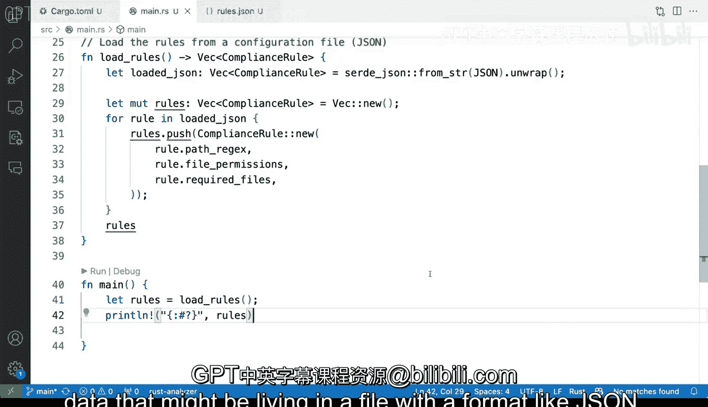

# 141：在Rust中使用JSON 🦀

在本节课中，我们将学习如何在Rust程序中处理JSON数据。我们将通过一个具体的例子，了解如何从JSON文件中读取数据，并将其反序列化为Rust的结构体，以便在程序中使用。

---

## 概述

JSON是一种常用的数据交换格式。在Rust中，我们可以使用 `serde` 和 `serde_json` 这两个库来轻松地序列化和反序列化JSON数据。本节教程将演示如何定义一个Rust结构体，从JSON文件中加载数据，并将其转换为Rust类型。

---


## 添加依赖

首先，我们需要在项目中添加必要的依赖。`serde` 和 `serde_json` 是处理JSON的常用库。`serde` 的特性允许我们为结构体和类型添加属性，使其能够序列化和反序列化。

在 `Cargo.toml` 文件中添加以下依赖：

```toml
[dependencies]
serde = { version = "1.0", features = ["derive"] }
serde_json = "1.0"
```

---

## 定义数据结构

接下来，我们将定义一个Rust结构体来表示JSON数据的格式。这个结构体将包含路径、正则表达式、文件权限和必需的文件列表。

```rust
use serde::{Deserialize, Serialize};

#[derive(Serialize, Deserialize, Debug)]
struct ComplianceRule {
    path: String,
    regex: String,
    file_permissions: String,
    required_files: Vec<String>,
}
```

在这个结构体中：
- `path` 表示文件路径。
- `regex` 是一个正则表达式。
- `file_permissions` 表示文件权限。
- `required_files` 是一个字符串向量，表示必需的文件列表。

---

## 加载JSON数据

现在，我们将编写一个函数来加载JSON数据并将其反序列化为Rust结构体。假设JSON数据存储在一个名为 `rules.json` 的文件中。

以下是加载JSON数据的步骤：

1. 读取JSON文件内容。
2. 使用 `serde_json` 将JSON字符串反序列化为Rust结构体。

```rust
use std::fs;

fn load_rules() -> Vec<ComplianceRule> {
    // 读取JSON文件内容
    let json_data = fs::read_to_string("rules.json")
        .expect("无法读取 rules.json 文件");

    // 反序列化JSON数据
    let rules: Vec<ComplianceRule> = serde_json::from_str(&json_data)
        .expect("JSON 反序列化失败");

    rules
}
```

---

## 使用加载的数据

加载数据后，我们可以在程序中使用这些规则。例如，我们可以在主函数中调用 `load_rules` 函数并打印加载的规则。

```rust
fn main() {
    let rules = load_rules();

    // 打印加载的规则
    for rule in rules {
        println!("路径: {}", rule.path);
        println!("正则表达式: {}", rule.regex);
        println!("文件权限: {}", rule.file_permissions);
        println!("必需文件: {:?}", rule.required_files);
        println!("---");
    }
}
```

---

## JSON文件示例

为了确保程序正常工作，我们需要一个JSON文件。以下是一个示例 `rules.json` 文件的内容：

```json
[
  {
    "path": "/etc",
    "regex": ".*\\.conf$",
    "file_permissions": "644",
    "required_files": ["passwd", "group"]
  },
  {
    "path": "/var/log",
    "regex": ".*\\.log$",
    "file_permissions": "640",
    "required_files": ["syslog", "auth.log"]
  }
]
```

---

## 运行程序

现在，我们可以运行程序来验证JSON数据是否被正确加载和反序列化。在终端中执行以下命令：

```bash
cargo run
```

如果一切正常，程序将输出加载的规则信息。

---

## 总结

在本节课中，我们一起学习了如何在Rust中使用JSON数据。我们通过以下步骤实现了JSON数据的加载和反序列化：

1. 添加 `serde` 和 `serde_json` 依赖。
2. 定义Rust结构体来表示JSON数据的格式。
3. 编写函数加载JSON文件并将其反序列化为Rust结构体。
4. 在主函数中使用加载的数据。



通过这种方式，我们可以轻松地将外部JSON数据集成到Rust程序中，从而实现更灵活的数据管理和业务逻辑分离。