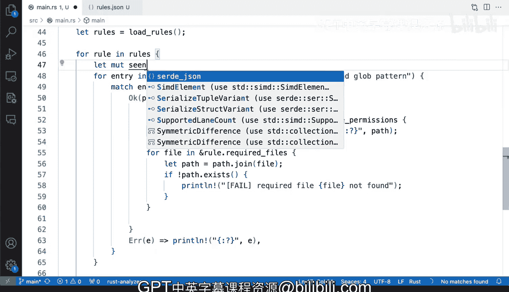

# Rust编程2-3（数据工程、DevOps）：54_03_06：改进报告逻辑 🛠️


在本节课中，我们将学习如何改进一个Rust工具的合规性检查逻辑。该工具旨在根据特定规则检查目录中是否存在必需的文件。目前，工具的报告逻辑存在重复输出问题，我们将通过重构代码来解决它。

## 问题分析

上一节我们介绍了工具的基本结构和规则检查逻辑。本节中我们来看看当前实现中存在的问题。

我们的工具旨在基于某些规则强制执行合规性检查。我们需要处理这里的循环逻辑。回顾一下，如果我们回到相邻的规则部分，我们的目标是检查每个目录，并确保某些必需文件存在。例如，在`Etsy`目录中，这些文件应该存在。

当前的情况是，由于使用了`glob`模式进行扩展，对于每条规则，它都会为每个文件进行检查。例如，它会寻找`password`和`group`文件。当然，这些文件并不存在。如果文件不存在，它就会为每个文件报告失败。

如果我们打开终端并运行`cargo run`，就会看到这个行为。

让我们看一下。我们会看到“password not found”和“group not found”的信息。你会看到这个模式一遍又一遍地重复，实际上到处都是。

这不是我们想要的结果。如果你要报告这些缺失，不应该为每个文件都报告，因为这些是`Etsy`文件。你会看到`group`被一遍又一遍地报告。

## 解决方案

所以，让我们修复这个问题，改进我们的工具。在开发这些工具并取得进展的过程中，输出结果不完全符合你的期望或需求是非常常见的情况。

即使这是一个演示，并且我正在尝试解释如何将这些概念付诸实践，当事情不太对劲时，你也不应该感到不知所措或沮丧。实际上，这是一种重要的学习方式，特别是在处理Rust和逻辑时，因为它能让你更好地理解问题。

我们知道，问题出在`match`语句内部的这个循环上。

这里的主要问题是，因为我们正在处理一个`glob`模式，我们需要理解它的根目录是什么。如果我们使用`Etsy/*`，它肯定会展开。

以下是改进逻辑的一种方法。

## 实施改进

你可以通过捕获所有已检查的文件来修复并改进这个问题。实现方式是为每条规则创建一个向量来收集文件。

让我们为每条规则捕获所有的文件。因为这将使我们能够看到所有捕获到的内容，并在之后检查我们想要的文件是否存在。

所以，让我们在这里创建一个可变的向量。

```rust
let mut captured_files = Vec::new();
```

通过这种方式，我们可以在遍历文件时将它们添加到向量中，然后在所有文件检查完毕后，再根据规则验证必需文件是否存在，从而避免重复报告。

## 总结



本节课中我们一起学习了如何识别和修复Rust工具中重复报告的问题。我们分析了问题根源在于循环和`glob`模式的结合使用，并提出了通过收集文件列表再进行统一验证的解决方案。这种方法不仅解决了重复输出的问题，也使代码逻辑更加清晰，为后续的功能扩展打下了良好的基础。