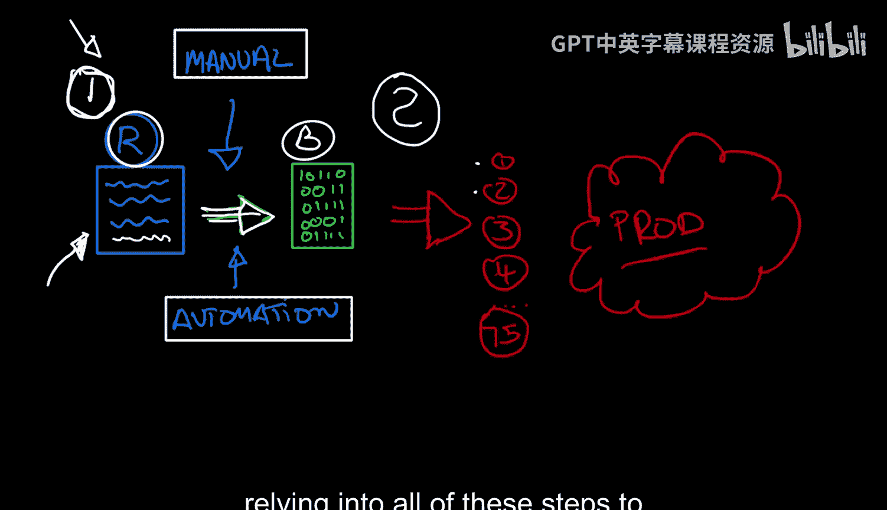
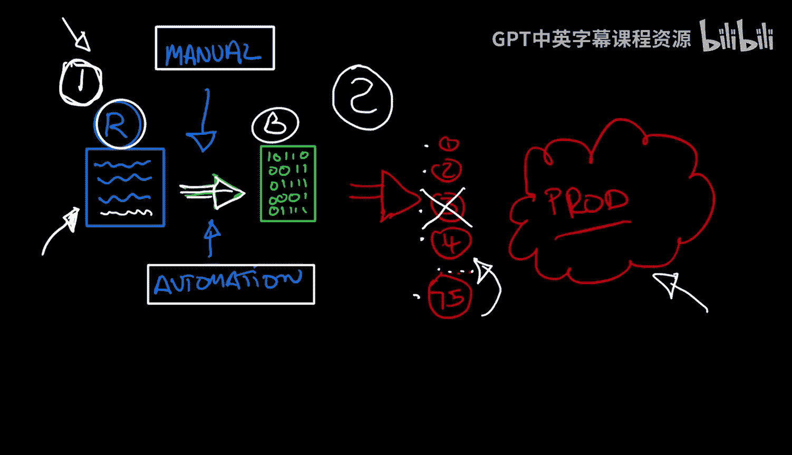
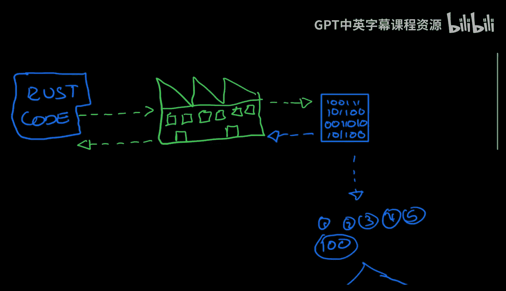
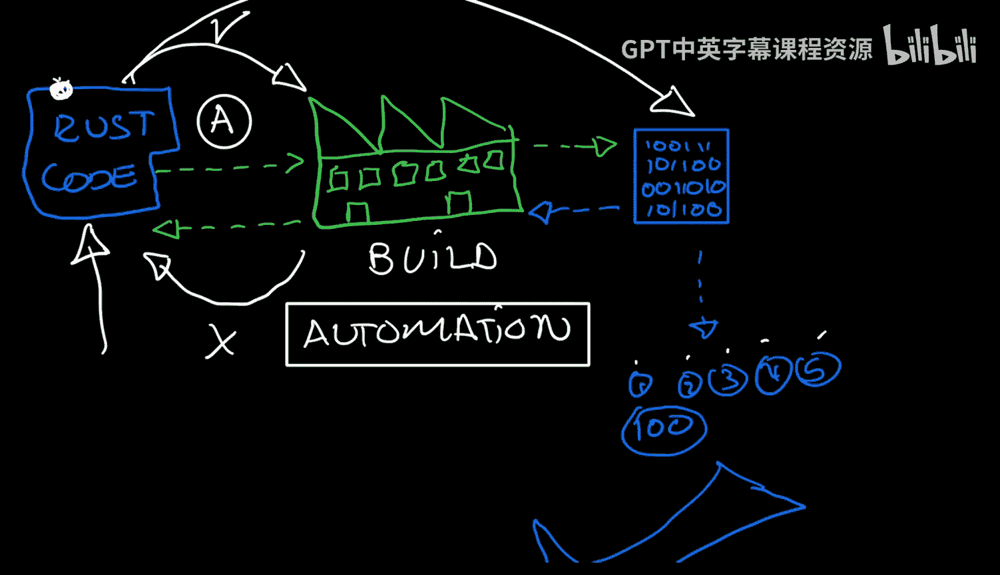

# Rust编程2-3（数据工程、DevOps）：1：什么是CI/CD 🚀

在本节课中，我们将要学习CI/CD（持续集成/持续交付）的核心概念。我们将了解它是什么，为什么它对现代软件开发至关重要，以及它如何将手动、易错的过程转变为自动化、可靠的流程。

## 从手动流程说起

上一节我们介绍了CI/CD的重要性，本节中我们来看看一个典型的软件开发流程是如何开始的。

一切始于你的源代码。以Rust项目为例，你需要执行许多步骤来完成任何工作。通常，你会经历一系列手动步骤，例如运行 `cargo run` 或 `cargo build`，检查一切是否正常工作。如果出现问题，你就返回去修改代码。这些操作本身没有问题，但关键在于，**这一切都是手动的**。

任何你看到的、需要手动执行的步骤，都是构建自动化的机会。每当我们把手动步骤转变为自动化流程时，我们就在为CI/CD系统奠定基础。

在这个简单的用例中，我们的代码（用箭头表示）经过许多步骤，最终生成一个二进制文件。这个二进制文件可以运行。这个概念不仅适用于Rust，也适用于任何语言（如Web应用或其他项目），并且是DevOps的基石。

## 手动发布的挑战

上述开发周期对于快速开发迭代可能尚可接受。然而，当进入第二步——将应用发布到生产环境时，问题就开始变得棘手且危险。

发布到生产环境可能涉及众多复杂步骤：
*   为版本打标签。
*   检查文档构建。
*   确保文档中没有404链接。
*   确保HTTP应用通过所有测试。
*   正确配置云服务提供商。
*   处理身份验证。

步骤可能非常多（图中夸张地用了75步来表示）。一旦其中一步出错、遗漏或顺序错误，就会导致生产环境出现问题，迫使你进行回滚并投入更多手动工作来修复。

## CI/CD如何提供帮助 🛠️

那么，CI/CD如何帮助我们解决这些问题呢？让我们看看它是如何工作的。

CI/CD系统，或称构建系统，形成了一个**反馈循环**。你提交Rust代码，系统尝试构建二进制文件。构建成功了吗？很好。构建失败了吗？系统会提供反馈，你可以据此进行修复。这一切都发生在**自动化**的方式下，无需手动干预。

构建系统负责处理所有步骤，直到最终生成二进制文件。对于Rust，产物是二进制文件；对于其他语言或HTTP服务，可能是部署到某个地方。关键在于，无论有多少步骤（1步、2步、5步甚至100步），所有事情都通过自动化完成。

**自动化是DevOps的核心概念**，目标是让尽可能多的事情自动发生。这样，开发者就能专注于最重要的任务——开发。其余工作虽然重要，但可以交给自动化系统处理。

## CI/CD的目标与优势

CI/CD的最终目标是实现自动化发布。一旦你能以自动化方式发布到生产环境，你将获得以下优势：
*   **速度更快**：自动化流程远快于手动操作。
*   **错误更少**：减少人为失误。
*   **步骤可靠**：永远不会遗漏步骤或弄错顺序。
*   **轻松回滚**：如果新版本（如`version1`）有问题，可以快速、自动化地回滚到上一个稳定版本（如`version0`）。

CI/CD平台是实现所有自动化构建的基础。它帮助你在尝试构建和发布时，创建并管理所有这些自动化步骤。

## 总结

本节课中我们一起学习了CI/CD的基本概念。我们了解到，CI/CD的核心是将软件开发中的手动、易错步骤（如构建、测试、发布）转变为自动化、可靠的流程。它通过建立自动化反馈循环，提高了开发效率，减少了人为错误，并确保了发布过程的稳定性和可回滚性。这是现代DevOps实践的基石，让开发者能更专注于代码本身。