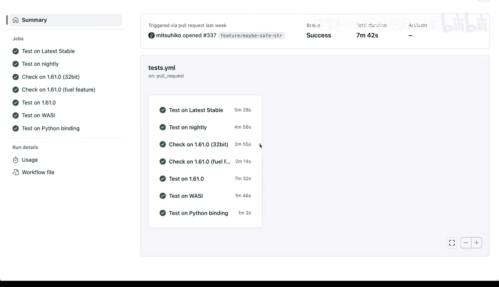
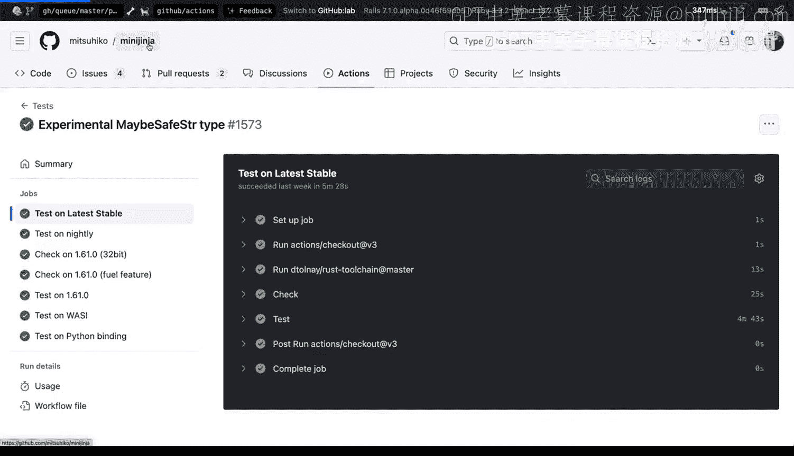
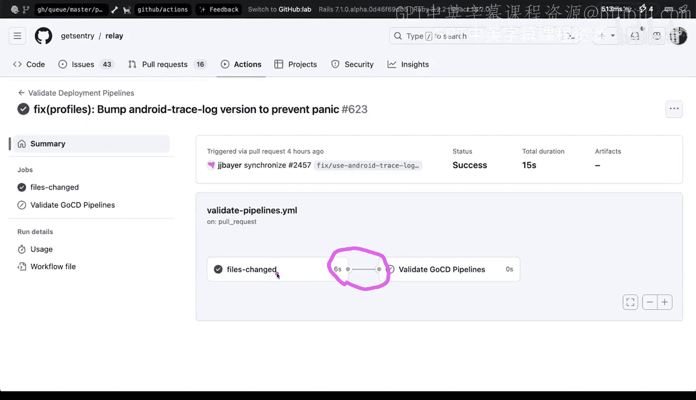
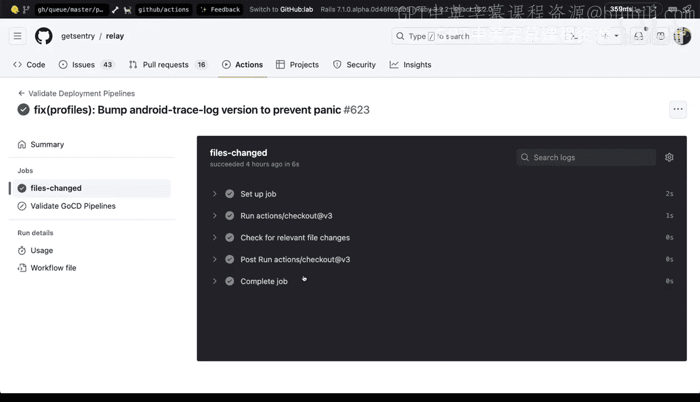
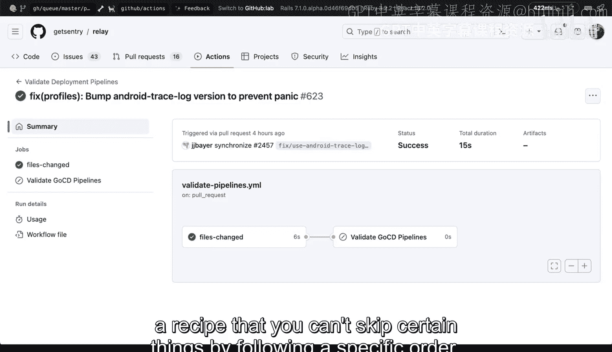

# 147：作业的构成组件 🧩

在本节课中，我们将要学习在CI/CD环境中，一个作业（Job）乃至一个流水线（Pipeline）是由哪些组件构成的。我们将以GitHub Actions为例，通过分析实际项目来理解这些概念，并学习如何组织步骤以实现关注点分离。

## 作业与流水线概述

在CI/CD环境中，一个作业是一系列步骤的集合，旨在完成一个特定的任务。有时，多个作业可以组合成一个流水线，其中各个作业之间可能存在依赖关系，共同实现一个更大的目标。

上一节我们介绍了CI/CD的基本概念，本节中我们来看看一个具体的作业是如何构成的。

## 作业的构成：步骤与关注点分离

让我们观察一个实际的Rust项目。在它的GitHub Actions配置中，我们可以看到一个执行测试的作业。

这个作业包含一个或多个步骤。所有步骤协同工作以完成测试任务。在当前示例中，该作业负责多项测试：
*   测试最新的稳定版Rust。
*   测试Nightly版本。
*   在32位系统上测试Rust 1.61版本。
*   测试其他特定配置下的Rust 1.61版本。
*   进行Python绑定测试。

所有这些测试都是独立运行的。关键在于，其中某些测试可能会失败，而其他测试可能正常通过。

当你将不同的关注点分离开来时，工作会变得更易于管理。你可以更容易地进行回滚、重新测试、做出修改，然后仅针对未通过的部分进行重测。

## 深入作业步骤

现在，让我们深入其中一个作业，查看其具体的步骤构成。

一个典型的作业步骤序列可能如下：
1.  **设置作业环境**：准备运行作业所需的基础环境。
2.  **克隆代码**：获取将要被测试的源代码。
3.  **设置工具链**：例如，安装和配置Rust工具链。
4.  **执行检查与测试**：运行实际的检查、编译或测试命令。
5.  **完成作业**：清理或报告结果。

**作业**就是为完成某事而执行的一系列步骤。它可以是一个更大任务的一部分，这个更大的任务有时被称为**流水线**。在流水线中，你会有一系列作业和步骤，它们各自执行不同的操作，共同服务于某个总体目标。

## 触发条件与流水线依赖

如果我们查看项目的GitHub Actions配置文件，可以更详细地看到这些步骤的定义。这种配置方式实现了关注点的分离。

此外，作业和流水线通常需要一个**触发器**来启动。触发器可以是：
*   手动触发。
*   代码变更时触发。
*   在GitHub中，可以设置为在拉取请求（Pull Request）时触发。

接下来，我们看另一个来自Sentry组织的Relay项目，它展示了一个更清晰的流水线示例。

这个流水线包含多个独立的作业。值得注意的是，这些作业并非总是顺序执行；某些作业能否执行，可能取决于前面作业的结果。这体现了作业间的**依赖关系**。

例如，你可以设置一个矩阵构建，或者创建多个尝试做相同事情的作业，并为其设置执行条件。流程可能是：如果文件发生更改，并且检查通过，则继续执行后续作业。你也会看到有些作业被标记为“跳过”，这通常是因为满足了预设的跳过条件。

通过设置特定的标志和配置，你可以控制流水线中的作业是跳过还是强制执行某些操作。

## 总结

本节课中我们一起学习了CI/CD中作业与流水线的核心构成。

简单来说，一个**作业**是一系列步骤的集合。而一个**流水线**可以是一系列步骤，或者是一系列彼此之间存在依赖关系的作业。这就像遵循一个食谱：你可以按照特定顺序执行，并且可以根据条件跳过某些步骤。

**核心概念回顾**：
*   **作业 (Job)** = 一系列步骤 (Steps)
*   **流水线 (Pipeline)** = 一系列作业/步骤，通常带有依赖关系 (Dependencies)
*   **触发器 (Trigger)** = 启动作业或流水线的事件 (如 `on: push` 或 `on: pull_request`)
*   **步骤 (Step)** = 具体的执行命令或操作 (如 `run: cargo test`)