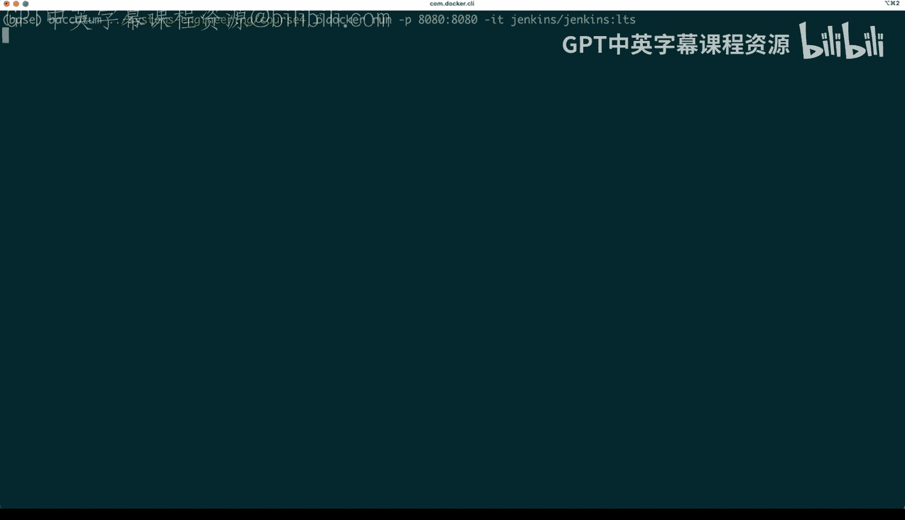
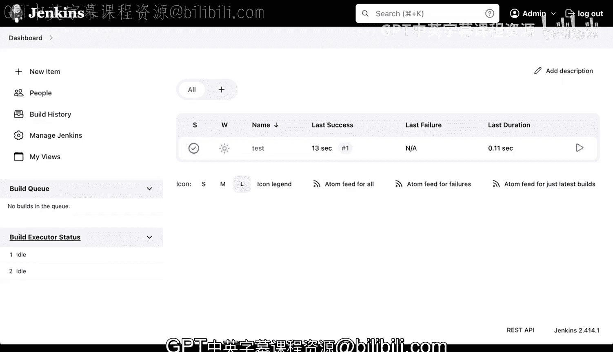

# Rust编程2-3（数据工程、DevOps）：148：Jenkins平台概览 🚀

在本节课中，我们将要学习全球最流行的CI/CD系统之一——Jenkins。我们将了解如何运行Jenkins容器，完成其初始设置，并创建一个简单的构建任务来理解其核心工作流程。

---

## Jenkins简介与运行

全球最流行的CI/CD系统或平台之一是Jenkins。我们今天要做的是运行Docker容器，将主机的8080端口映射到容器的8080端口。我将使用Jenkins的LTS版本镜像。

有多种安装Jenkins的方法，我们不会详细讲解安装过程，但我会展示我通常的运行方式。我之前已经运行过，所以你不会看到我拉取镜像的过程。容器已经初始化，这是关键。我之所以展示日志，是因为你第一次启动时，会看到一个用于继续安装的小令牌。

我复制了这个令牌，然后打开已经在8080端口运行的浏览器。我需要刷新页面。

你会看到Jenkins处于锁定状态。我放大页面，然后粘贴刚才复制的特殊令牌。我选择“不安装推荐插件”，因为我认为默认的那些插件已经足够。接下来，它会安装几个默认插件。

## 插件与集成

现在，让我们看看这里发生了什么。我们获得了GitHub流水线支持、SSH支持以及GitHub分支源插件，这意味着与GitHub有深度集成。如果你想要一个完全不运行在GitHub上的外部系统，例如处理私有项目或依赖本地构建服务器的专门任务，那么Jenkins是一个很好的选择。

我们稍等片刻，直到所有插件安装完成。

仪表盘正在加载。好的，安装已完成。

## 管理员设置

我将快速进行一些设置。我输入一个虚拟的管理员用户名“admin”。我跳过电子邮件地址步骤，点击“保存并继续”。我可能还是需要一个电子邮件地址，所以在这里输入一个虚拟地址，例如 `admin@sample.org`，然后再次点击“保存并继续”。

这个“实例配置”步骤在你使用反向代理服务器时很有用，但我们没有，我们是直接运行的。最后，我选择“开始使用Jenkins”。

一切顺利，这就是你看到的初始界面。可能会有一些安全提示或需要设置代理的提醒，我现在先忽略它们。这个界面与我们之前见过的其他CI/CD系统非常相似。

## 核心组件与创建任务

接下来，我们将看到构建队列。如果你有多个服务器和多个任务，它们会显示在这里。目前，我们有两个构建执行器，这代表两个实际执行工作的节点。Jenkins有分配工作的机制。在这个例子中，这是一个独立的服务器，默认带有这两个执行器。

如果我们想创建一个新项目，比如一个自由风格项目，我们可以点击“新建任务”。我们将其命名为“test”，然后点击“确定”。

我们会看到这个信息屏幕，暂时点击“确定”即可。这里没有源代码管理或构建触发器设置。我们之前讨论过构建触发器，它可以拉取你的源代码仓库。你可以设置GitHub钩子，这样当GitHub有变更时，Jenkins就会感知到。或者，你也可以定期构建，或通过脚本、定时任务来触发构建。

你可以在这里添加构建步骤。例如，我添加一个“执行shell”的步骤，输入命令 `echo success`。然后点击“保存”，我们的任务就创建好了。

## 执行与查看结果

我们现在就可以立即构建这个任务。构建会立刻显示在这里。它几乎没花时间，因为我没让它做太多事情。你可以在这里看到输出结果。整个过程设置简单，操作便捷。

现在，我们的测试任务就出现在这里了。

## 总结

本节课中，我们一起学习了Jenkins平台。其组件非常相似，核心在于：一旦CI/CD系统（这里是Jenkins）启动并运行，你需要知道在哪里定义任务、如何配置它们、它们将在哪里运行，以及当有多个任务时如何查看构建队列。以上就是开始使用Jenkins并理解其核心组件的一个非常简单直接的方法。