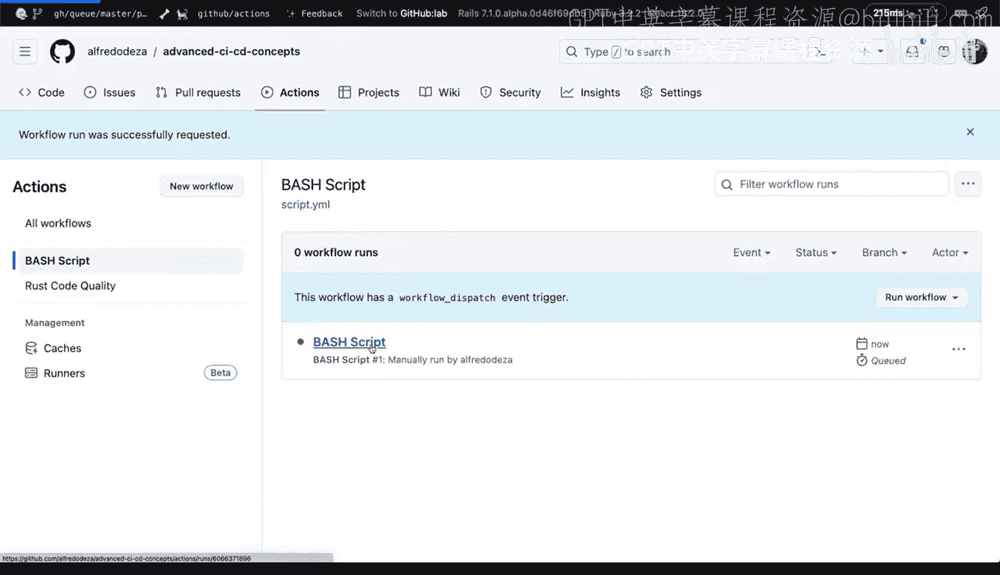
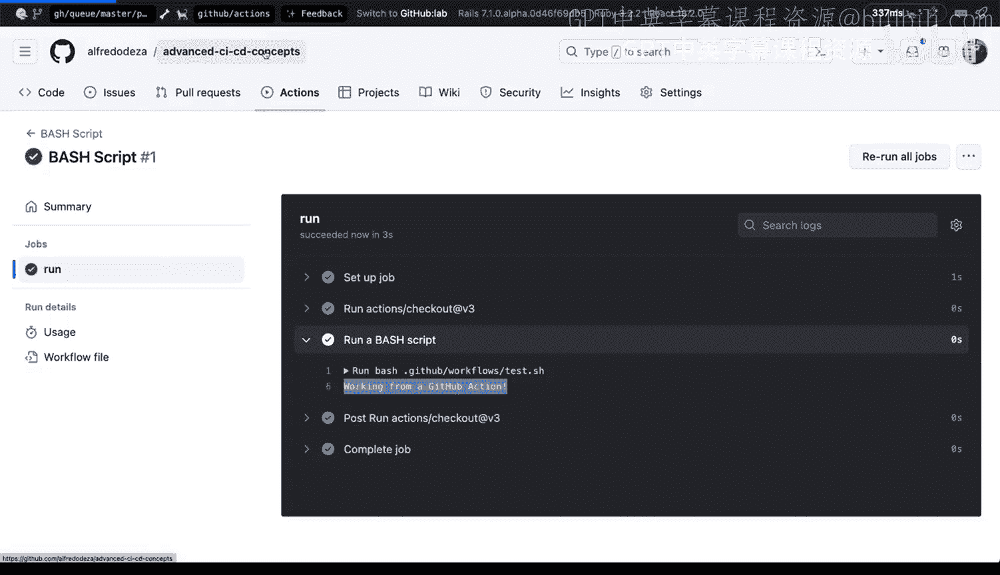
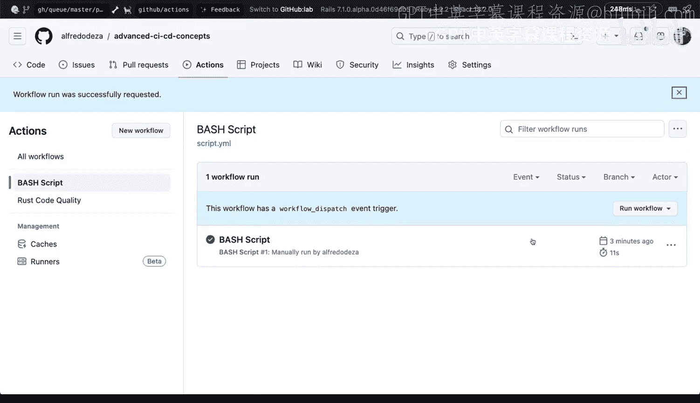
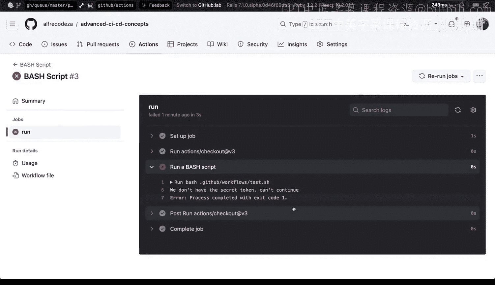
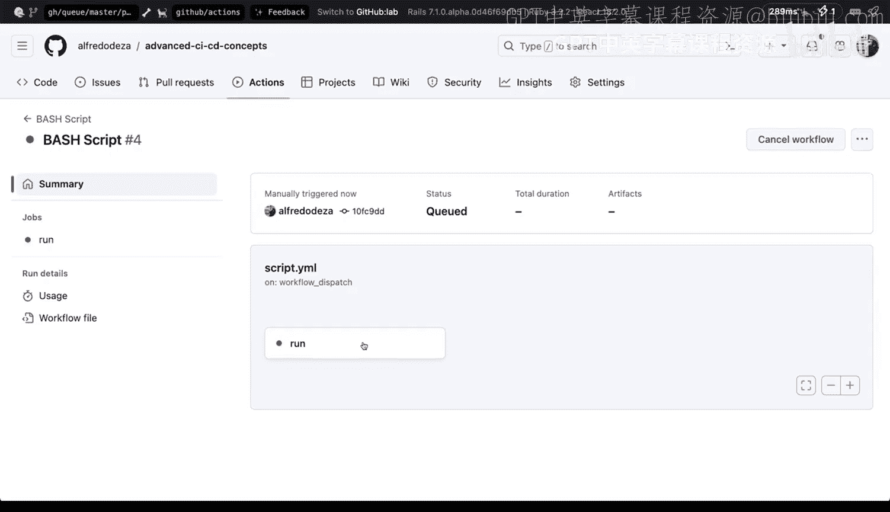
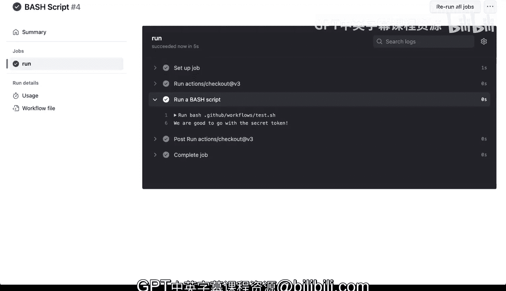

# 154：在工作流中处理逻辑 🔧


在本节课中，我们将学习如何在 GitHub Actions 工作流中处理复杂的逻辑判断。由于 YAML 配置格式本身缺乏灵活性，我们将探索通过运行外部脚本（如 Bash 脚本）来实现条件判断和控制流程的方法。

## 概述

GitHub Actions 的 YAML 配置格式在处理条件逻辑时存在限制。它不允许你直接根据特定条件来决定执行某个步骤或直接使任务失败。这种不灵活性是一个重要的约束。本节课将介绍一种策略：通过运行仓库中的外部脚本来实现复杂的逻辑控制。

## 工作流配置基础

首先，我们创建一个简单的 GitHub Actions 工作流文件。以下是一个名为 `bash-script.yml` 的基础工作流配置：

```yaml
name: Bash Script Workflow

on:
  workflow_dispatch: # 允许手动触发

jobs:
  test-bash:
    runs-on: ubuntu-latest
    steps:
      - name: Checkout repository
        uses: actions/checkout@v3

      - name: Run a Bash script
        run: bash test.sh ${{ secrets.TOKEN }}
```

在这个配置中：
*   `workflow_dispatch` 允许我们手动触发工作流。
*   任务在 `ubuntu-latest` 环境中运行。
*   第一步使用 `actions/checkout` 操作来克隆仓库内容。
*   第二步运行一个名为 `test.sh` 的 Bash 脚本，并向其传递一个密钥 `TOKEN`。`${{ secrets.TOKEN }}` 是 GitHub Actions 注入的一个特殊变量，代表存储在仓库设置中的密钥。

## 创建并测试基础脚本

接下来，我们创建将要被调用的 Bash 脚本 `test.sh`。

```bash
#!/bin/bash
echo “Working from a Github Action”
```

提交工作流文件和脚本后，我们可以在 GitHub 仓库的 “Actions” 标签页中手动触发工作流。运行成功后，日志会输出 “Working from a Github Action”，这证明我们的基础配置是有效的。

然而，这个脚本目前没有进行任何逻辑判断。它只是简单地输出一条信息。





## 在脚本中实现条件逻辑

为了使工作流具备决策能力，我们需要在 Bash 脚本中加入条件判断。我们可以检查环境变量或传入的参数是否存在。

以下是改进后的 `test.sh` 脚本内容：

```bash
#!/bin/bash

# 检查是否传入了 TOKEN 参数
if [ -z “$1” ]; then
  echo “We don‘t have the secret token. Can‘t continue.”
  exit 1 # 退出码非零，将使 GitHub Actions 步骤标记为失败
else
  echo “We are good to go with the secret token.”
fi
```

脚本逻辑说明：
*   `if [ -z “$1” ]`：这是一个条件判断语句。`-z` 用于检查第一个参数（`$1`，即我们传入的 `TOKEN`）是否为空字符串。
*   如果参数为空（`-z` 为真），则输出错误信息并使用 `exit 1` 退出脚本，这会导致 GitHub Actions 的该步骤失败。
*   如果参数不为空，则输出成功信息，脚本正常退出（退出码为0）。

提交修改后的脚本，并再次手动触发工作流。这次，工作流会执行脚本中的条件判断。由于我们正确传入了 `TOKEN`，步骤应该成功，并输出 “We are good to go with the secret token.”。

## 方法的优势与扩展





通过外部脚本处理逻辑的策略非常强大，它不仅限于 Bash 脚本。

以下是你可以采用的其他方式：
*   **Python 脚本**：利用 `sys.argv` 获取参数，进行更复杂的逻辑处理。
*   **Rust 二进制程序**：如果你有一个编译好的 Rust 程序，同样可以在工作流中调用它来处理逻辑。
*   **任何可执行文件**：原则上，任何能在运行器环境中执行的文件都可以用于此目的。

这种方法将逻辑从僵化的 YAML 配置中剥离出来，放入了功能更完整的编程语言环境中，极大地提升了工作流的灵活性和可维护性。

## 总结





本节课我们一起学习了如何在 GitHub Actions 中克服 YAML 的条件逻辑限制。核心方法是**将判断逻辑移至外部脚本中执行**。我们创建了一个基础工作流，调用了一个 Bash 脚本，并在该脚本中实现了检查参数是否存在的条件判断。通过 `exit 1` 可以使步骤失败，从而控制工作流的执行路径。这种模式可以扩展到 Python、Rust 等多种语言，是实现复杂自动化工作流的有效策略。