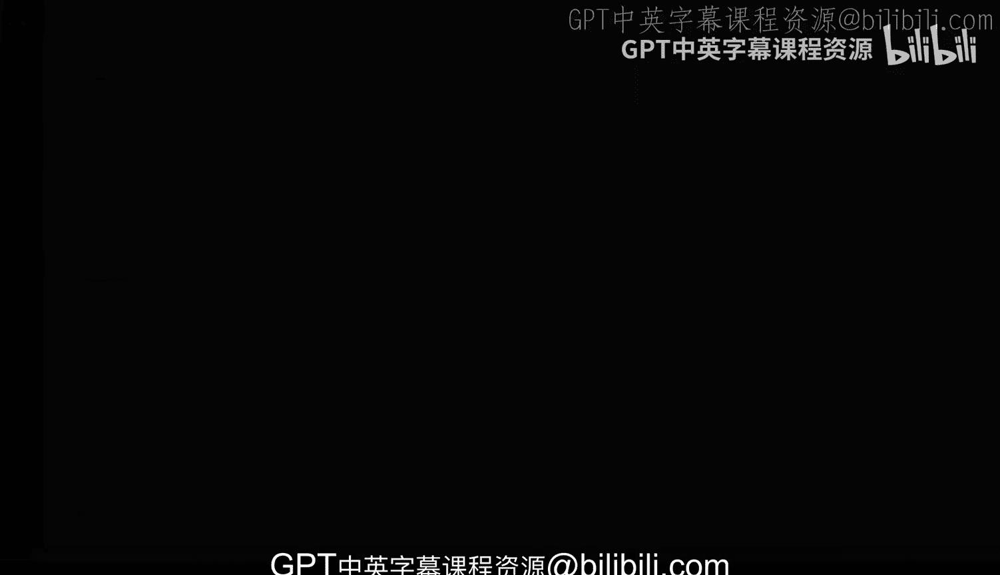
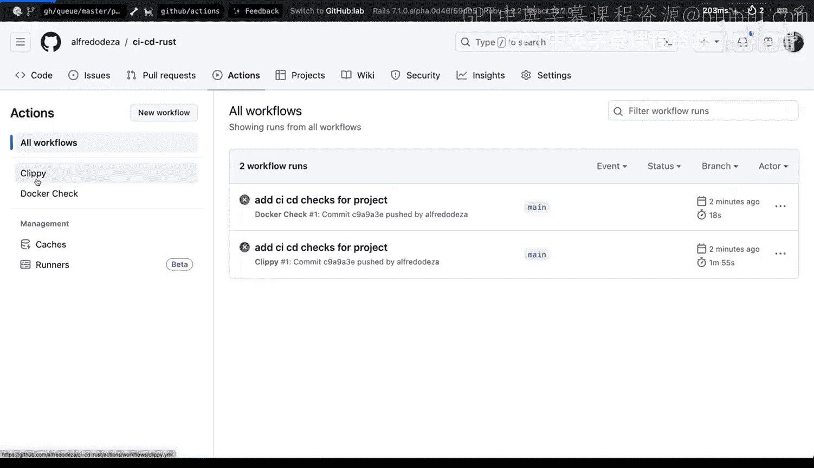
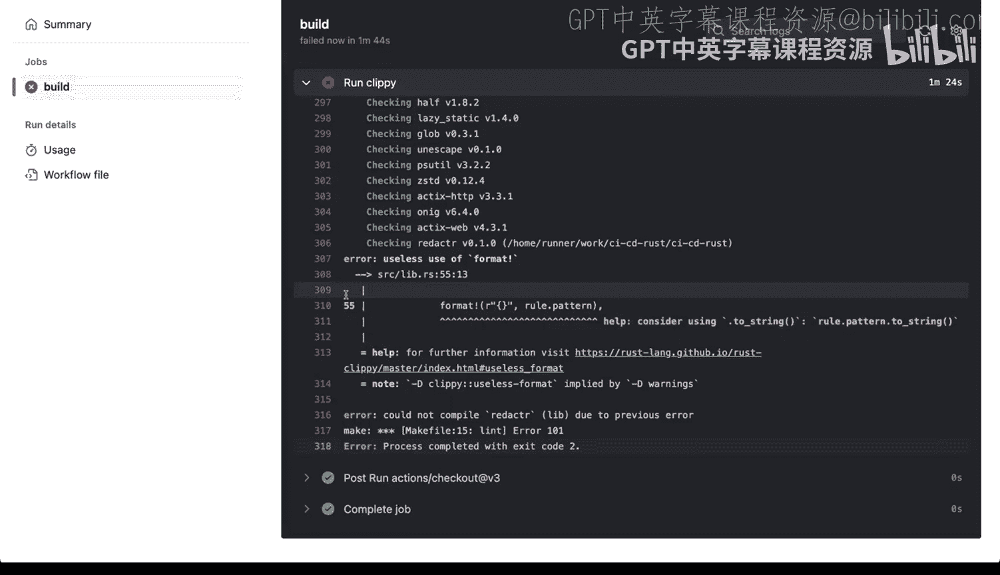
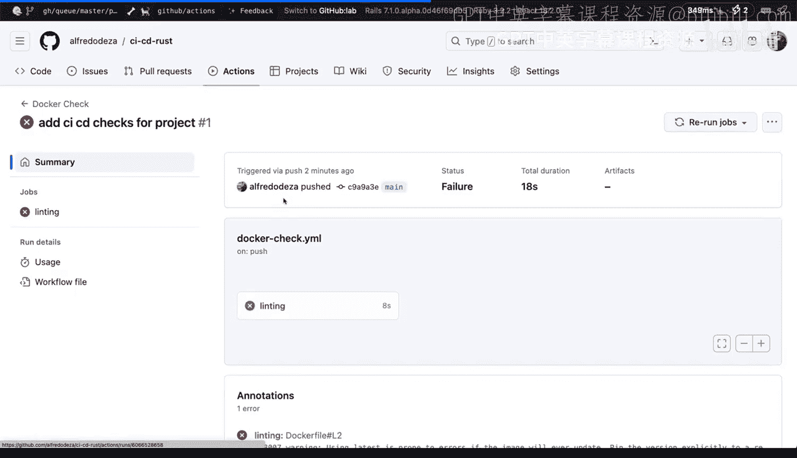
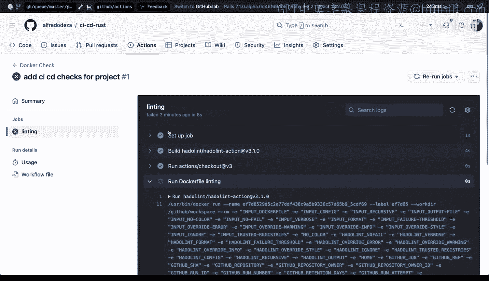
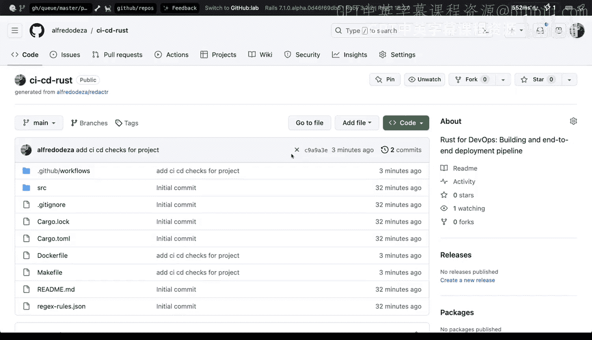

# 158：为拉取请求设置Dockerfile检查 🐳

在本节课中，我们将学习如何为GitHub Actions工作流添加一个新的检查步骤，专门用于对项目中的Dockerfile进行代码质量检查（Linting）和构建验证。这有助于确保Docker配置的正确性，并防止有问题的配置被合并到主分支。

上一节我们介绍了如何为Rust项目设置Clippy检查，本节中我们来看看如何为Dockerfile设置类似的自动化检查。

## 添加Dockerfile检查工作流

现在，我们希望在已有的工作流中添加另一个检查步骤，因为我们项目中有一个Dockerfile。

让我们先查看一下现有的Dockerfile内容，它用于构建名为“redactor”的应用程序。我们想要做两件事：一是对Dockerfile进行代码检查（Linting），二是确保它能够成功构建，不会破坏现有流程。接下来，我们将同时实现这两步。

我们将在这里添加一个新的工作流文件。点击创建新文件，将其命名为 `docker-check.yml`。YAML文件的格式可能比较复杂，一个稳妥的做法是复制现有的工作流配置（例如clippy检查的配置）作为模板，然后进行修改。

以下是创建新工作流文件的具体步骤：

1.  复制现有的 `clippy.yml` 文件内容。
2.  回到新文件 `docker-check.yml`，粘贴复制的内容。
3.  将工作流的名称从“clippy”改为“Docker check”。
4.  保存文件。
5.  配置该工作流在代码推送（push）和拉取请求（pull request）时触发。

这样，我们就有了一个基础的工作流框架。接下来，我们需要调整具体的步骤。

## 配置Linting步骤

我们需要修改从第10行开始的“steps”部分。首先，确保格式正确，“runs-on”和“steps”的缩进要准确。

现在，我们来配置具体的检查步骤。我们想要添加一个名为“Run Dockerfile Lint”的步骤。

我们将使用一个名为 **Hadolint** 的专用工具来完成Dockerfile的Linting。Hadolint是一个很棒的助手，它能帮助我们分析Dockerfile并找出潜在问题。

在这个步骤中，我们需要指定要检查的Dockerfile路径，也就是项目根目录下的 `Dockerfile`。

这个设置将允许我们执行Linting检查。因此，整个工作的名称可以定为“Linting”。

## 配置构建验证步骤

接着，我们可以添加另一个步骤，用于实际构建Docker镜像以验证其正确性。我们可以将这个步骤命名为“Build Docker”。

这里我们采用一个有趣的方案：我们只构建镜像，但不将其推送到任何镜像仓库。这样做的目的是纯粹验证Dockerfile是否能成功构建，而不涉及发布。

我们将使用一个名为 **`docker/build-push-action`** 的GitHub Action。这个Action封装了构建Docker镜像所需的一切。

我们需要配置以下参数：
*   `context` 设置为 `.`，代表使用仓库的根目录作为构建上下文。
*   `file` 指定为根目录下的 `Dockerfile`。
*   由于我们只验证构建，不进行推送，因此不需要配置推送相关的标签（tags）等信息。

保存并提交这些更改后，新的检查工作流就会立即生效。

## 测试与结果分析

现在，我们可以进行一次提交来测试新添加的检查。提交信息可以是“Add CI/CD checks for project”。

提交并推送代码后，我们可以立即在GitHub仓库的“Actions”选项卡中查看工作流的运行情况。

我们会发现检查可能立即失败了。点击失败的工作流详情，可以看到Hadolint工具已经添加了行内注释。例如，它可能会警告：“使用‘latest’标签，如果镜像更新，容易导致错误。建议明确指定版本标签。”

这是一个非常有价值的建议。如果没有固定版本，未来基础镜像更新可能会导致应用程序因不兼容而崩溃。这正是自动化代码检查带来的核心好处：它能捕捉到开发者容易忽略但可能导致严重问题的细节。

在Actions页面，我们可以看到两个工作流在运行：“clippy”和“Docker check”。Clippy检查可能会因为一些代码警告而失败，并且也会在代码中留下注释。同时，Docker检查工作流也会运行。

点开Docker检查的详情，我们可以看到Linting步骤执行了，并且给出了关于使用“latest”标签的警告。然而，由于Linting步骤发现了问题，后续的Docker构建步骤可能被跳过或标记为失败。

这非常好！我们现在拥有了一套坚实的策略来防止有问题的代码被合并。尽管我刚刚推送了代码，但仓库页面上会显示一个红色的“X”，这表明项目的当前状态并不理想，存在需要修复的问题。这有效地阻止了低质量或错误的配置进入主分支。

## 总结

本节课中我们一起学习了如何为GitHub Actions工作流集成Dockerfile的自动化检查。我们通过添加Hadolint步骤来对Dockerfile进行代码质量分析，并配置了一个构建验证步骤来确保Dockerfile能成功生成镜像。这套流程能自动捕获配置错误和最佳实践违规，显著提升了项目在容器化方面的代码健壮性和可维护性，是CI/CD流程中至关重要的一环。